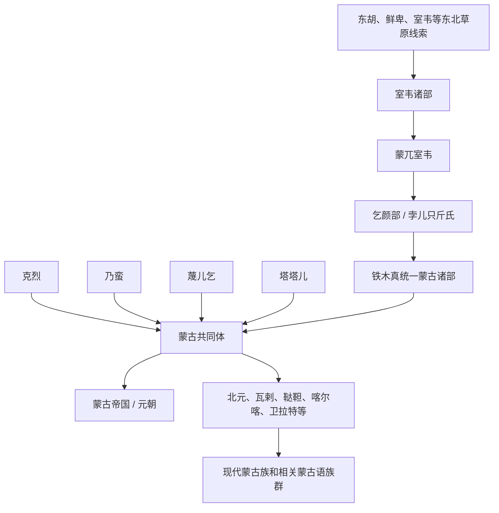

# 蒙古

## 校正版演进图

> 蒙古族形成不是“室韦单线后裔”，而是蒙兀室韦、乞颜部和草原多部族政治整合的结果。

## 概括

蒙古部名见于唐代“蒙兀室韦”等记载，12 至 13 世纪由铁木真整合草原诸部，建立蒙古帝国。

## 起源

蒙兀室韦、乞颜部及草原多部族整合

### 起源详细补充

- 蒙古部名见于唐代蒙兀室韦等记载，核心早期在额尔古纳河、大兴安岭附近。
- 唐末以后部分蒙古部迁向鄂嫩河、克鲁伦河、土拉河上游。
- 蒙古族形成包含乞颜、孛儿只斤、克烈、乃蛮、蔑儿乞、塔塔儿等多部族整合。

## 变迁

蒙古帝国扩张后，蒙古族形成包含原蒙古部、克烈、乃蛮、蔑儿乞、塔塔儿及被征服部众等多源成分。

### 变迁详细补充

- 12世纪草原诸部竞争，铁木真通过联盟、征服和札撒制度统一草原。
- 蒙古帝国扩张后，将蒙古名号扩展为政治共同体和族群身份。
- 元亡后形成北元、瓦剌、鞑靼、喀尔喀、卫拉特等后续分支，进入现代蒙古族格局。

## 主要世系表（蒙古帝国至元）

| 顺序 | 姓名 | 称号 | 在位时间 | 关键事件 / 备注 |
|---|---|---|---|---|
| 1 | **铁木真 / 成吉思汗** | 大蒙古国大汗 | 1206-1227 | 统一蒙古诸部，建立蒙古帝国。 |
| 2 | 窝阔台 | 大汗 | 1229-1241 | 继续西征，制度建设。 |
| 3 | 贵由 | 大汗 | 1246-1248 | 窝阔台系。 |
| 4 | **蒙哥** | 大汗 | 1251-1259 | 拖雷系掌权，继续扩张。 |
| 5 | **忽必烈** | 大汗 / 元世祖 | 1260-1294 | 建立元朝，完成灭宋。 |
| 6 | 铁穆耳 | 元成宗 | 1294-1307 | 元朝守成。 |
| 7 | 海山 | 元武宗 | 1307-1311 | 元中期。 |
| 8 | 爱育黎拔力八达 | 元仁宗 | 1311-1320 | 推行汉法政治。 |
| 9 | 硕德八剌 | 元英宗 | 1320-1323 | 南坡之变被杀。 |
| 10 | 也孙铁木儿 | 泰定帝 | 1323-1328 | 宗王即位。 |
| 11 | 图帖睦尔 | 元文宗 | 1328-1329、1329-1332 | 两都之战后即位。 |
| 12 | 和世㻋 | 元明宗 | 1329 | 在位极短。 |
| 13 | 妥懽帖睦尔 | 元惠宗 / 顺帝 | 1333-1370 | 1368 年元退出大都，北元延续。 |

## 所属大类

- [蒙古语族与东胡](/%E4%BA%BA%E6%96%87%E7%A7%91%E5%AD%A6/%E5%8E%86%E5%8F%B2-%E4%B8%AD%E5%9B%BD/%E6%B0%91%E6%97%8F/%E8%92%99%E5%8F%A4%E8%AF%AD%E6%97%8F%E4%B8%8E%E4%B8%9C%E8%83%A1/README.md)

## 相关总览

- [华夏周边民族](/%E4%BA%BA%E6%96%87%E7%A7%91%E5%AD%A6/%E5%8E%86%E5%8F%B2-%E4%B8%AD%E5%9B%BD/%E6%B0%91%E6%97%8F/README.md)
- [起源](/%E4%BA%BA%E6%96%87%E7%A7%91%E5%AD%A6/%E5%8E%86%E5%8F%B2-%E4%B8%AD%E5%9B%BD/%E6%B0%91%E6%97%8F/README.md#起源)
- [变迁](/%E4%BA%BA%E6%96%87%E7%A7%91%E5%AD%A6/%E5%8E%86%E5%8F%B2-%E4%B8%AD%E5%9B%BD/%E6%B0%91%E6%97%8F/README.md#变迁)
