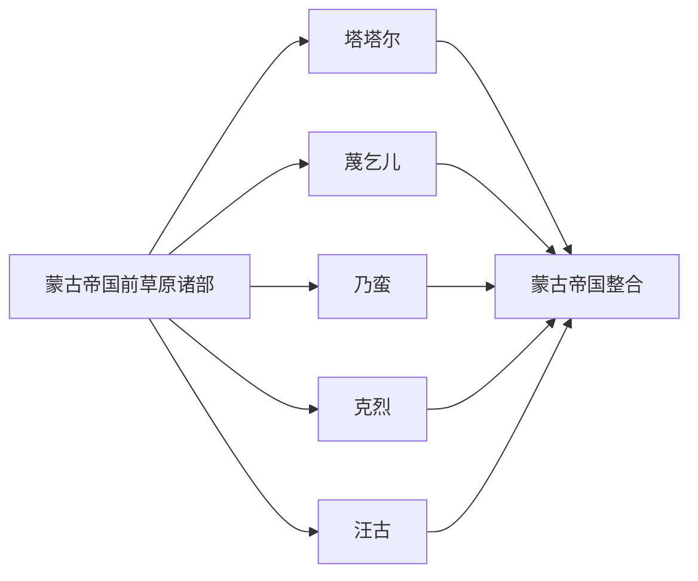

# 蒙古帝国前诸部

本目录是“蒙古语族与东胡”下的二级线索，用于收纳蒙古帝国前诸部相关民族、部族或政权笔记。

## 演进图

## 包含笔记

- [塔塔尔](/%E4%BA%BA%E6%96%87%E7%A7%91%E5%AD%A6/%E5%8E%86%E5%8F%B2-%E4%B8%AD%E5%9B%BD/%E6%B0%91%E6%97%8F/%E8%92%99%E5%8F%A4%E8%AF%AD%E6%97%8F%E4%B8%8E%E4%B8%9C%E8%83%A1/%E8%92%99%E5%8F%A4%E5%B8%9D%E5%9B%BD%E5%89%8D%E8%AF%B8%E9%83%A8/%E5%A1%94%E5%A1%94%E5%B0%94.md)
- [蔑乞儿](/%E4%BA%BA%E6%96%87%E7%A7%91%E5%AD%A6/%E5%8E%86%E5%8F%B2-%E4%B8%AD%E5%9B%BD/%E6%B0%91%E6%97%8F/%E8%92%99%E5%8F%A4%E8%AF%AD%E6%97%8F%E4%B8%8E%E4%B8%9C%E8%83%A1/%E8%92%99%E5%8F%A4%E5%B8%9D%E5%9B%BD%E5%89%8D%E8%AF%B8%E9%83%A8/%E8%94%91%E4%B9%9E%E5%84%BF.md)
- [乃蛮](/%E4%BA%BA%E6%96%87%E7%A7%91%E5%AD%A6/%E5%8E%86%E5%8F%B2-%E4%B8%AD%E5%9B%BD/%E6%B0%91%E6%97%8F/%E8%92%99%E5%8F%A4%E8%AF%AD%E6%97%8F%E4%B8%8E%E4%B8%9C%E8%83%A1/%E8%92%99%E5%8F%A4%E5%B8%9D%E5%9B%BD%E5%89%8D%E8%AF%B8%E9%83%A8/%E4%B9%83%E8%9B%AE.md)
- [克烈](/%E4%BA%BA%E6%96%87%E7%A7%91%E5%AD%A6/%E5%8E%86%E5%8F%B2-%E4%B8%AD%E5%9B%BD/%E6%B0%91%E6%97%8F/%E8%92%99%E5%8F%A4%E8%AF%AD%E6%97%8F%E4%B8%8E%E4%B8%9C%E8%83%A1/%E8%92%99%E5%8F%A4%E5%B8%9D%E5%9B%BD%E5%89%8D%E8%AF%B8%E9%83%A8/%E5%85%8B%E7%83%88.md)
- [汪古](/%E4%BA%BA%E6%96%87%E7%A7%91%E5%AD%A6/%E5%8E%86%E5%8F%B2-%E4%B8%AD%E5%9B%BD/%E6%B0%91%E6%97%8F/%E8%92%99%E5%8F%A4%E8%AF%AD%E6%97%8F%E4%B8%8E%E4%B8%9C%E8%83%A1/%E8%92%99%E5%8F%A4%E5%B8%9D%E5%9B%BD%E5%89%8D%E8%AF%B8%E9%83%A8/%E6%B1%AA%E5%8F%A4.md)

## 上级目录

- [蒙古语族与东胡](/%E4%BA%BA%E6%96%87%E7%A7%91%E5%AD%A6/%E5%8E%86%E5%8F%B2-%E4%B8%AD%E5%9B%BD/%E6%B0%91%E6%97%8F/%E8%92%99%E5%8F%A4%E8%AF%AD%E6%97%8F%E4%B8%8E%E4%B8%9C%E8%83%A1/README.md)
- [华夏周边民族](/%E4%BA%BA%E6%96%87%E7%A7%91%E5%AD%A6/%E5%8E%86%E5%8F%B2-%E4%B8%AD%E5%9B%BD/%E6%B0%91%E6%97%8F/README.md)
