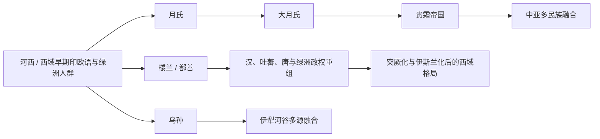

# 西域绿洲与印欧

## 概括

以河西走廊、天山南北、塔里木盆地、伊犁河谷、粟特和巴克特里亚为主要空间，包括月氏、乌孙、楼兰等。

## 起源

西域是绿洲、草原和中原的交汇区，印欧语、伊朗语、吐火罗语、突厥语、汉语等多种语言和人群长期交错。月氏、乌孙、楼兰等不能简单归为单一“种族”。

## 变迁

这一大类的演进通常不是单线血缘继承，而是多部族联盟、迁徙、征服、内附、语言转用和文化融合的结果。

## 演进图

## 包含民族

### [月氏乌孙](/%E4%BA%BA%E6%96%87%E7%A7%91%E5%AD%A6/%E5%8E%86%E5%8F%B2-%E4%B8%AD%E5%9B%BD/%E6%B0%91%E6%97%8F/%E8%A5%BF%E5%9F%9F%E7%BB%BF%E6%B4%B2%E4%B8%8E%E5%8D%B0%E6%AC%A7/%E6%9C%88%E6%B0%8F%E4%B9%8C%E5%AD%99/README.md)

- [月氏](/%E4%BA%BA%E6%96%87%E7%A7%91%E5%AD%A6/%E5%8E%86%E5%8F%B2-%E4%B8%AD%E5%9B%BD/%E6%B0%91%E6%97%8F/%E8%A5%BF%E5%9F%9F%E7%BB%BF%E6%B4%B2%E4%B8%8E%E5%8D%B0%E6%AC%A7/%E6%9C%88%E6%B0%8F%E4%B9%8C%E5%AD%99/%E6%9C%88%E6%B0%8F.md)
- [大月氏](/%E4%BA%BA%E6%96%87%E7%A7%91%E5%AD%A6/%E5%8E%86%E5%8F%B2-%E4%B8%AD%E5%9B%BD/%E6%B0%91%E6%97%8F/%E8%A5%BF%E5%9F%9F%E7%BB%BF%E6%B4%B2%E4%B8%8E%E5%8D%B0%E6%AC%A7/%E6%9C%88%E6%B0%8F%E4%B9%8C%E5%AD%99/%E5%A4%A7%E6%9C%88%E6%B0%8F.md)
- [乌孙](/%E4%BA%BA%E6%96%87%E7%A7%91%E5%AD%A6/%E5%8E%86%E5%8F%B2-%E4%B8%AD%E5%9B%BD/%E6%B0%91%E6%97%8F/%E8%A5%BF%E5%9F%9F%E7%BB%BF%E6%B4%B2%E4%B8%8E%E5%8D%B0%E6%AC%A7/%E6%9C%88%E6%B0%8F%E4%B9%8C%E5%AD%99/%E4%B9%8C%E5%AD%99.md)

### [绿洲城邦](/%E4%BA%BA%E6%96%87%E7%A7%91%E5%AD%A6/%E5%8E%86%E5%8F%B2-%E4%B8%AD%E5%9B%BD/%E6%B0%91%E6%97%8F/%E8%A5%BF%E5%9F%9F%E7%BB%BF%E6%B4%B2%E4%B8%8E%E5%8D%B0%E6%AC%A7/%E7%BB%BF%E6%B4%B2%E5%9F%8E%E9%82%A6/README.md)

- [楼兰](/%E4%BA%BA%E6%96%87%E7%A7%91%E5%AD%A6/%E5%8E%86%E5%8F%B2-%E4%B8%AD%E5%9B%BD/%E6%B0%91%E6%97%8F/%E8%A5%BF%E5%9F%9F%E7%BB%BF%E6%B4%B2%E4%B8%8E%E5%8D%B0%E6%AC%A7/%E7%BB%BF%E6%B4%B2%E5%9F%8E%E9%82%A6/%E6%A5%BC%E5%85%B0.md)

## 相关总览

- [起源](/%E4%BA%BA%E6%96%87%E7%A7%91%E5%AD%A6/%E5%8E%86%E5%8F%B2-%E4%B8%AD%E5%9B%BD/%E6%B0%91%E6%97%8F/README.md#起源)
- [变迁](/%E4%BA%BA%E6%96%87%E7%A7%91%E5%AD%A6/%E5%8E%86%E5%8F%B2-%E4%B8%AD%E5%9B%BD/%E6%B0%91%E6%97%8F/README.md#变迁)
