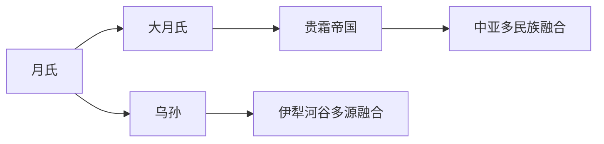

# 月氏乌孙

本目录是“西域绿洲与印欧”下的二级线索，用于收纳月氏乌孙相关民族、部族或政权笔记。

## 演进图

## 包含笔记

- [月氏](/%E4%BA%BA%E6%96%87%E7%A7%91%E5%AD%A6/%E5%8E%86%E5%8F%B2-%E4%B8%AD%E5%9B%BD/%E6%B0%91%E6%97%8F/%E8%A5%BF%E5%9F%9F%E7%BB%BF%E6%B4%B2%E4%B8%8E%E5%8D%B0%E6%AC%A7/%E6%9C%88%E6%B0%8F%E4%B9%8C%E5%AD%99/%E6%9C%88%E6%B0%8F.md)
- [大月氏](/%E4%BA%BA%E6%96%87%E7%A7%91%E5%AD%A6/%E5%8E%86%E5%8F%B2-%E4%B8%AD%E5%9B%BD/%E6%B0%91%E6%97%8F/%E8%A5%BF%E5%9F%9F%E7%BB%BF%E6%B4%B2%E4%B8%8E%E5%8D%B0%E6%AC%A7/%E6%9C%88%E6%B0%8F%E4%B9%8C%E5%AD%99/%E5%A4%A7%E6%9C%88%E6%B0%8F.md)
- [乌孙](/%E4%BA%BA%E6%96%87%E7%A7%91%E5%AD%A6/%E5%8E%86%E5%8F%B2-%E4%B8%AD%E5%9B%BD/%E6%B0%91%E6%97%8F/%E8%A5%BF%E5%9F%9F%E7%BB%BF%E6%B4%B2%E4%B8%8E%E5%8D%B0%E6%AC%A7/%E6%9C%88%E6%B0%8F%E4%B9%8C%E5%AD%99/%E4%B9%8C%E5%AD%99.md)

## 上级目录

- [西域绿洲与印欧](/%E4%BA%BA%E6%96%87%E7%A7%91%E5%AD%A6/%E5%8E%86%E5%8F%B2-%E4%B8%AD%E5%9B%BD/%E6%B0%91%E6%97%8F/%E8%A5%BF%E5%9F%9F%E7%BB%BF%E6%B4%B2%E4%B8%8E%E5%8D%B0%E6%AC%A7/README.md)
- [华夏周边民族](/%E4%BA%BA%E6%96%87%E7%A7%91%E5%AD%A6/%E5%8E%86%E5%8F%B2-%E4%B8%AD%E5%9B%BD/%E6%B0%91%E6%97%8F/README.md)
