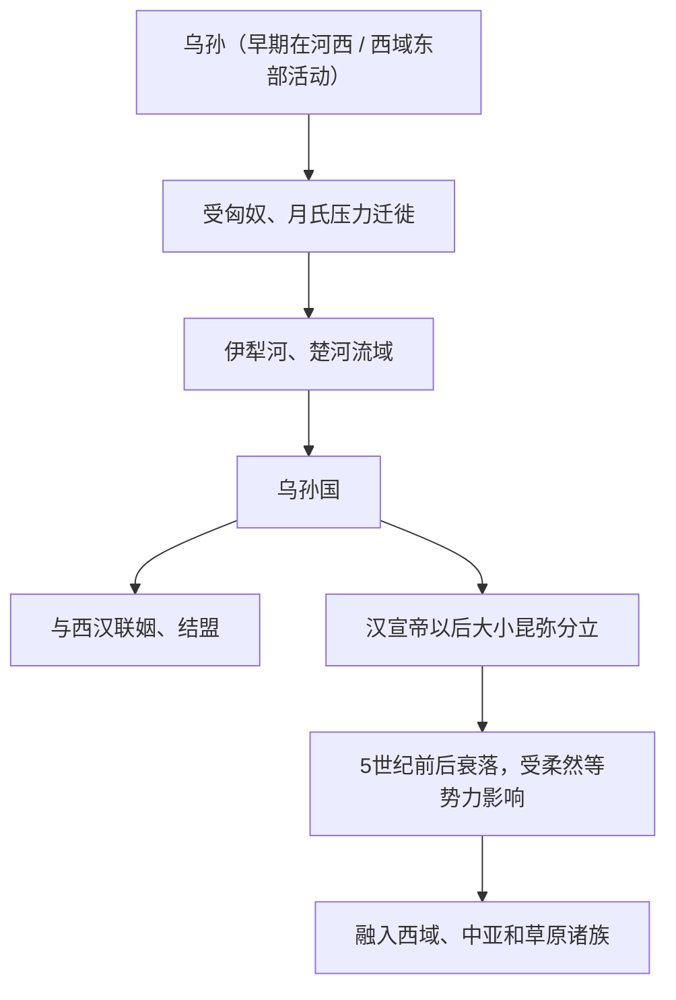

# 乌孙

## 校正版演进图

> 乌孙族属和语言仍有争议，不能简单定为单一现代民族祖先。

## 概括

乌孙是西汉时期西域强国，主要活动于伊犁河、楚河流域。

## 起源

河西或西域东部游牧人群，早期受匈奴、月氏压力迁徙

### 起源详细补充

- 乌孙早期活动地点有河西、西域东部和天山北麓等不同说法。
- 其族属和语言争议较大，可能包含塞种、印欧和草原混合成分。
- 乌孙国家形成与匈奴、月氏和汉朝三方力量有关。

## 变迁

击败大月氏后占据伊犁一带，与汉朝和匈奴长期结盟、对抗，后逐渐衰落并融入中亚和西域诸族。

### 变迁详细补充

- 乌孙在匈奴支持下击败大月氏，占据伊犁河、楚河流域。
- 西汉通过和亲与乌孙结盟，用以牵制匈奴。
- 汉宣帝以后分大小昆弥，后逐渐衰落并融入西域、中亚和草原诸族。

## 昆弥世系表（节选）

乌孙昆弥世系资料不完整，且大小昆弥分裂后更复杂。这里列出汉代史料中最关键的昆弥。

| 顺序 | 姓名 / 称号 | 时间 | 关键事件 / 备注 |
|---|---|---|---|
| 1 | 难兜靡 | 前 2 世纪 | 乌孙早期首领，猎骄靡之父。 |
| 2 | **猎骄靡** | 前 2 世纪中后期 | 乌孙昆弥，西迁伊犁河谷，击败大月氏。 |
| 3 | 军须靡 | 前 1 世纪前期 | 娶汉江都公主刘细君。 |
| 4 | 翁归靡 | 前 1 世纪中期 | 娶解忧公主，乌孙与汉关系密切。 |
| 5 | 泥靡 | 前 1 世纪中期 | 号狂王，乌孙内乱加剧。 |
| 6 | 元贵靡 | 前 1 世纪后期 | 汉支持的大昆弥。 |
| 7 | 乌就屠 | 前 1 世纪后期 | 小昆弥，乌孙分裂局面形成。 |

## 所属大类

- [西域绿洲与印欧](/%E4%BA%BA%E6%96%87%E7%A7%91%E5%AD%A6/%E5%8E%86%E5%8F%B2-%E4%B8%AD%E5%9B%BD/%E6%B0%91%E6%97%8F/%E8%A5%BF%E5%9F%9F%E7%BB%BF%E6%B4%B2%E4%B8%8E%E5%8D%B0%E6%AC%A7/README.md)

## 相关总览

- [华夏周边民族](/%E4%BA%BA%E6%96%87%E7%A7%91%E5%AD%A6/%E5%8E%86%E5%8F%B2-%E4%B8%AD%E5%9B%BD/%E6%B0%91%E6%97%8F/README.md)
- [起源](/%E4%BA%BA%E6%96%87%E7%A7%91%E5%AD%A6/%E5%8E%86%E5%8F%B2-%E4%B8%AD%E5%9B%BD/%E6%B0%91%E6%97%8F/README.md#起源)
- [变迁](/%E4%BA%BA%E6%96%87%E7%A7%91%E5%AD%A6/%E5%8E%86%E5%8F%B2-%E4%B8%AD%E5%9B%BD/%E6%B0%91%E6%97%8F/README.md#变迁)
