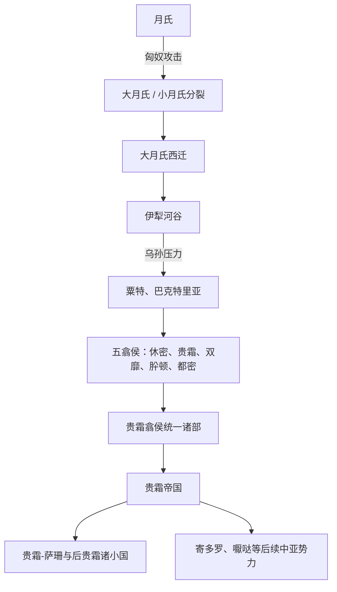

# 大月氏

## 概括

大月氏是月氏被匈奴击败后西迁的一支。其先进入伊犁河谷，后被乌孙驱逐，继续西迁至粟特、巴克特里亚一带。大月氏在中亚分为五翕侯，其中贵霜翕侯后来统一诸部，建立贵霜帝国。

## 起源

月氏原活动于河西、祁连山和西域东部一带。前 2 世纪，匈奴击败月氏，月氏分裂：西迁者称大月氏，留居甘青和塔里木周边者称小月氏。

### 起源详细补充

- 大月氏是月氏西迁主支，先到伊犁河谷，后入中亚巴克特里亚。
- 它由多个翕侯组成，其中贵霜只是五部之一。
- 大月氏在中亚吸收希腊-巴克特里亚、塞种和伊朗文化环境。

## 变迁

### 变迁详细补充

- 被乌孙逐出伊犁后，大月氏南下占据巴克特里亚。
- 贵霜翕侯丘就却统一五部，发展为贵霜帝国。
- 贵霜帝国衰落后，其遗产被贵霜-萨珊、寄多罗、嚈哒等中亚后续势力吸收。

## 贵霜王朝世系表

| 顺序 | 姓名 | 在位时间 | 说明 |
|---|---|---|---|
| 1 | 丘就却 / Kujula Kadphises | 约 50-90 | 贵霜王朝奠基者，统一大月氏五部的重要人物。 |
| 2 | 阎膏珍 / Vima Takto | 约 90-113 | 又称 Soter Megas，向印度西北扩展。 |
| 3 | 阎膏陈 / Vima Kadphises | 约 113-127 | 扩张贵霜领土，发行金币。 |
| 4 | **迦腻色伽一世 / Kanishka I** | 127-约151 | 贵霜强盛期君主，佛教传播与犍陀罗文化的重要人物。 |
| 5 | Huvishka | 约151-190 | 维持贵霜统治。 |
| 6 | Vasudeva I | 约190-230 | 通常视为“大神王”阶段最后重要君主。 |
| 7 | Kanishka II | 约230-247 | 后期贵霜君主。 |
| 8 | Vashishka | 约247-267 | 后期贵霜君主。 |
| 9 | Kanishka III | 约267-270 | 小贵霜阶段。 |
| 10 | Vasudeva II | 约270-300 | 小贵霜阶段。 |
| 11 | Mahi | 约300-305 | 后期君主。 |
| 12 | Shaka | 约305-335 | 后期君主。 |
| 13 | Kipunada | 约335-350 | 后期贵霜末段君主。 |

## 所属大类

- [西域绿洲与印欧](/%E4%BA%BA%E6%96%87%E7%A7%91%E5%AD%A6/%E5%8E%86%E5%8F%B2-%E4%B8%AD%E5%9B%BD/%E6%B0%91%E6%97%8F/%E8%A5%BF%E5%9F%9F%E7%BB%BF%E6%B4%B2%E4%B8%8E%E5%8D%B0%E6%AC%A7/README.md)

## 相关笔记

- [月氏](/%E4%BA%BA%E6%96%87%E7%A7%91%E5%AD%A6/%E5%8E%86%E5%8F%B2-%E4%B8%AD%E5%9B%BD/%E6%B0%91%E6%97%8F/%E8%A5%BF%E5%9F%9F%E7%BB%BF%E6%B4%B2%E4%B8%8E%E5%8D%B0%E6%AC%A7/%E6%9C%88%E6%B0%8F%E4%B9%8C%E5%AD%99/%E6%9C%88%E6%B0%8F.md)
- [乌孙](/%E4%BA%BA%E6%96%87%E7%A7%91%E5%AD%A6/%E5%8E%86%E5%8F%B2-%E4%B8%AD%E5%9B%BD/%E6%B0%91%E6%97%8F/%E8%A5%BF%E5%9F%9F%E7%BB%BF%E6%B4%B2%E4%B8%8E%E5%8D%B0%E6%AC%A7/%E6%9C%88%E6%B0%8F%E4%B9%8C%E5%AD%99/%E4%B9%8C%E5%AD%99.md)
- [变迁](/%E4%BA%BA%E6%96%87%E7%A7%91%E5%AD%A6/%E5%8E%86%E5%8F%B2-%E4%B8%AD%E5%9B%BD/%E6%B0%91%E6%97%8F/README.md#变迁)

