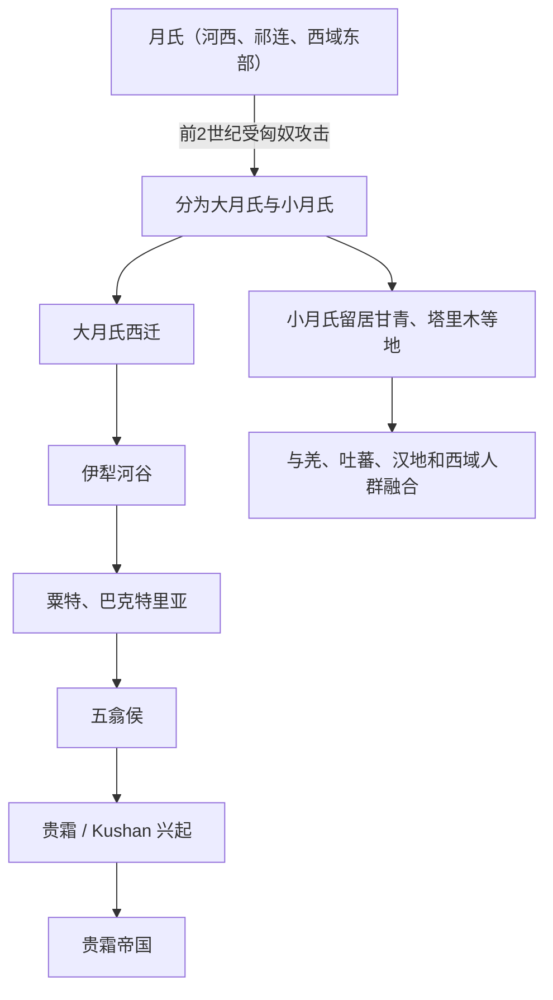

# 月氏

## 校正版演进图

> 月氏和贵霜的关系较清楚，但“大月氏=全部贵霜人”也过于简化；贵霜是大月氏五部之一发展出的政权。

## 概括

月氏是早期活动于甘肃西部、河西和新疆东部一带的族群，后被匈奴击败西迁。

## 起源

河西、祁连和西域东部古代游牧 / 绿洲人群

### 起源详细补充

- 月氏早期活动于河西、祁连山和新疆东部草原绿洲交界。
- 其语言和族属常被认为与印欧语、吐火罗或伊朗语人群有关，但仍有争议。
- 月氏是西域、中亚和汉匈关系中的关键迁徙族群。

## 变迁

大月氏西迁伊犁、粟特、巴克特里亚，贵霜帝国由其一支发展而来；小月氏留在甘青、塔里木等地并与羌、吐蕃、汉地人群融合。

### 变迁详细补充

- 前2世纪被匈奴击败后分为大月氏和小月氏。
- 大月氏经伊犁、粟特进入巴克特里亚，贵霜部最终建立贵霜帝国。
- 小月氏留居甘青、塔里木周边，与羌、吐蕃、汉地和西域人群融合。

## 世系说明

月氏不是一个单一王朝或固定家族名称，而是河西和西域东部的古代族群名称，西迁前没有连续王统记载，因此没有能够连续排列的统一君主世系。可考的政治世系应分别放在大月氏和贵霜王朝等具体政权或部族笔记中。

## 所属大类

- [西域绿洲与印欧](/%E4%BA%BA%E6%96%87%E7%A7%91%E5%AD%A6/%E5%8E%86%E5%8F%B2-%E4%B8%AD%E5%9B%BD/%E6%B0%91%E6%97%8F/%E8%A5%BF%E5%9F%9F%E7%BB%BF%E6%B4%B2%E4%B8%8E%E5%8D%B0%E6%AC%A7/README.md)

## 相关总览

- [华夏周边民族](/%E4%BA%BA%E6%96%87%E7%A7%91%E5%AD%A6/%E5%8E%86%E5%8F%B2-%E4%B8%AD%E5%9B%BD/%E6%B0%91%E6%97%8F/README.md)
- [起源](/%E4%BA%BA%E6%96%87%E7%A7%91%E5%AD%A6/%E5%8E%86%E5%8F%B2-%E4%B8%AD%E5%9B%BD/%E6%B0%91%E6%97%8F/README.md#起源)
- [变迁](/%E4%BA%BA%E6%96%87%E7%A7%91%E5%AD%A6/%E5%8E%86%E5%8F%B2-%E4%B8%AD%E5%9B%BD/%E6%B0%91%E6%97%8F/README.md#变迁)
