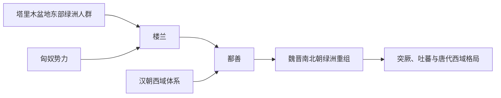

# 楼兰

## 概括

楼兰是塔里木盆地东部罗布泊附近绿洲国家，汉昭帝以后改名鄯善。

## 起源

塔里木东部绿洲居民

### 起源详细补充

- 楼兰位于罗布泊西北岸，是塔里木盆地东部绿洲城邦。
- 它处在汉朝、匈奴、西域南北道之间，战略位置极重要。
- 楼兰居民可能包含吐火罗语、伊朗语和本地绿洲成分。

## 变迁

先后受月氏、匈奴、汉朝影响，改名鄯善后迁都伊循，原楼兰城成为汉屯田据点。

### 变迁详细补充

- 早期受月氏、匈奴影响，后在汉匈之间反复。
- 前77年汉朝更立国王，改国名为鄯善并迁都伊循。
- 楼兰古城后来因环境变化和交通线转移而衰落，居民融入鄯善和塔里木绿洲人群。

## 演进图

## 王系说明

楼兰 / 鄯善有王国体制，但保存下来的王名零散，难以排列完整世系。可考节点主要来自汉代西域经营记录。

| 顺序 | 姓名 / 称号 | 时间 | 关键事件 / 备注 |
|---|---|---|---|
| 1 | 楼兰王（名不详） | 前 2 世纪-前 1 世纪初 | 在汉与匈奴之间摇摆。 |
| 2 | 尉屠耆 | 前 77 年后 | 傅介子刺杀楼兰王后，汉立尉屠耆为王，改国名鄯善。 |
| 3 | 鄯善诸王 | 前 1 世纪-魏晋 | 王名多零散，鄯善长期处在汉、魏晋和西域诸势力之间。 |

## 所属大类

- [西域绿洲与印欧](/%E4%BA%BA%E6%96%87%E7%A7%91%E5%AD%A6/%E5%8E%86%E5%8F%B2-%E4%B8%AD%E5%9B%BD/%E6%B0%91%E6%97%8F/%E8%A5%BF%E5%9F%9F%E7%BB%BF%E6%B4%B2%E4%B8%8E%E5%8D%B0%E6%AC%A7/README.md)

## 相关总览

- [华夏周边民族](/%E4%BA%BA%E6%96%87%E7%A7%91%E5%AD%A6/%E5%8E%86%E5%8F%B2-%E4%B8%AD%E5%9B%BD/%E6%B0%91%E6%97%8F/README.md)
- [起源](/%E4%BA%BA%E6%96%87%E7%A7%91%E5%AD%A6/%E5%8E%86%E5%8F%B2-%E4%B8%AD%E5%9B%BD/%E6%B0%91%E6%97%8F/README.md#起源)
- [变迁](/%E4%BA%BA%E6%96%87%E7%A7%91%E5%AD%A6/%E5%8E%86%E5%8F%B2-%E4%B8%AD%E5%9B%BD/%E6%B0%91%E6%97%8F/README.md#变迁)
