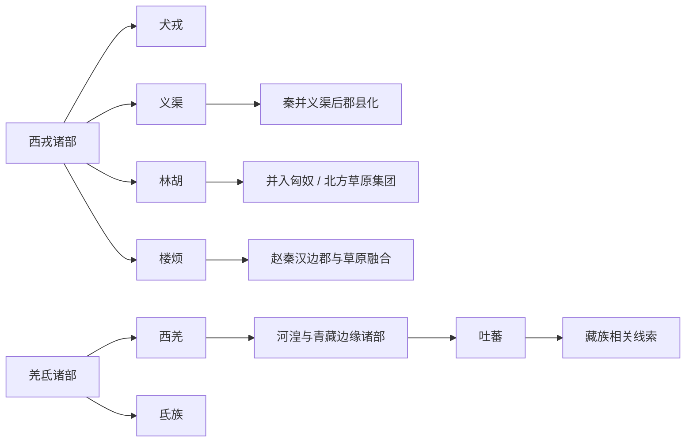

# 西戎羌氐与青藏

## 概括

以关陇、陕甘宁、河湟、青海、川西北、青藏高原为核心，包括西戎、犬戎、义渠、林胡、楼烦、西羌、氐、吐蕃等。

## 起源

“戎”“羌”“氐”都是古代中原王朝对西北和西部族群的泛称，不等于现代单一民族。羌、氐、吐蕃、党项等与汉藏语系和青藏高原、河湟地区历史关系密切。

## 变迁

这一大类的演进通常不是单线血缘继承，而是多部族联盟、迁徙、征服、内附、语言转用和文化融合的结果。

## 演进图

## 包含民族

### [先秦戎狄](/%E4%BA%BA%E6%96%87%E7%A7%91%E5%AD%A6/%E5%8E%86%E5%8F%B2-%E4%B8%AD%E5%9B%BD/%E6%B0%91%E6%97%8F/%E8%A5%BF%E6%88%8E%E7%BE%8C%E6%B0%90%E4%B8%8E%E9%9D%92%E8%97%8F/%E5%85%88%E7%A7%A6%E6%88%8E%E7%8B%84/README.md)

- [西戎](/%E4%BA%BA%E6%96%87%E7%A7%91%E5%AD%A6/%E5%8E%86%E5%8F%B2-%E4%B8%AD%E5%9B%BD/%E6%B0%91%E6%97%8F/%E8%A5%BF%E6%88%8E%E7%BE%8C%E6%B0%90%E4%B8%8E%E9%9D%92%E8%97%8F/%E5%85%88%E7%A7%A6%E6%88%8E%E7%8B%84/%E8%A5%BF%E6%88%8E.md)
- [犬戎](/%E4%BA%BA%E6%96%87%E7%A7%91%E5%AD%A6/%E5%8E%86%E5%8F%B2-%E4%B8%AD%E5%9B%BD/%E6%B0%91%E6%97%8F/%E8%A5%BF%E6%88%8E%E7%BE%8C%E6%B0%90%E4%B8%8E%E9%9D%92%E8%97%8F/%E5%85%88%E7%A7%A6%E6%88%8E%E7%8B%84/%E7%8A%AC%E6%88%8E.md)
- [义渠](/%E4%BA%BA%E6%96%87%E7%A7%91%E5%AD%A6/%E5%8E%86%E5%8F%B2-%E4%B8%AD%E5%9B%BD/%E6%B0%91%E6%97%8F/%E8%A5%BF%E6%88%8E%E7%BE%8C%E6%B0%90%E4%B8%8E%E9%9D%92%E8%97%8F/%E5%85%88%E7%A7%A6%E6%88%8E%E7%8B%84/%E4%B9%89%E6%B8%A0.md)
- [林胡](/%E4%BA%BA%E6%96%87%E7%A7%91%E5%AD%A6/%E5%8E%86%E5%8F%B2-%E4%B8%AD%E5%9B%BD/%E6%B0%91%E6%97%8F/%E8%A5%BF%E6%88%8E%E7%BE%8C%E6%B0%90%E4%B8%8E%E9%9D%92%E8%97%8F/%E5%85%88%E7%A7%A6%E6%88%8E%E7%8B%84/%E6%9E%97%E8%83%A1.md)
- [楼烦](/%E4%BA%BA%E6%96%87%E7%A7%91%E5%AD%A6/%E5%8E%86%E5%8F%B2-%E4%B8%AD%E5%9B%BD/%E6%B0%91%E6%97%8F/%E8%A5%BF%E6%88%8E%E7%BE%8C%E6%B0%90%E4%B8%8E%E9%9D%92%E8%97%8F/%E5%85%88%E7%A7%A6%E6%88%8E%E7%8B%84/%E6%A5%BC%E7%83%A6.md)

### [羌氐政权](/%E4%BA%BA%E6%96%87%E7%A7%91%E5%AD%A6/%E5%8E%86%E5%8F%B2-%E4%B8%AD%E5%9B%BD/%E6%B0%91%E6%97%8F/%E8%A5%BF%E6%88%8E%E7%BE%8C%E6%B0%90%E4%B8%8E%E9%9D%92%E8%97%8F/%E7%BE%8C%E6%B0%90%E6%94%BF%E6%9D%83/README.md)

- [西羌](/%E4%BA%BA%E6%96%87%E7%A7%91%E5%AD%A6/%E5%8E%86%E5%8F%B2-%E4%B8%AD%E5%9B%BD/%E6%B0%91%E6%97%8F/%E8%A5%BF%E6%88%8E%E7%BE%8C%E6%B0%90%E4%B8%8E%E9%9D%92%E8%97%8F/%E7%BE%8C%E6%B0%90%E6%94%BF%E6%9D%83/%E8%A5%BF%E7%BE%8C.md)
- [氐族](/%E4%BA%BA%E6%96%87%E7%A7%91%E5%AD%A6/%E5%8E%86%E5%8F%B2-%E4%B8%AD%E5%9B%BD/%E6%B0%91%E6%97%8F/%E8%A5%BF%E6%88%8E%E7%BE%8C%E6%B0%90%E4%B8%8E%E9%9D%92%E8%97%8F/%E7%BE%8C%E6%B0%90%E6%94%BF%E6%9D%83/%E6%B0%90%E6%97%8F.md)

### [青藏吐蕃](/%E4%BA%BA%E6%96%87%E7%A7%91%E5%AD%A6/%E5%8E%86%E5%8F%B2-%E4%B8%AD%E5%9B%BD/%E6%B0%91%E6%97%8F/%E8%A5%BF%E6%88%8E%E7%BE%8C%E6%B0%90%E4%B8%8E%E9%9D%92%E8%97%8F/%E9%9D%92%E8%97%8F%E5%90%90%E8%95%83/README.md)

- [吐蕃](/%E4%BA%BA%E6%96%87%E7%A7%91%E5%AD%A6/%E5%8E%86%E5%8F%B2-%E4%B8%AD%E5%9B%BD/%E6%B0%91%E6%97%8F/%E8%A5%BF%E6%88%8E%E7%BE%8C%E6%B0%90%E4%B8%8E%E9%9D%92%E8%97%8F/%E9%9D%92%E8%97%8F%E5%90%90%E8%95%83/%E5%90%90%E8%95%83.md)

## 相关总览

- [起源](/%E4%BA%BA%E6%96%87%E7%A7%91%E5%AD%A6/%E5%8E%86%E5%8F%B2-%E4%B8%AD%E5%9B%BD/%E6%B0%91%E6%97%8F/README.md#起源)
- [变迁](/%E4%BA%BA%E6%96%87%E7%A7%91%E5%AD%A6/%E5%8E%86%E5%8F%B2-%E4%B8%AD%E5%9B%BD/%E6%B0%91%E6%97%8F/README.md#变迁)
