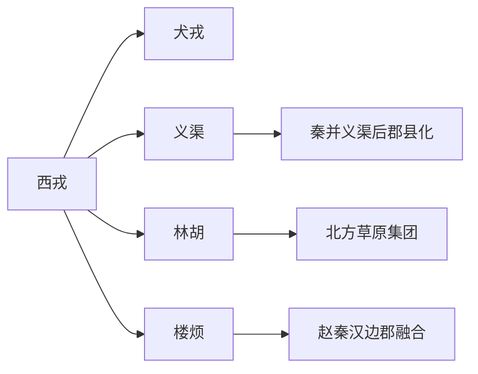

# 先秦戎狄

本目录是“西戎羌氐与青藏”下的二级线索，用于收纳先秦戎狄相关民族、部族或政权笔记。

## 演进图

## 包含笔记

- [西戎](/%E4%BA%BA%E6%96%87%E7%A7%91%E5%AD%A6/%E5%8E%86%E5%8F%B2-%E4%B8%AD%E5%9B%BD/%E6%B0%91%E6%97%8F/%E8%A5%BF%E6%88%8E%E7%BE%8C%E6%B0%90%E4%B8%8E%E9%9D%92%E8%97%8F/%E5%85%88%E7%A7%A6%E6%88%8E%E7%8B%84/%E8%A5%BF%E6%88%8E.md)
- [犬戎](/%E4%BA%BA%E6%96%87%E7%A7%91%E5%AD%A6/%E5%8E%86%E5%8F%B2-%E4%B8%AD%E5%9B%BD/%E6%B0%91%E6%97%8F/%E8%A5%BF%E6%88%8E%E7%BE%8C%E6%B0%90%E4%B8%8E%E9%9D%92%E8%97%8F/%E5%85%88%E7%A7%A6%E6%88%8E%E7%8B%84/%E7%8A%AC%E6%88%8E.md)
- [义渠](/%E4%BA%BA%E6%96%87%E7%A7%91%E5%AD%A6/%E5%8E%86%E5%8F%B2-%E4%B8%AD%E5%9B%BD/%E6%B0%91%E6%97%8F/%E8%A5%BF%E6%88%8E%E7%BE%8C%E6%B0%90%E4%B8%8E%E9%9D%92%E8%97%8F/%E5%85%88%E7%A7%A6%E6%88%8E%E7%8B%84/%E4%B9%89%E6%B8%A0.md)
- [林胡](/%E4%BA%BA%E6%96%87%E7%A7%91%E5%AD%A6/%E5%8E%86%E5%8F%B2-%E4%B8%AD%E5%9B%BD/%E6%B0%91%E6%97%8F/%E8%A5%BF%E6%88%8E%E7%BE%8C%E6%B0%90%E4%B8%8E%E9%9D%92%E8%97%8F/%E5%85%88%E7%A7%A6%E6%88%8E%E7%8B%84/%E6%9E%97%E8%83%A1.md)
- [楼烦](/%E4%BA%BA%E6%96%87%E7%A7%91%E5%AD%A6/%E5%8E%86%E5%8F%B2-%E4%B8%AD%E5%9B%BD/%E6%B0%91%E6%97%8F/%E8%A5%BF%E6%88%8E%E7%BE%8C%E6%B0%90%E4%B8%8E%E9%9D%92%E8%97%8F/%E5%85%88%E7%A7%A6%E6%88%8E%E7%8B%84/%E6%A5%BC%E7%83%A6.md)

## 上级目录

- [西戎羌氐与青藏](/%E4%BA%BA%E6%96%87%E7%A7%91%E5%AD%A6/%E5%8E%86%E5%8F%B2-%E4%B8%AD%E5%9B%BD/%E6%B0%91%E6%97%8F/%E8%A5%BF%E6%88%8E%E7%BE%8C%E6%B0%90%E4%B8%8E%E9%9D%92%E8%97%8F/README.md)
- [华夏周边民族](/%E4%BA%BA%E6%96%87%E7%A7%91%E5%AD%A6/%E5%8E%86%E5%8F%B2-%E4%B8%AD%E5%9B%BD/%E6%B0%91%E6%97%8F/README.md)
