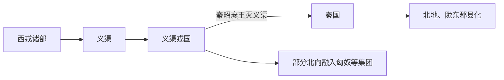

# 义渠

## 概括

义渠是战国时期关中西北、陇东和宁夏一带的戎族国家。

## 起源

西戎诸部

### 起源详细补充

- 义渠是战国时期陇东、宁夏、陕北一带的戎族国家。
- 它介于秦、赵、匈奴和西戎诸部之间。
- 义渠已有较稳定的国家形态和定居-游牧混合经济。

## 变迁

秦昭襄王时期被秦灭，部分并入秦人，部分与匈奴、汉代边郡人群发生融合。

### 变迁详细补充

- 战国时期义渠长期与秦国竞争并时降时叛。
- 秦昭襄王时期灭义渠，设置郡县并控制陇东、北地。
- 部分义渠人融入秦汉边郡，部分进入匈奴或其他北方集团。

## 演进图

## 王系说明

义渠是战国时期有国家形态的戎族政权，但史书没有保存完整王系。可考节点主要是末期义渠王。

| 顺序 | 姓名 / 称号 | 时间 | 关键事件 / 备注 |
|---|---|---|---|
| 1 | 义渠早期诸王 | 春秋战国 | 名号多不详，长期与秦、魏、赵等互动。 |
| 2 | **义渠王** | ?-前 272 | 与秦宣太后有政治关系，秦昭襄王时被杀，义渠国亡。 |

## 所属大类

- [西戎羌氐与青藏](/%E4%BA%BA%E6%96%87%E7%A7%91%E5%AD%A6/%E5%8E%86%E5%8F%B2-%E4%B8%AD%E5%9B%BD/%E6%B0%91%E6%97%8F/%E8%A5%BF%E6%88%8E%E7%BE%8C%E6%B0%90%E4%B8%8E%E9%9D%92%E8%97%8F/README.md)

## 相关总览

- [华夏周边民族](/%E4%BA%BA%E6%96%87%E7%A7%91%E5%AD%A6/%E5%8E%86%E5%8F%B2-%E4%B8%AD%E5%9B%BD/%E6%B0%91%E6%97%8F/README.md)
- [起源](/%E4%BA%BA%E6%96%87%E7%A7%91%E5%AD%A6/%E5%8E%86%E5%8F%B2-%E4%B8%AD%E5%9B%BD/%E6%B0%91%E6%97%8F/README.md#起源)
- [变迁](/%E4%BA%BA%E6%96%87%E7%A7%91%E5%AD%A6/%E5%8E%86%E5%8F%B2-%E4%B8%AD%E5%9B%BD/%E6%B0%91%E6%97%8F/README.md#变迁)
