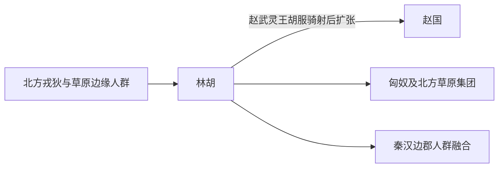

# 林胡

## 概括

林胡是战国时期活动于晋北、燕赵以北和鄂尔多斯东部的北方族群。

## 起源

北方戎狄和森林草原人群

### 起源详细补充

- 林胡是战国时期晋北、赵北、燕北和鄂尔多斯东部的北方族群。
- 名称含“林中胡人”之意，但不等于后世蒙古林中百姓。
- 其族属可能与戎狄、胡、草原边缘人群混合有关。

## 变迁

被赵国击败后，一部分融入赵、匈奴或后续草原集团；与后世布里亚特等的关系只能作为名称相似或传说线索，不宜定论。

### 变迁详细补充

- 赵武灵王胡服骑射后北破林胡、楼烦，设置云中、雁门、代郡。
- 林胡一部分归附赵国，另一部分北移或并入匈奴。
- 作为独立族名在秦汉以后消失。

## 演进图

## 世系说明

林胡不是一个单一王朝或固定家族名称，而是战国北边草原边缘部族称谓，因此没有能够连续排列的统一君主世系。可考的政治世系应分别放在匈奴、楼烦以及赵秦汉边郡线索等具体政权或部族笔记中。

## 所属大类

- [西戎羌氐与青藏](/%E4%BA%BA%E6%96%87%E7%A7%91%E5%AD%A6/%E5%8E%86%E5%8F%B2-%E4%B8%AD%E5%9B%BD/%E6%B0%91%E6%97%8F/%E8%A5%BF%E6%88%8E%E7%BE%8C%E6%B0%90%E4%B8%8E%E9%9D%92%E8%97%8F/README.md)

## 相关总览

- [华夏周边民族](/%E4%BA%BA%E6%96%87%E7%A7%91%E5%AD%A6/%E5%8E%86%E5%8F%B2-%E4%B8%AD%E5%9B%BD/%E6%B0%91%E6%97%8F/README.md)
- [起源](/%E4%BA%BA%E6%96%87%E7%A7%91%E5%AD%A6/%E5%8E%86%E5%8F%B2-%E4%B8%AD%E5%9B%BD/%E6%B0%91%E6%97%8F/README.md#起源)
- [变迁](/%E4%BA%BA%E6%96%87%E7%A7%91%E5%AD%A6/%E5%8E%86%E5%8F%B2-%E4%B8%AD%E5%9B%BD/%E6%B0%91%E6%97%8F/README.md#变迁)
