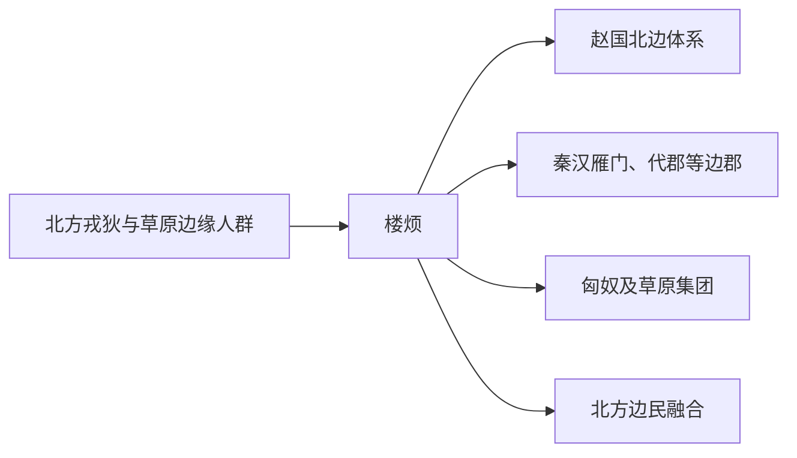

# 楼烦

## 概括

楼烦是战国至汉初活动于山西北部、河套一带的族群和政权。

## 起源

北方戎狄、河套游牧人群

### 起源详细补充

- 楼烦活动于山西北部、雁门、河套和鄂尔多斯周边。
- 它处于农牧交错地带，既与赵秦接触，也与匈奴关系密切。
- 楼烦不是单纯西羌或匈奴，而是北方戎狄系统的一支。

## 变迁

战国被赵、秦压缩，汉武帝时楼烦王、白羊王被击败，部众融入汉边郡、匈奴或其他草原群体。

### 变迁详细补充

- 战国时被赵、秦压缩，汉初北移并成为匈奴附庸。
- 汉武帝时期卫青击败楼烦王、白羊王，汉朝取得河套。
- 楼烦部众后融入汉边郡、匈奴、鲜卑等人群。

## 演进图

## 世系说明

楼烦不是一个单一王朝或固定家族名称，而是战国至秦汉北边部族称谓，因此没有能够连续排列的统一君主世系。可考的政治世系应分别放在匈奴、赵秦汉边郡线索等具体政权或部族笔记中。

## 所属大类

- [西戎羌氐与青藏](/%E4%BA%BA%E6%96%87%E7%A7%91%E5%AD%A6/%E5%8E%86%E5%8F%B2-%E4%B8%AD%E5%9B%BD/%E6%B0%91%E6%97%8F/%E8%A5%BF%E6%88%8E%E7%BE%8C%E6%B0%90%E4%B8%8E%E9%9D%92%E8%97%8F/README.md)

## 相关总览

- [华夏周边民族](/%E4%BA%BA%E6%96%87%E7%A7%91%E5%AD%A6/%E5%8E%86%E5%8F%B2-%E4%B8%AD%E5%9B%BD/%E6%B0%91%E6%97%8F/README.md)
- [起源](/%E4%BA%BA%E6%96%87%E7%A7%91%E5%AD%A6/%E5%8E%86%E5%8F%B2-%E4%B8%AD%E5%9B%BD/%E6%B0%91%E6%97%8F/README.md#起源)
- [变迁](/%E4%BA%BA%E6%96%87%E7%A7%91%E5%AD%A6/%E5%8E%86%E5%8F%B2-%E4%B8%AD%E5%9B%BD/%E6%B0%91%E6%97%8F/README.md#变迁)
