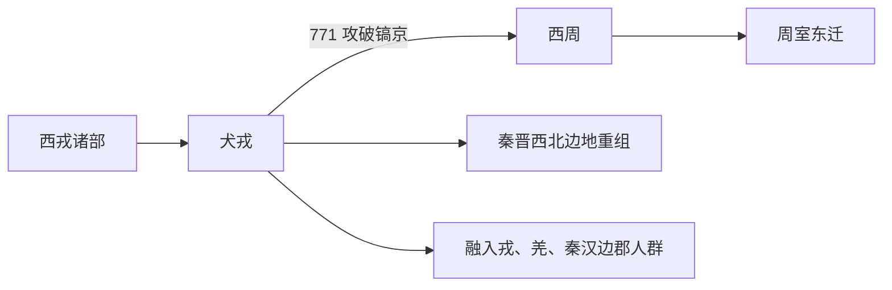

# 犬戎

## 概括

犬戎是西周至春秋时期西部戎族之一，传统记载中参与攻破镐京，导致周平王东迁。

## 起源

西戎诸部

### 起源详细补充

- 犬戎是西周时期西部戎族之一，活动于甘肃东部、宁夏和关中西北。
- 其传说来源复杂，史书常把它放入西戎系统。
- 犬戎名称可能包含图腾化、外部称谓和政治敌对叙事。

## 变迁

后续或融入秦、周边戎狄和西北诸族群，作为独立族名消失。

### 变迁详细补充

- 前771年犬戎与申侯等攻破镐京，周平王东迁，西周结束。
- 春秋以后犬戎作为独立名称逐渐淡出。
- 其部众可能并入秦、戎狄和西北其他族群。

## 演进图

## 世系说明

犬戎不是一个单一王朝或固定家族名称，而是西周至春秋时期的戎族集团，史料没有保存连续君主世系，因此没有能够连续排列的统一君主世系。可考的政治世系应分别放在西戎、义渠等西部族群等具体政权或部族笔记中。

## 所属大类

- [西戎羌氐与青藏](/%E4%BA%BA%E6%96%87%E7%A7%91%E5%AD%A6/%E5%8E%86%E5%8F%B2-%E4%B8%AD%E5%9B%BD/%E6%B0%91%E6%97%8F/%E8%A5%BF%E6%88%8E%E7%BE%8C%E6%B0%90%E4%B8%8E%E9%9D%92%E8%97%8F/README.md)

## 相关总览

- [华夏周边民族](/%E4%BA%BA%E6%96%87%E7%A7%91%E5%AD%A6/%E5%8E%86%E5%8F%B2-%E4%B8%AD%E5%9B%BD/%E6%B0%91%E6%97%8F/README.md)
- [起源](/%E4%BA%BA%E6%96%87%E7%A7%91%E5%AD%A6/%E5%8E%86%E5%8F%B2-%E4%B8%AD%E5%9B%BD/%E6%B0%91%E6%97%8F/README.md#起源)
- [变迁](/%E4%BA%BA%E6%96%87%E7%A7%91%E5%AD%A6/%E5%8E%86%E5%8F%B2-%E4%B8%AD%E5%9B%BD/%E6%B0%91%E6%97%8F/README.md#变迁)
