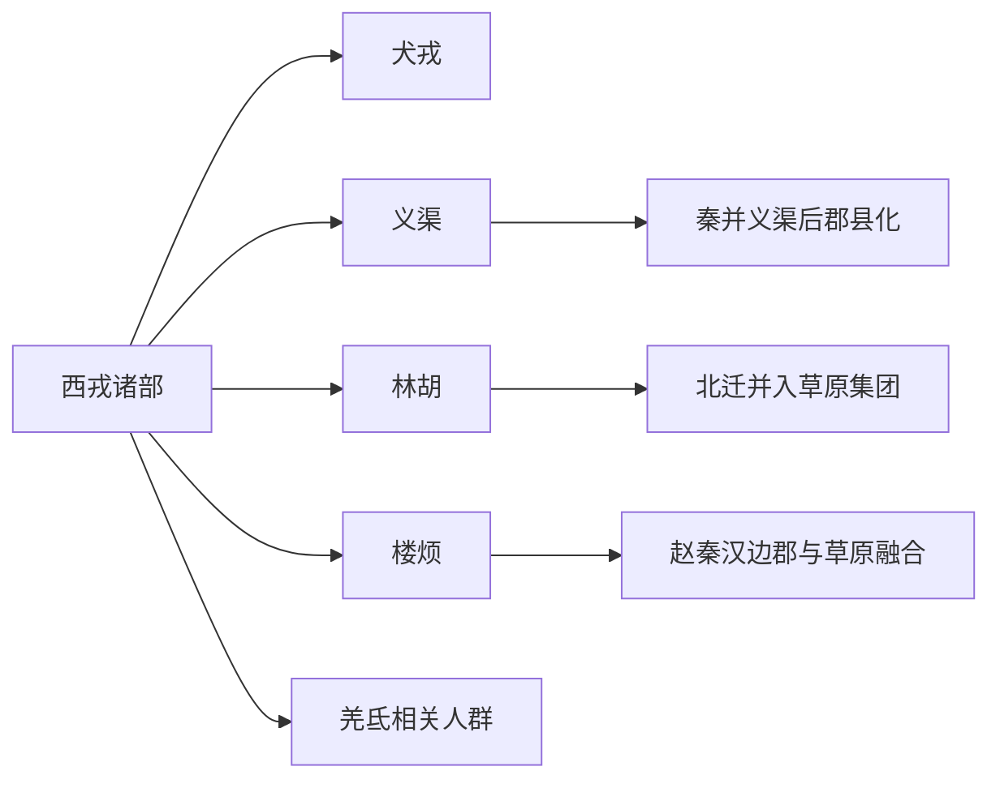

# 西戎

## 概括

西戎是先秦中原文献对西部、关陇和陕甘宁一带多种族群的泛称。

## 起源

关陇、陕甘宁和河套西部多群体

### 起源详细补充

- 西戎是先秦中原对西部、关陇、陕甘宁和河套周边族群的泛称。
- 它包含犬戎、义渠、羌、氐等不同来源群体，不是单一民族。
- 西戎名称反映周秦与西部边缘社会的政治关系。

## 变迁

犬戎、义渠、羌、氐、楼烦等都可放入西部边缘线索讨论，但彼此不一定同源。

### 变迁详细补充

- 西周至春秋时期，犬戎等戎族影响周王室迁都和秦国兴起。
- 战国秦并义渠、戎狄诸部后，西戎逐步被纳入秦汉郡县和边郡体系。
- 西戎作为总称消失后，羌、氐、月氏、匈奴、吐蕃等更具体线索出现。

## 演进图

## 世系说明

西戎不是一个单一王朝或固定家族名称，而是周秦文献中对西部多个族群的泛称，因此没有能够连续排列的统一君主世系。可考的政治世系应分别放在犬戎、义渠、西羌、氐族等具体集团等具体政权或部族笔记中。

## 所属大类

- [西戎羌氐与青藏](/%E4%BA%BA%E6%96%87%E7%A7%91%E5%AD%A6/%E5%8E%86%E5%8F%B2-%E4%B8%AD%E5%9B%BD/%E6%B0%91%E6%97%8F/%E8%A5%BF%E6%88%8E%E7%BE%8C%E6%B0%90%E4%B8%8E%E9%9D%92%E8%97%8F/README.md)

## 相关总览

- [华夏周边民族](/%E4%BA%BA%E6%96%87%E7%A7%91%E5%AD%A6/%E5%8E%86%E5%8F%B2-%E4%B8%AD%E5%9B%BD/%E6%B0%91%E6%97%8F/README.md)
- [起源](/%E4%BA%BA%E6%96%87%E7%A7%91%E5%AD%A6/%E5%8E%86%E5%8F%B2-%E4%B8%AD%E5%9B%BD/%E6%B0%91%E6%97%8F/README.md#起源)
- [变迁](/%E4%BA%BA%E6%96%87%E7%A7%91%E5%AD%A6/%E5%8E%86%E5%8F%B2-%E4%B8%AD%E5%9B%BD/%E6%B0%91%E6%97%8F/README.md#变迁)
