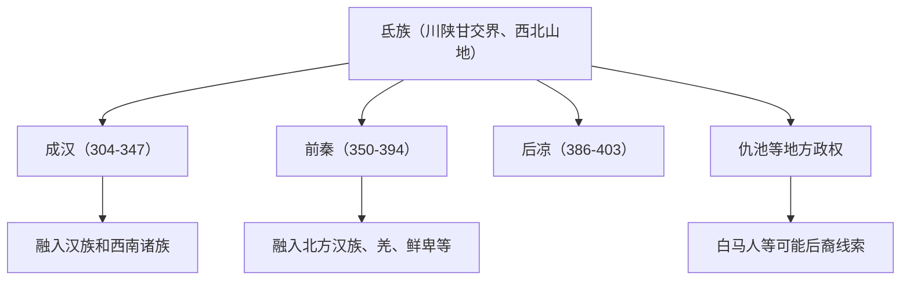

# 氐族

## 校正版演进图

> 氐与羌关系密切，但“氐羌”不表示二者完全相同。

## 概括

氐是古代西北和川陕甘交界地区重要族群，常与羌并称氐羌。

## 起源

西戎、氐羌系统

### 起源详细补充

- 氐族主要活动于陕甘川交界、汉中、武都、仇池和巴蜀周边。
- 氐与羌关系密切，常合称氐羌，但二者并非完全同一。
- 氐人兼有山地农牧和边郡移民特征。

## 变迁

十六国时期建立前秦、后凉、仇池、成汉等政权。唐以后多融入汉、藏、羌等人群，白马人常被讨论为氐人后裔线索之一。

### 变迁详细补充

- 两汉至三国时期氐人大量内迁关中、汉中和巴蜀。
- 十六国时期建立成汉、前秦、后凉、仇池等政权。
- 唐以后氐族名逐渐消失，部众融入汉族、藏族、羌族和西南山地人群。

## 主要世系表（氐族代表政权）

氐族不是单一王朝，以下列出最重要的氐族政权主线：前秦苻氏与成汉李氏。

| 顺序 | 姓名 | 政权 / 称号 | 在位时间 | 关键事件 / 备注 |
|---|---|---|---|---|
| 1 | 李特 | 成汉奠基者 | 301-303 起兵 | 巴氐流民领袖。 |
| 2 | 李雄 | 成汉武帝 | 304-334 | 建立成汉。 |
| 3 | 李班 | 成汉哀帝 | 334 | 在位短，被杀。 |
| 4 | 李期 | 成汉幽公 | 334-338 | 被李寿废。 |
| 5 | 李寿 | 成汉昭文帝 | 338-343 | 改国号汉。 |
| 6 | 李势 | 成汉末帝 | 343-347 | 东晋灭成汉。 |
| 7 | 苻健 | 前秦景明帝 | 351-355 | 建立前秦。 |
| 8 | 苻生 | 前秦厉王 | 355-357 | 被苻坚废杀。 |
| 9 | **苻坚** | 前秦宣昭帝 | 357-385 | 一度统一北方，淝水之战失败。 |
| 10 | 苻丕 | 前秦哀平帝 | 385-386 | 前秦衰亡期。 |
| 11 | 苻登 | 前秦高帝 | 386-394 | 继续抵抗后秦。 |
| 12 | 苻崇 | 前秦末帝 | 394 | 前秦灭亡。 |

## 所属大类

- [西戎羌氐与青藏](/%E4%BA%BA%E6%96%87%E7%A7%91%E5%AD%A6/%E5%8E%86%E5%8F%B2-%E4%B8%AD%E5%9B%BD/%E6%B0%91%E6%97%8F/%E8%A5%BF%E6%88%8E%E7%BE%8C%E6%B0%90%E4%B8%8E%E9%9D%92%E8%97%8F/README.md)

## 相关总览

- [华夏周边民族](/%E4%BA%BA%E6%96%87%E7%A7%91%E5%AD%A6/%E5%8E%86%E5%8F%B2-%E4%B8%AD%E5%9B%BD/%E6%B0%91%E6%97%8F/README.md)
- [起源](/%E4%BA%BA%E6%96%87%E7%A7%91%E5%AD%A6/%E5%8E%86%E5%8F%B2-%E4%B8%AD%E5%9B%BD/%E6%B0%91%E6%97%8F/README.md#起源)
- [变迁](/%E4%BA%BA%E6%96%87%E7%A7%91%E5%AD%A6/%E5%8E%86%E5%8F%B2-%E4%B8%AD%E5%9B%BD/%E6%B0%91%E6%97%8F/README.md#变迁)
