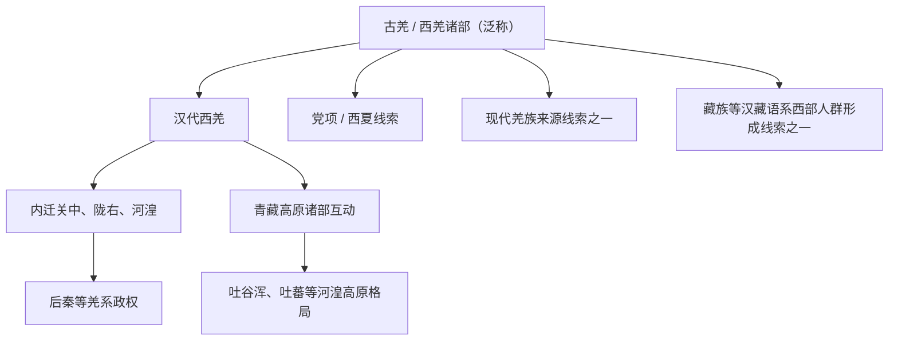

# 西羌

## 校正版演进图

> “羌”是古代泛称，不等于现代羌族，也不能把所有藏缅语族人群都写成同一支羌人直系。

## 概括

西羌是汉代对河湟、甘青、川西北等地羌人诸部的称谓。

## 起源

古羌人和西北牧业人群

### 起源详细补充

- 西羌是汉代对河湟、甘青、川西北等地羌人诸部的总称。
- 古羌是泛称，不等于现代羌族，也不等于全部藏缅语族。
- 其经济形态多为牧业、半农牧和山地部落社会。

## 变迁

东汉羌乱、三国羌人内迁、十六国后秦、唐宋党项等都与羌系线索有关，但古羌不等于现代羌族。

### 变迁详细补充

- 汉代羌人与边郡、屯田和内迁政策冲突，引发多次羌乱。
- 魏晋南北朝时期羌人建立后秦等政权，也融入关陇和河湟人群。
- 唐宋以后，羌系线索与吐蕃、党项、西夏、现代羌族和藏族形成史交织。

## 世系说明

西羌不是一个单一王朝或固定家族名称，而是汉魏文献中西部羌人诸部的总称，因此没有能够连续排列的统一君主世系。可考的政治世系应分别放在吐蕃、党项、西夏和现代羌族等后续线索等具体政权或部族笔记中。

## 所属大类

- [西戎羌氐与青藏](/%E4%BA%BA%E6%96%87%E7%A7%91%E5%AD%A6/%E5%8E%86%E5%8F%B2-%E4%B8%AD%E5%9B%BD/%E6%B0%91%E6%97%8F/%E8%A5%BF%E6%88%8E%E7%BE%8C%E6%B0%90%E4%B8%8E%E9%9D%92%E8%97%8F/README.md)

## 相关总览

- [华夏周边民族](/%E4%BA%BA%E6%96%87%E7%A7%91%E5%AD%A6/%E5%8E%86%E5%8F%B2-%E4%B8%AD%E5%9B%BD/%E6%B0%91%E6%97%8F/README.md)
- [起源](/%E4%BA%BA%E6%96%87%E7%A7%91%E5%AD%A6/%E5%8E%86%E5%8F%B2-%E4%B8%AD%E5%9B%BD/%E6%B0%91%E6%97%8F/README.md#起源)
- [变迁](/%E4%BA%BA%E6%96%87%E7%A7%91%E5%AD%A6/%E5%8E%86%E5%8F%B2-%E4%B8%AD%E5%9B%BD/%E6%B0%91%E6%97%8F/README.md#变迁)
