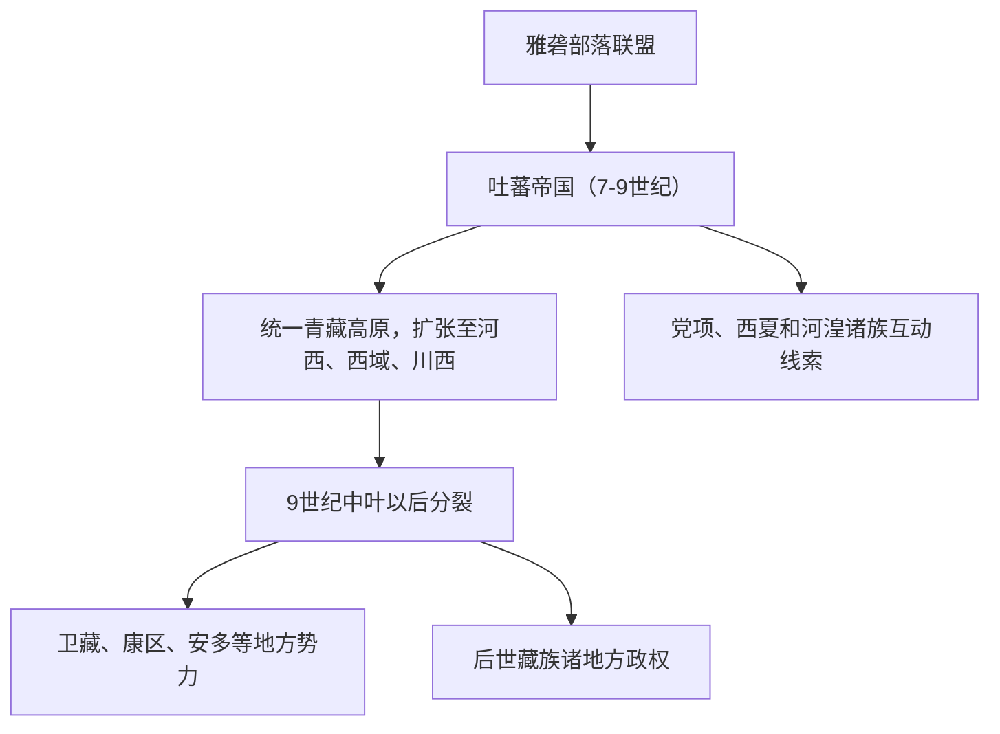

# 吐蕃

## 校正版演进图

> 吐蕃是青藏高原政权，不宜简单写成“融入某一族”。其瓦解后形成多个藏区地方政治和族群线索。

## 概括

吐蕃是 7 至 9 世纪兴起于青藏高原的强大政权，核心为藏族先民。

## 起源

青藏高原诸部、雅砻部落联盟

### 起源详细补充

- 吐蕃兴起于雅砻河谷，核心是青藏高原诸部整合。
- 松赞干布时期统一高原，建立强大王权。
- 吐蕃与古羌、吐谷浑、党项等西部族群有互动，但不是这些族群的简单延续。

## 变迁

松赞干布以后统一高原并与唐、西域诸国长期互动；吐蕃瓦解后，高原进入分裂时期，后续形成藏族各地方政权。

### 变迁详细补充

- 7至9世纪吐蕃与唐、突厥、回鹘、西域诸国争夺河西和西域。
- 9世纪中叶王朝瓦解后，高原进入分裂和地方政权时期。
- 后世卫藏、康、安多等藏区形成，吐蕃成为藏族历史的重要政治源头。

## 赞普世系表（吐蕃帝国主线）

| 顺序 | 姓名 | 称号 | 在位时间 | 关键事件 / 备注 |
|---|---|---|---|---|
| 1 | 囊日论赞 | 雅砻首领 / 赞普 | 约 6 世纪末-618 | 松赞干布之父，奠定扩张基础。 |
| 2 | **松赞干布** | 赞普 | 约 618-650 | 统一高原，迁都逻些，与唐、尼泊尔联姻。 |
| 3 | 芒松芒赞 | 赞普 | 650-676 | 吐蕃继续扩张。 |
| 4 | 都松芒波杰 | 赞普 | 676-704 | 与唐争夺西域、青海。 |
| 5 | 赤德祖赞 | 赞普 | 704-755 | 又称尺带珠丹，与唐金城公主联姻。 |
| 6 | **赤松德赞** | 赞普 | 755-797 | 吐蕃强盛，佛教制度化。 |
| 7 | 牟尼赞普 | 赞普 | 797-799 | 在位短。 |
| 8 | 赤德松赞 | 赞普 | 799-815 | 吐蕃中后期。 |
| 9 | **赤祖德赞** | 赞普 | 815-841 | 又称热巴巾，崇佛，唐蕃会盟。 |
| 10 | **朗达玛** | 赞普 | 841-842 | 吐蕃帝国崩解前最后关键赞普。 |

## 所属大类

- [西戎羌氐与青藏](/%E4%BA%BA%E6%96%87%E7%A7%91%E5%AD%A6/%E5%8E%86%E5%8F%B2-%E4%B8%AD%E5%9B%BD/%E6%B0%91%E6%97%8F/%E8%A5%BF%E6%88%8E%E7%BE%8C%E6%B0%90%E4%B8%8E%E9%9D%92%E8%97%8F/README.md)

## 相关总览

- [华夏周边民族](/%E4%BA%BA%E6%96%87%E7%A7%91%E5%AD%A6/%E5%8E%86%E5%8F%B2-%E4%B8%AD%E5%9B%BD/%E6%B0%91%E6%97%8F/README.md)
- [起源](/%E4%BA%BA%E6%96%87%E7%A7%91%E5%AD%A6/%E5%8E%86%E5%8F%B2-%E4%B8%AD%E5%9B%BD/%E6%B0%91%E6%97%8F/README.md#起源)
- [变迁](/%E4%BA%BA%E6%96%87%E7%A7%91%E5%AD%A6/%E5%8E%86%E5%8F%B2-%E4%B8%AD%E5%9B%BD/%E6%B0%91%E6%97%8F/README.md#变迁)
