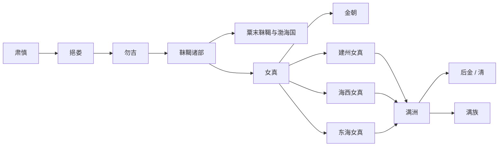

# 通古斯语族与肃慎

## 概括

以东北亚山林、松花江、黑龙江、长白山和辽东的古代人群为主，包括肃慎、挹娄、勿吉、靺鞨、女真、满洲。

## 起源

肃慎、挹娄、勿吉、靺鞨、女真是中国东北文献中的长期线索，但不能写成同一民族名称的简单改译。女真到满洲、满族的政治和族名演变较清楚；鄂温克、鄂伦春、赫哲、锡伯等也属于通古斯语族相关线索，但本目录当前主要整理原始资料中已有的肃慎至满洲一线。

## 变迁

这一大类的演进通常不是单线血缘继承，而是多部族联盟、迁徙、征服、内附、语言转用和文化融合的结果。

## 演进图

## 包含民族

### [肃慎靺鞨源流](/%E4%BA%BA%E6%96%87%E7%A7%91%E5%AD%A6/%E5%8E%86%E5%8F%B2-%E4%B8%AD%E5%9B%BD/%E6%B0%91%E6%97%8F/%E9%80%9A%E5%8F%A4%E6%96%AF%E8%AF%AD%E6%97%8F%E4%B8%8E%E8%82%83%E6%85%8E/%E8%82%83%E6%85%8E%E9%9D%BA%E9%9E%A8%E6%BA%90%E6%B5%81/README.md)

- [肃慎](/%E4%BA%BA%E6%96%87%E7%A7%91%E5%AD%A6/%E5%8E%86%E5%8F%B2-%E4%B8%AD%E5%9B%BD/%E6%B0%91%E6%97%8F/%E9%80%9A%E5%8F%A4%E6%96%AF%E8%AF%AD%E6%97%8F%E4%B8%8E%E8%82%83%E6%85%8E/%E8%82%83%E6%85%8E%E9%9D%BA%E9%9E%A8%E6%BA%90%E6%B5%81/%E8%82%83%E6%85%8E.md)
- [挹娄](/%E4%BA%BA%E6%96%87%E7%A7%91%E5%AD%A6/%E5%8E%86%E5%8F%B2-%E4%B8%AD%E5%9B%BD/%E6%B0%91%E6%97%8F/%E9%80%9A%E5%8F%A4%E6%96%AF%E8%AF%AD%E6%97%8F%E4%B8%8E%E8%82%83%E6%85%8E/%E8%82%83%E6%85%8E%E9%9D%BA%E9%9E%A8%E6%BA%90%E6%B5%81/%E6%8C%B9%E5%A8%84.md)
- [勿吉](/%E4%BA%BA%E6%96%87%E7%A7%91%E5%AD%A6/%E5%8E%86%E5%8F%B2-%E4%B8%AD%E5%9B%BD/%E6%B0%91%E6%97%8F/%E9%80%9A%E5%8F%A4%E6%96%AF%E8%AF%AD%E6%97%8F%E4%B8%8E%E8%82%83%E6%85%8E/%E8%82%83%E6%85%8E%E9%9D%BA%E9%9E%A8%E6%BA%90%E6%B5%81/%E5%8B%BF%E5%90%89.md)
- [靺鞨](/%E4%BA%BA%E6%96%87%E7%A7%91%E5%AD%A6/%E5%8E%86%E5%8F%B2-%E4%B8%AD%E5%9B%BD/%E6%B0%91%E6%97%8F/%E9%80%9A%E5%8F%A4%E6%96%AF%E8%AF%AD%E6%97%8F%E4%B8%8E%E8%82%83%E6%85%8E/%E8%82%83%E6%85%8E%E9%9D%BA%E9%9E%A8%E6%BA%90%E6%B5%81/%E9%9D%BA%E9%9E%A8.md)

### [女真诸部](/%E4%BA%BA%E6%96%87%E7%A7%91%E5%AD%A6/%E5%8E%86%E5%8F%B2-%E4%B8%AD%E5%9B%BD/%E6%B0%91%E6%97%8F/%E9%80%9A%E5%8F%A4%E6%96%AF%E8%AF%AD%E6%97%8F%E4%B8%8E%E8%82%83%E6%85%8E/%E5%A5%B3%E7%9C%9F%E8%AF%B8%E9%83%A8/README.md)

- [女真](/%E4%BA%BA%E6%96%87%E7%A7%91%E5%AD%A6/%E5%8E%86%E5%8F%B2-%E4%B8%AD%E5%9B%BD/%E6%B0%91%E6%97%8F/%E9%80%9A%E5%8F%A4%E6%96%AF%E8%AF%AD%E6%97%8F%E4%B8%8E%E8%82%83%E6%85%8E/%E5%A5%B3%E7%9C%9F%E8%AF%B8%E9%83%A8/%E5%A5%B3%E7%9C%9F.md)
- [建州女真](/%E4%BA%BA%E6%96%87%E7%A7%91%E5%AD%A6/%E5%8E%86%E5%8F%B2-%E4%B8%AD%E5%9B%BD/%E6%B0%91%E6%97%8F/%E9%80%9A%E5%8F%A4%E6%96%AF%E8%AF%AD%E6%97%8F%E4%B8%8E%E8%82%83%E6%85%8E/%E5%A5%B3%E7%9C%9F%E8%AF%B8%E9%83%A8/%E5%BB%BA%E5%B7%9E%E5%A5%B3%E7%9C%9F.md)
- [海西女真](/%E4%BA%BA%E6%96%87%E7%A7%91%E5%AD%A6/%E5%8E%86%E5%8F%B2-%E4%B8%AD%E5%9B%BD/%E6%B0%91%E6%97%8F/%E9%80%9A%E5%8F%A4%E6%96%AF%E8%AF%AD%E6%97%8F%E4%B8%8E%E8%82%83%E6%85%8E/%E5%A5%B3%E7%9C%9F%E8%AF%B8%E9%83%A8/%E6%B5%B7%E8%A5%BF%E5%A5%B3%E7%9C%9F.md)
- [东海女真](/%E4%BA%BA%E6%96%87%E7%A7%91%E5%AD%A6/%E5%8E%86%E5%8F%B2-%E4%B8%AD%E5%9B%BD/%E6%B0%91%E6%97%8F/%E9%80%9A%E5%8F%A4%E6%96%AF%E8%AF%AD%E6%97%8F%E4%B8%8E%E8%82%83%E6%85%8E/%E5%A5%B3%E7%9C%9F%E8%AF%B8%E9%83%A8/%E4%B8%9C%E6%B5%B7%E5%A5%B3%E7%9C%9F.md)

### [满洲满族](/%E4%BA%BA%E6%96%87%E7%A7%91%E5%AD%A6/%E5%8E%86%E5%8F%B2-%E4%B8%AD%E5%9B%BD/%E6%B0%91%E6%97%8F/%E9%80%9A%E5%8F%A4%E6%96%AF%E8%AF%AD%E6%97%8F%E4%B8%8E%E8%82%83%E6%85%8E/%E6%BB%A1%E6%B4%B2%E6%BB%A1%E6%97%8F/README.md)

- [满洲](/%E4%BA%BA%E6%96%87%E7%A7%91%E5%AD%A6/%E5%8E%86%E5%8F%B2-%E4%B8%AD%E5%9B%BD/%E6%B0%91%E6%97%8F/%E9%80%9A%E5%8F%A4%E6%96%AF%E8%AF%AD%E6%97%8F%E4%B8%8E%E8%82%83%E6%85%8E/%E6%BB%A1%E6%B4%B2%E6%BB%A1%E6%97%8F/%E6%BB%A1%E6%B4%B2.md)
- [满族](/%E4%BA%BA%E6%96%87%E7%A7%91%E5%AD%A6/%E5%8E%86%E5%8F%B2-%E4%B8%AD%E5%9B%BD/%E6%B0%91%E6%97%8F/%E9%80%9A%E5%8F%A4%E6%96%AF%E8%AF%AD%E6%97%8F%E4%B8%8E%E8%82%83%E6%85%8E/%E6%BB%A1%E6%B4%B2%E6%BB%A1%E6%97%8F/%E6%BB%A1%E6%97%8F.md)

## 相关总览

- [起源](/%E4%BA%BA%E6%96%87%E7%A7%91%E5%AD%A6/%E5%8E%86%E5%8F%B2-%E4%B8%AD%E5%9B%BD/%E6%B0%91%E6%97%8F/README.md#起源)
- [变迁](/%E4%BA%BA%E6%96%87%E7%A7%91%E5%AD%A6/%E5%8E%86%E5%8F%B2-%E4%B8%AD%E5%9B%BD/%E6%B0%91%E6%97%8F/README.md#变迁)
