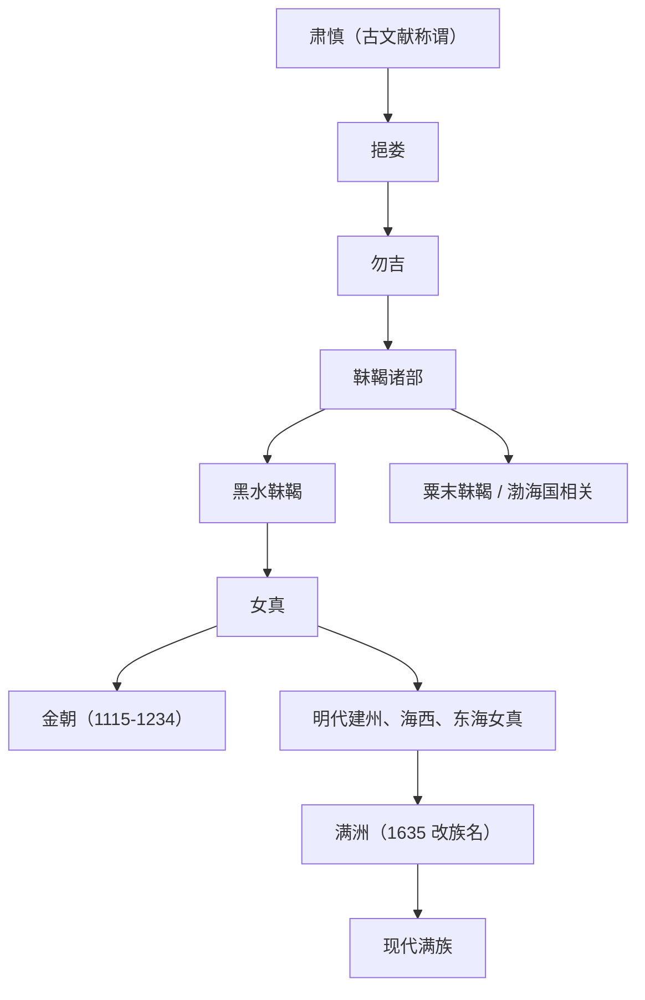

# 女真

## 校正版演进图

> “肃慎—女真”是东北亚长时段文献和族群线索，不是同一个民族名称的连续改译。

## 概括

女真是辽金时期东北通古斯语族人群，完颜部建立金朝。

## 起源

黑水靺鞨等东北部族

### 起源详细补充

- 女真兴起于辽金时期东北，常从黑水靺鞨等线索发展而来。
- 女真内部有生女真、熟女真等差别，受辽朝控制程度不同。
- 其语言属于通古斯语族满-女真支。

## 变迁

金亡后女真各部分散；明代形成建州、海西、东海等女真分区，17 世纪由建州女真整合为满洲。

### 变迁详细补充

- 完颜阿骨打统一女真诸部并于1115年建立金朝。
- 金亡后女真分散于东北，明代形成建州、海西、东海等分区。
- 努尔哈赤以建州女真为核心统一诸部，皇太极改称满洲，清代形成满族。

## 主要世系表（金朝）

| 顺序 | 姓名 | 庙号 / 谥号 | 在位时间 | 关键事件 / 备注 |
|---|---|---|---|---|
| 1 | **完颜阿骨打** | 金太祖 | 1115-1123 | 建立金朝，起兵反辽。 |
| 2 | 完颜晟 | 金太宗 | 1123-1135 | 灭辽、北宋。 |
| 3 | 完颜亶 | 金熙宗 | 1135-1150 | 推行汉制，后被弑。 |
| 4 | 完颜亮 | 海陵王 | 1150-1161 | 迁都燕京，南侵失败被杀。 |
| 5 | **完颜雍** | 金世宗 | 1161-1189 | 金朝治世代表。 |
| 6 | 完颜璟 | 金章宗 | 1189-1208 | 金朝文化高峰，后期衰弱。 |
| 7 | 完颜永济 | 卫绍王 | 1208-1213 | 蒙古压力加重。 |
| 8 | 完颜珣 | 金宣宗 | 1213-1224 | 迁都汴京。 |
| 9 | 完颜守绪 | 金哀宗 | 1224-1234 | 1234 年蒙宋灭金。 |
| 10 | 完颜承麟 | 金末帝 | 1234 | 在位极短，金亡。 |

## 所属大类

- [通古斯语族与肃慎](/%E4%BA%BA%E6%96%87%E7%A7%91%E5%AD%A6/%E5%8E%86%E5%8F%B2-%E4%B8%AD%E5%9B%BD/%E6%B0%91%E6%97%8F/%E9%80%9A%E5%8F%A4%E6%96%AF%E8%AF%AD%E6%97%8F%E4%B8%8E%E8%82%83%E6%85%8E/README.md)

## 相关笔记

- [建州女真](/%E4%BA%BA%E6%96%87%E7%A7%91%E5%AD%A6/%E5%8E%86%E5%8F%B2-%E4%B8%AD%E5%9B%BD/%E6%B0%91%E6%97%8F/%E9%80%9A%E5%8F%A4%E6%96%AF%E8%AF%AD%E6%97%8F%E4%B8%8E%E8%82%83%E6%85%8E/%E5%A5%B3%E7%9C%9F%E8%AF%B8%E9%83%A8/%E5%BB%BA%E5%B7%9E%E5%A5%B3%E7%9C%9F.md)
- [海西女真](/%E4%BA%BA%E6%96%87%E7%A7%91%E5%AD%A6/%E5%8E%86%E5%8F%B2-%E4%B8%AD%E5%9B%BD/%E6%B0%91%E6%97%8F/%E9%80%9A%E5%8F%A4%E6%96%AF%E8%AF%AD%E6%97%8F%E4%B8%8E%E8%82%83%E6%85%8E/%E5%A5%B3%E7%9C%9F%E8%AF%B8%E9%83%A8/%E6%B5%B7%E8%A5%BF%E5%A5%B3%E7%9C%9F.md)
- [东海女真](/%E4%BA%BA%E6%96%87%E7%A7%91%E5%AD%A6/%E5%8E%86%E5%8F%B2-%E4%B8%AD%E5%9B%BD/%E6%B0%91%E6%97%8F/%E9%80%9A%E5%8F%A4%E6%96%AF%E8%AF%AD%E6%97%8F%E4%B8%8E%E8%82%83%E6%85%8E/%E5%A5%B3%E7%9C%9F%E8%AF%B8%E9%83%A8/%E4%B8%9C%E6%B5%B7%E5%A5%B3%E7%9C%9F.md)
- [满洲](/%E4%BA%BA%E6%96%87%E7%A7%91%E5%AD%A6/%E5%8E%86%E5%8F%B2-%E4%B8%AD%E5%9B%BD/%E6%B0%91%E6%97%8F/%E9%80%9A%E5%8F%A4%E6%96%AF%E8%AF%AD%E6%97%8F%E4%B8%8E%E8%82%83%E6%85%8E/%E6%BB%A1%E6%B4%B2%E6%BB%A1%E6%97%8F/%E6%BB%A1%E6%B4%B2.md)
- [满族](/%E4%BA%BA%E6%96%87%E7%A7%91%E5%AD%A6/%E5%8E%86%E5%8F%B2-%E4%B8%AD%E5%9B%BD/%E6%B0%91%E6%97%8F/%E9%80%9A%E5%8F%A4%E6%96%AF%E8%AF%AD%E6%97%8F%E4%B8%8E%E8%82%83%E6%85%8E/%E6%BB%A1%E6%B4%B2%E6%BB%A1%E6%97%8F/%E6%BB%A1%E6%97%8F.md)

## 相关总览

- [华夏周边民族](/%E4%BA%BA%E6%96%87%E7%A7%91%E5%AD%A6/%E5%8E%86%E5%8F%B2-%E4%B8%AD%E5%9B%BD/%E6%B0%91%E6%97%8F/README.md)
- [起源](/%E4%BA%BA%E6%96%87%E7%A7%91%E5%AD%A6/%E5%8E%86%E5%8F%B2-%E4%B8%AD%E5%9B%BD/%E6%B0%91%E6%97%8F/README.md#起源)
- [变迁](/%E4%BA%BA%E6%96%87%E7%A7%91%E5%AD%A6/%E5%8E%86%E5%8F%B2-%E4%B8%AD%E5%9B%BD/%E6%B0%91%E6%97%8F/README.md#变迁)
