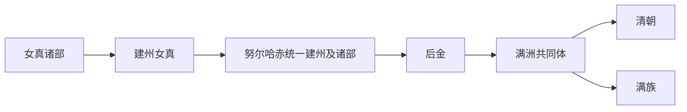

# 建州女真

## 概括

建州女真是明代女真三大部之一，活动于长白山、辽东以东。

## 起源

女真诸部中的建州集团

### 起源详细补充

- 建州女真是明代女真三大部之一，核心在长白山、浑江、鸭绿江和辽东以东。
- 其形成包含元明边疆迁徙、女真诸部重组和明朝卫所体系影响。
- 建州内部又有苏克素护河、浑河、完颜、董鄂等多种部族线索。

## 变迁

努尔哈赤以建州女真为核心统一女真诸部，建立后金，是清朝兴起的核心。

### 变迁详细补充

- 明代建州女真在朝贡、互市和边防体系中逐步壮大。
- 努尔哈赤整合建州及周边女真，建立后金。
- 建州女真后来成为满洲八旗和清朝统治集团的核心。

## 演进图

## 主要世系表（建州女真至后金）

| 顺序 | 姓名 | 身份 / 称号 | 在位 / 掌权时间 | 关键事件 / 备注 |
|---|---|---|---|---|
| 1 | 猛哥帖木儿 | 建州女真首领 | 14 世纪末-1433 | 建州左卫重要祖先。 |
| 2 | 董山 | 建州女真首领 | 15 世纪 | 明代建州重要首领。 |
| 3 | 福满 | 爱新觉罗氏祖先 | 16 世纪 | 清皇室追尊兴祖直皇帝。 |
| 4 | 觉昌安 | 建州首领 | ?-1583 | 努尔哈赤祖父。 |
| 5 | 塔克世 | 建州首领 | ?-1583 | 努尔哈赤之父。 |
| 6 | **努尔哈赤** | 后金天命汗 / 清太祖 | 1616-1626 | 统一建州并扩展至女真诸部，建立后金。 |
| 7 | **皇太极** | 后金汗 / 清太宗 | 1626-1643 | 改族名满洲，改国号清。 |

## 所属大类

- [通古斯语族与肃慎](/%E4%BA%BA%E6%96%87%E7%A7%91%E5%AD%A6/%E5%8E%86%E5%8F%B2-%E4%B8%AD%E5%9B%BD/%E6%B0%91%E6%97%8F/%E9%80%9A%E5%8F%A4%E6%96%AF%E8%AF%AD%E6%97%8F%E4%B8%8E%E8%82%83%E6%85%8E/README.md)

## 相关总览

- [华夏周边民族](/%E4%BA%BA%E6%96%87%E7%A7%91%E5%AD%A6/%E5%8E%86%E5%8F%B2-%E4%B8%AD%E5%9B%BD/%E6%B0%91%E6%97%8F/README.md)
- [起源](/%E4%BA%BA%E6%96%87%E7%A7%91%E5%AD%A6/%E5%8E%86%E5%8F%B2-%E4%B8%AD%E5%9B%BD/%E6%B0%91%E6%97%8F/README.md#起源)
- [变迁](/%E4%BA%BA%E6%96%87%E7%A7%91%E5%AD%A6/%E5%8E%86%E5%8F%B2-%E4%B8%AD%E5%9B%BD/%E6%B0%91%E6%97%8F/README.md#变迁)
