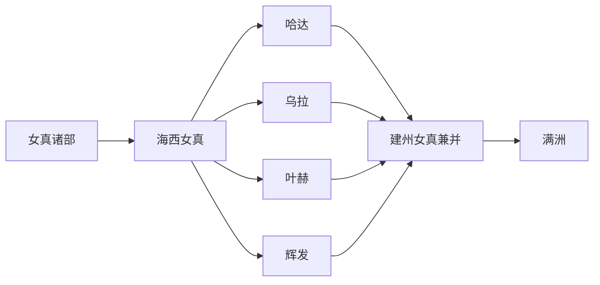

# 海西女真

## 概括

海西女真是明代女真三大集团之一，主要位于松花江中游、辉发河、哈达、乌拉、叶赫等地，后被建州女真逐步兼并。

## 起源

海西女真承接女真到满洲的东北通古斯语族相关线索。其形成与明代女真分部、后金统一和清代八旗制度密切相关。

### 起源详细补充

- 核心区域在松花江、黑龙江、乌苏里江、长白山和辽东周边。
- 与建州女真、海西女真、东海女真及满洲共同体关系密切。
- 族名变化反映政治整合，不是简单的同名改译。

## 变迁

海西女真在明清之际被纳入建州女真和满洲共同体的整合过程，后续进入清朝八旗与近现代民族识别。

## 演进图

### 变迁详细补充

- 明代女真分为建州、海西、东海等集团。
- 努尔哈赤和皇太极时期完成大规模政治整合。
- 近现代“满族”是民族识别后的现代身份。

## 主要世系表（海西四部首领节选）

| 顺序 | 部族 | 代表人物 | 时间 | 关键事件 / 备注 |
|---|---|---|---|---|
| 1 | 哈达 | 万汗 / 王台 | 16 世纪 | 海西女真强势首领。 |
| 2 | 乌拉 | 布占泰 | 16-17 世纪 | 与建州女真多次战争，后乌拉被并。 |
| 3 | 叶赫 | 金台石、布扬古 | 16-17 世纪 | 叶赫那拉氏重要首领，后被努尔哈赤灭。 |
| 4 | 辉发 | 拜音达里 | 17 世纪初 | 辉发部后被建州女真兼并。 |

## 所属大类

- [通古斯语族与肃慎](/%E4%BA%BA%E6%96%87%E7%A7%91%E5%AD%A6/%E5%8E%86%E5%8F%B2-%E4%B8%AD%E5%9B%BD/%E6%B0%91%E6%97%8F/%E9%80%9A%E5%8F%A4%E6%96%AF%E8%AF%AD%E6%97%8F%E4%B8%8E%E8%82%83%E6%85%8E/README.md)

## 相关笔记

- [女真](/%E4%BA%BA%E6%96%87%E7%A7%91%E5%AD%A6/%E5%8E%86%E5%8F%B2-%E4%B8%AD%E5%9B%BD/%E6%B0%91%E6%97%8F/%E9%80%9A%E5%8F%A4%E6%96%AF%E8%AF%AD%E6%97%8F%E4%B8%8E%E8%82%83%E6%85%8E/%E5%A5%B3%E7%9C%9F%E8%AF%B8%E9%83%A8/%E5%A5%B3%E7%9C%9F.md)
- [建州女真](/%E4%BA%BA%E6%96%87%E7%A7%91%E5%AD%A6/%E5%8E%86%E5%8F%B2-%E4%B8%AD%E5%9B%BD/%E6%B0%91%E6%97%8F/%E9%80%9A%E5%8F%A4%E6%96%AF%E8%AF%AD%E6%97%8F%E4%B8%8E%E8%82%83%E6%85%8E/%E5%A5%B3%E7%9C%9F%E8%AF%B8%E9%83%A8/%E5%BB%BA%E5%B7%9E%E5%A5%B3%E7%9C%9F.md)
- [满洲](/%E4%BA%BA%E6%96%87%E7%A7%91%E5%AD%A6/%E5%8E%86%E5%8F%B2-%E4%B8%AD%E5%9B%BD/%E6%B0%91%E6%97%8F/%E9%80%9A%E5%8F%A4%E6%96%AF%E8%AF%AD%E6%97%8F%E4%B8%8E%E8%82%83%E6%85%8E/%E6%BB%A1%E6%B4%B2%E6%BB%A1%E6%97%8F/%E6%BB%A1%E6%B4%B2.md)
- [华夏周边民族](/%E4%BA%BA%E6%96%87%E7%A7%91%E5%AD%A6/%E5%8E%86%E5%8F%B2-%E4%B8%AD%E5%9B%BD/%E6%B0%91%E6%97%8F/README.md)
- [起源](/%E4%BA%BA%E6%96%87%E7%A7%91%E5%AD%A6/%E5%8E%86%E5%8F%B2-%E4%B8%AD%E5%9B%BD/%E6%B0%91%E6%97%8F/README.md#起源)
- [变迁](/%E4%BA%BA%E6%96%87%E7%A7%91%E5%AD%A6/%E5%8E%86%E5%8F%B2-%E4%B8%AD%E5%9B%BD/%E6%B0%91%E6%97%8F/README.md#变迁)

