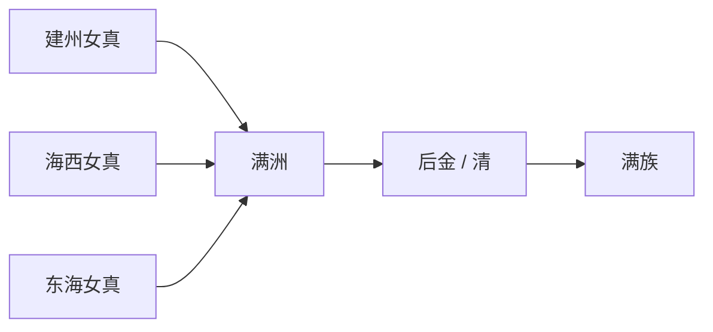

# 满洲满族

本目录是“通古斯语族与肃慎”下的二级线索，用于收纳满洲满族相关民族、部族或政权笔记。

## 演进图

## 包含笔记

- [满洲](/%E4%BA%BA%E6%96%87%E7%A7%91%E5%AD%A6/%E5%8E%86%E5%8F%B2-%E4%B8%AD%E5%9B%BD/%E6%B0%91%E6%97%8F/%E9%80%9A%E5%8F%A4%E6%96%AF%E8%AF%AD%E6%97%8F%E4%B8%8E%E8%82%83%E6%85%8E/%E6%BB%A1%E6%B4%B2%E6%BB%A1%E6%97%8F/%E6%BB%A1%E6%B4%B2.md)
- [满族](/%E4%BA%BA%E6%96%87%E7%A7%91%E5%AD%A6/%E5%8E%86%E5%8F%B2-%E4%B8%AD%E5%9B%BD/%E6%B0%91%E6%97%8F/%E9%80%9A%E5%8F%A4%E6%96%AF%E8%AF%AD%E6%97%8F%E4%B8%8E%E8%82%83%E6%85%8E/%E6%BB%A1%E6%B4%B2%E6%BB%A1%E6%97%8F/%E6%BB%A1%E6%97%8F.md)

## 上级目录

- [通古斯语族与肃慎](/%E4%BA%BA%E6%96%87%E7%A7%91%E5%AD%A6/%E5%8E%86%E5%8F%B2-%E4%B8%AD%E5%9B%BD/%E6%B0%91%E6%97%8F/%E9%80%9A%E5%8F%A4%E6%96%AF%E8%AF%AD%E6%97%8F%E4%B8%8E%E8%82%83%E6%85%8E/README.md)
- [华夏周边民族](/%E4%BA%BA%E6%96%87%E7%A7%91%E5%AD%A6/%E5%8E%86%E5%8F%B2-%E4%B8%AD%E5%9B%BD/%E6%B0%91%E6%97%8F/README.md)
