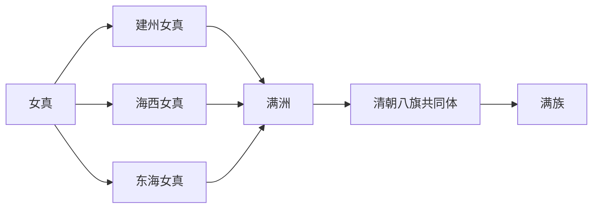

# 满族

## 概括

满族是清代满洲共同体在近现代民族识别中的现代民族名称，承接建州女真、海西女真、东海女真及八旗制度整合。

## 起源

满族承接女真到满洲的东北通古斯语族相关线索。其形成与明代女真分部、后金统一和清代八旗制度密切相关。

### 起源详细补充

- 核心区域在松花江、黑龙江、乌苏里江、长白山和辽东周边。
- 与建州女真、海西女真、东海女真及满洲共同体关系密切。
- 族名变化反映政治整合，不是简单的同名改译。

## 变迁

满族在明清之际被纳入建州女真和满洲共同体的整合过程，后续进入清朝八旗与近现代民族识别。

## 演进图

### 变迁详细补充

- 明代女真分为建州、海西、东海等集团。
- 努尔哈赤和皇太极时期完成大规模政治整合。
- 近现代“满族”是民族识别后的现代身份。

## 君主世系表（清朝主线）

| 顺序 | 姓名 | 庙号 / 年号 | 在位时间 | 关键事件 / 备注 |
|---|---|---|---|---|
| 1 | **努尔哈赤** | 清太祖 / 天命 | 1616-1626 | 建立后金，统一女真诸部。 |
| 2 | **皇太极** | 清太宗 / 天聪、崇德 | 1626-1643 | 改称满洲，改国号清。 |
| 3 | 福临 | 清世祖 / 顺治 | 1643-1661 | 清入关后第一位皇帝。 |
| 4 | **玄烨** | 清圣祖 / 康熙 | 1661-1722 | 稳定清朝版图。 |
| 5 | 胤禛 | 清世宗 / 雍正 | 1722-1735 | 强化皇权和财政制度。 |
| 6 | **弘历** | 清高宗 / 乾隆 | 1735-1796 | 清朝疆域和国力高峰。 |
| 7 | 颙琰 | 清仁宗 / 嘉庆 | 1796-1820 | 清朝由盛转衰。 |
| 8 | 旻宁 | 清宣宗 / 道光 | 1820-1850 | 鸦片战争。 |
| 9 | 奕詝 | 清文宗 / 咸丰 | 1850-1861 | 太平天国与第二次鸦片战争。 |
| 10 | 载淳 | 清穆宗 / 同治 | 1861-1875 | 同治中兴。 |
| 11 | 载湉 | 清德宗 / 光绪 | 1875-1908 | 戊戌变法、庚子事变。 |
| 12 | **溥仪** | 宣统帝 | 1908-1912 | 清末帝，1912 年退位。 |

## 所属大类

- [通古斯语族与肃慎](/%E4%BA%BA%E6%96%87%E7%A7%91%E5%AD%A6/%E5%8E%86%E5%8F%B2-%E4%B8%AD%E5%9B%BD/%E6%B0%91%E6%97%8F/%E9%80%9A%E5%8F%A4%E6%96%AF%E8%AF%AD%E6%97%8F%E4%B8%8E%E8%82%83%E6%85%8E/README.md)

## 相关笔记

- [女真](/%E4%BA%BA%E6%96%87%E7%A7%91%E5%AD%A6/%E5%8E%86%E5%8F%B2-%E4%B8%AD%E5%9B%BD/%E6%B0%91%E6%97%8F/%E9%80%9A%E5%8F%A4%E6%96%AF%E8%AF%AD%E6%97%8F%E4%B8%8E%E8%82%83%E6%85%8E/%E5%A5%B3%E7%9C%9F%E8%AF%B8%E9%83%A8/%E5%A5%B3%E7%9C%9F.md)
- [建州女真](/%E4%BA%BA%E6%96%87%E7%A7%91%E5%AD%A6/%E5%8E%86%E5%8F%B2-%E4%B8%AD%E5%9B%BD/%E6%B0%91%E6%97%8F/%E9%80%9A%E5%8F%A4%E6%96%AF%E8%AF%AD%E6%97%8F%E4%B8%8E%E8%82%83%E6%85%8E/%E5%A5%B3%E7%9C%9F%E8%AF%B8%E9%83%A8/%E5%BB%BA%E5%B7%9E%E5%A5%B3%E7%9C%9F.md)
- [满洲](/%E4%BA%BA%E6%96%87%E7%A7%91%E5%AD%A6/%E5%8E%86%E5%8F%B2-%E4%B8%AD%E5%9B%BD/%E6%B0%91%E6%97%8F/%E9%80%9A%E5%8F%A4%E6%96%AF%E8%AF%AD%E6%97%8F%E4%B8%8E%E8%82%83%E6%85%8E/%E6%BB%A1%E6%B4%B2%E6%BB%A1%E6%97%8F/%E6%BB%A1%E6%B4%B2.md)
- [华夏周边民族](/%E4%BA%BA%E6%96%87%E7%A7%91%E5%AD%A6/%E5%8E%86%E5%8F%B2-%E4%B8%AD%E5%9B%BD/%E6%B0%91%E6%97%8F/README.md)
- [起源](/%E4%BA%BA%E6%96%87%E7%A7%91%E5%AD%A6/%E5%8E%86%E5%8F%B2-%E4%B8%AD%E5%9B%BD/%E6%B0%91%E6%97%8F/README.md#起源)
- [变迁](/%E4%BA%BA%E6%96%87%E7%A7%91%E5%AD%A6/%E5%8E%86%E5%8F%B2-%E4%B8%AD%E5%9B%BD/%E6%B0%91%E6%97%8F/README.md#变迁)

## 参考

- [Jurchen people](https://en.wikipedia.org/wiki/Jurchen_people)
- [Manchu people](https://en.wikipedia.org/wiki/Manchu_people)
