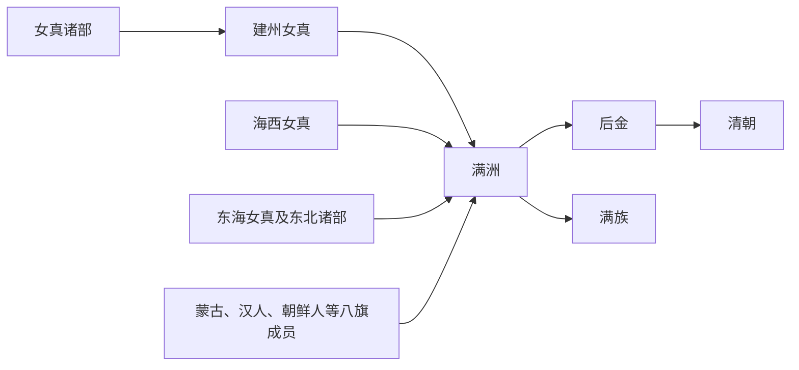

# 满洲

## 概括

满洲是皇太极 1635 年改定的族名，用以整合女真诸部和后金政治共同体。

## 起源

建州女真、海西女真、东海女真及归附部众

### 起源详细补充

- 满洲是皇太极在1635年正式改定的族名，用以取代旧称女真。
- 满洲身份并非单一血缘，而是八旗制度、政治归属和族名整合的结果。
- 其中包含建州、海西、东海女真以及部分蒙古、汉军、朝鲜等归附群体。

## 变迁

清代形成满洲八旗和现代满族身份，内部也吸收蒙古、汉军、朝鲜等成分。

### 变迁详细补充

- 后金改国号清后，满洲八旗成为清朝军事和政治核心。
- 入关后满洲人分驻京师、东北和全国驻防城，与汉、蒙古等长期互动。
- 近现代民族识别中形成满族，但满语使用大幅衰退，身份更多依赖历史和族群记忆。

## 演进图

## 君主世系表（后金至清）

| 顺序 | 姓名 | 庙号 / 年号 | 在位时间 | 关键事件 / 备注 |
|---|---|---|---|---|
| 1 | **努尔哈赤** | 清太祖 / 天命 | 1616-1626 | 建立后金，统一女真诸部。 |
| 2 | **皇太极** | 清太宗 / 天聪、崇德 | 1626-1643 | 改称满洲，改国号清。 |
| 3 | 福临 | 清世祖 / 顺治 | 1643-1661 | 清入关后第一位皇帝。 |
| 4 | **玄烨** | 清圣祖 / 康熙 | 1661-1722 | 平三藩、统一台湾、稳定清朝版图。 |
| 5 | 胤禛 | 清世宗 / 雍正 | 1722-1735 | 强化皇权和财政制度。 |
| 6 | **弘历** | 清高宗 / 乾隆 | 1735-1796 | 清朝疆域和国力高峰。 |
| 7 | 颙琰 | 清仁宗 / 嘉庆 | 1796-1820 | 白莲教起事后清朝转衰。 |
| 8 | 旻宁 | 清宣宗 / 道光 | 1820-1850 | 鸦片战争。 |
| 9 | 奕詝 | 清文宗 / 咸丰 | 1850-1861 | 太平天国与第二次鸦片战争。 |
| 10 | 载淳 | 清穆宗 / 同治 | 1861-1875 | 同治中兴。 |
| 11 | 载湉 | 清德宗 / 光绪 | 1875-1908 | 戊戌变法、庚子事变。 |
| 12 | **溥仪** | 宣统帝 | 1908-1912 | 清末帝，1912 年退位。 |

## 所属大类

- [通古斯语族与肃慎](/%E4%BA%BA%E6%96%87%E7%A7%91%E5%AD%A6/%E5%8E%86%E5%8F%B2-%E4%B8%AD%E5%9B%BD/%E6%B0%91%E6%97%8F/%E9%80%9A%E5%8F%A4%E6%96%AF%E8%AF%AD%E6%97%8F%E4%B8%8E%E8%82%83%E6%85%8E/README.md)

## 相关总览

- [华夏周边民族](/%E4%BA%BA%E6%96%87%E7%A7%91%E5%AD%A6/%E5%8E%86%E5%8F%B2-%E4%B8%AD%E5%9B%BD/%E6%B0%91%E6%97%8F/README.md)
- [起源](/%E4%BA%BA%E6%96%87%E7%A7%91%E5%AD%A6/%E5%8E%86%E5%8F%B2-%E4%B8%AD%E5%9B%BD/%E6%B0%91%E6%97%8F/README.md#起源)
- [变迁](/%E4%BA%BA%E6%96%87%E7%A7%91%E5%AD%A6/%E5%8E%86%E5%8F%B2-%E4%B8%AD%E5%9B%BD/%E6%B0%91%E6%97%8F/README.md#变迁)
