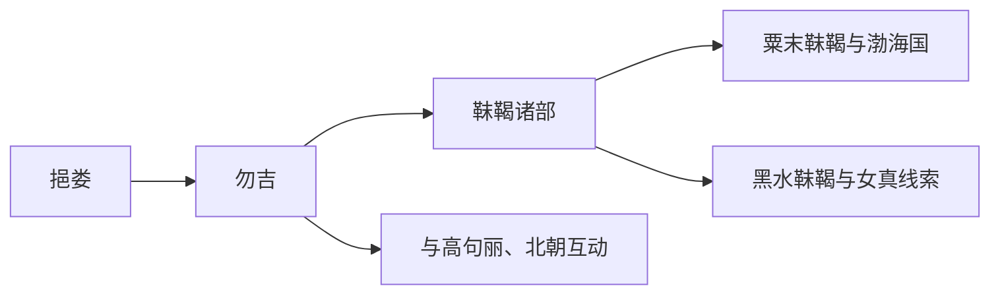

# 勿吉

## 概括

勿吉是南北朝时期东北族群称谓，通常被视为靺鞨前身之一。

## 起源

挹娄、肃慎相关东北人群

### 起源详细补充

- 勿吉是南北朝时期东北族群称谓，继承挹娄相关区域线索。
- 其活动范围包括松花江流域、黑龙江流域和长白山北麓。
- 勿吉内部已有多个部落和地域分支。

## 变迁

隋唐时期被靺鞨称谓取代，分化为多个靺鞨部。

### 变迁详细补充

- 勿吉在南北朝时期向中原朝贡，也与高句丽、扶余等发生冲突。
- 隋唐时期勿吉称谓逐渐被靺鞨取代。
- 其各部成为粟末靺鞨、黑水靺鞨等后续分支的重要来源。

## 演进图

## 世系说明

勿吉不是一个单一王朝或固定家族名称，而是南北朝时期东北多个部族集团的总称，因此没有能够连续排列的统一君主世系。可考的政治世系应分别放在靺鞨、渤海国、女真等具体政权或部族笔记中。

## 所属大类

- [通古斯语族与肃慎](/%E4%BA%BA%E6%96%87%E7%A7%91%E5%AD%A6/%E5%8E%86%E5%8F%B2-%E4%B8%AD%E5%9B%BD/%E6%B0%91%E6%97%8F/%E9%80%9A%E5%8F%A4%E6%96%AF%E8%AF%AD%E6%97%8F%E4%B8%8E%E8%82%83%E6%85%8E/README.md)

## 相关总览

- [华夏周边民族](/%E4%BA%BA%E6%96%87%E7%A7%91%E5%AD%A6/%E5%8E%86%E5%8F%B2-%E4%B8%AD%E5%9B%BD/%E6%B0%91%E6%97%8F/README.md)
- [起源](/%E4%BA%BA%E6%96%87%E7%A7%91%E5%AD%A6/%E5%8E%86%E5%8F%B2-%E4%B8%AD%E5%9B%BD/%E6%B0%91%E6%97%8F/README.md#起源)
- [变迁](/%E4%BA%BA%E6%96%87%E7%A7%91%E5%AD%A6/%E5%8E%86%E5%8F%B2-%E4%B8%AD%E5%9B%BD/%E6%B0%91%E6%97%8F/README.md#变迁)
