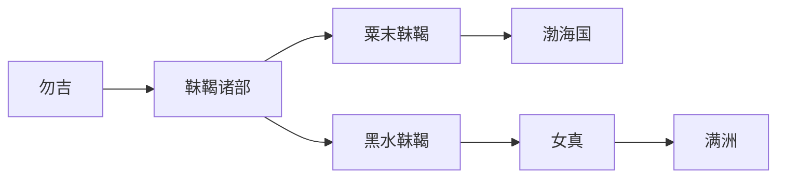

# 靺鞨

## 概括

靺鞨是隋唐时期东北重要族群，分为粟末、黑水等多部。

## 起源

勿吉及东北诸部

### 起源详细补充

- 靺鞨是隋唐时期东北重要族群，通常视为勿吉后续称谓。
- 靺鞨分粟末、黑水、白山、伯咄、安车骨、拂涅、号室等部。
- 各部经济形态和政治关系不同，不能视为单一国家。

## 变迁

粟末靺鞨建立渤海国，黑水靺鞨常被视为女真重要来源。

### 变迁详细补充

- 粟末靺鞨与高句丽遗民共同构成渤海国核心。
- 黑水靺鞨在唐辽之间保持较强独立性，常被视为女真重要来源。
- 辽金时期靺鞨名称逐渐被女真取代。

## 演进图

## 世系说明

靺鞨不是一个单一王朝或固定家族名称，而是隋唐时期东北诸部的总称，内部有粟末、黑水等多支，因此没有能够连续排列的统一君主世系。可考的政治世系应分别放在渤海国、女真等具体政权或部族笔记中。

## 所属大类

- [通古斯语族与肃慎](/%E4%BA%BA%E6%96%87%E7%A7%91%E5%AD%A6/%E5%8E%86%E5%8F%B2-%E4%B8%AD%E5%9B%BD/%E6%B0%91%E6%97%8F/%E9%80%9A%E5%8F%A4%E6%96%AF%E8%AF%AD%E6%97%8F%E4%B8%8E%E8%82%83%E6%85%8E/README.md)

## 相关总览

- [华夏周边民族](/%E4%BA%BA%E6%96%87%E7%A7%91%E5%AD%A6/%E5%8E%86%E5%8F%B2-%E4%B8%AD%E5%9B%BD/%E6%B0%91%E6%97%8F/README.md)
- [起源](/%E4%BA%BA%E6%96%87%E7%A7%91%E5%AD%A6/%E5%8E%86%E5%8F%B2-%E4%B8%AD%E5%9B%BD/%E6%B0%91%E6%97%8F/README.md#起源)
- [变迁](/%E4%BA%BA%E6%96%87%E7%A7%91%E5%AD%A6/%E5%8E%86%E5%8F%B2-%E4%B8%AD%E5%9B%BD/%E6%B0%91%E6%97%8F/README.md#变迁)
