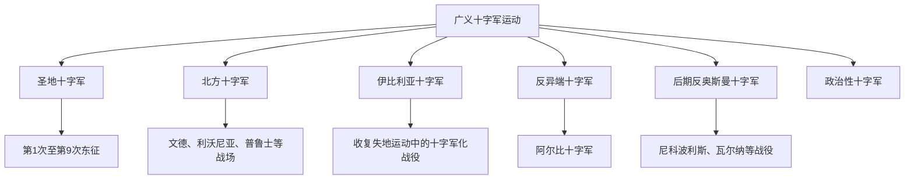

# 广义十字军运动

## 概括

广义十字军运动指教廷将十字军制度、赎罪承诺、军事宣誓和特许权扩展到圣地之外的战争。它们可能针对穆斯林政权、异教民族、被认定为异端的基督徒群体，甚至教宗的政治敌人。因此，“十字军”不只是第1次至第9次圣地远征，而是一套中世纪拉丁基督教世界动员战争的制度和话语。

## 类型关系

## 主要类型

| 顺序 | 名称 | 时间 | 简要概括 |
|---:|---|---|---|
| 1 | [北方十字军](%E4%BA%BA%E6%96%87%E7%A7%91%E5%AD%A6/%E5%8E%86%E5%8F%B2-%E5%A4%96%E5%9B%BD/_%E9%80%9A%E5%8F%B2/%E5%8D%81%E5%AD%97%E5%86%9B%E4%B8%9C%E5%BE%81/%E5%B9%BF%E4%B9%89%E5%8D%81%E5%AD%97%E5%86%9B%E8%BF%90%E5%8A%A8/%E5%8C%97%E6%96%B9%E5%8D%81%E5%AD%97%E5%86%9B.md) | 12世纪－15世纪 | 德意志、丹麦、瑞典和军事修会在波罗的海沿岸推动的征服、传教和殖民战争。 |
| 2 | [伊比利亚十字军](%E4%BA%BA%E6%96%87%E7%A7%91%E5%AD%A6/%E5%8E%86%E5%8F%B2-%E5%A4%96%E5%9B%BD/_%E9%80%9A%E5%8F%B2/%E5%8D%81%E5%AD%97%E5%86%9B%E4%B8%9C%E5%BE%81/%E5%B9%BF%E4%B9%89%E5%8D%81%E5%AD%97%E5%86%9B%E8%BF%90%E5%8A%A8/%E4%BC%8A%E6%AF%94%E5%88%A9%E4%BA%9A%E5%8D%81%E5%AD%97%E5%86%9B.md) | 11世纪－15世纪 | 伊比利亚基督教王国对安达卢斯穆斯林政权的战争，其中部分战役被教廷赋予十字军性质。 |
| 3 | [阿尔比十字军](%E4%BA%BA%E6%96%87%E7%A7%91%E5%AD%A6/%E5%8E%86%E5%8F%B2-%E5%A4%96%E5%9B%BD/_%E9%80%9A%E5%8F%B2/%E5%8D%81%E5%AD%97%E5%86%9B%E4%B8%9C%E5%BE%81/%E5%B9%BF%E4%B9%89%E5%8D%81%E5%AD%97%E5%86%9B%E8%BF%90%E5%8A%A8/%E9%98%BF%E5%B0%94%E6%AF%94%E5%8D%81%E5%AD%97%E5%86%9B.md) | 1209年－1229年 | 教廷和法国北部贵族针对法国南部卡特里派及其保护者发动的反异端战争。 |
| 4 | [后期反奥斯曼十字军](%E4%BA%BA%E6%96%87%E7%A7%91%E5%AD%A6/%E5%8E%86%E5%8F%B2-%E5%A4%96%E5%9B%BD/_%E9%80%9A%E5%8F%B2/%E5%8D%81%E5%AD%97%E5%86%9B%E4%B8%9C%E5%BE%81/%E5%B9%BF%E4%B9%89%E5%8D%81%E5%AD%97%E5%86%9B%E8%BF%90%E5%8A%A8/%E5%90%8E%E6%9C%9F%E5%8F%8D%E5%A5%A5%E6%96%AF%E6%9B%BC%E5%8D%81%E5%AD%97%E5%86%9B.md) | 14世纪－15世纪 | 奥斯曼帝国在巴尔干扩张后，教廷和欧洲君主组织的防御与反攻行动。 |

## 说明

- “十字军”身份通常与教宗授权、十字军誓愿、赎罪承诺、财产保护、债务或司法特许等制度相关。
- 同一场战争是否称为“十字军”，常取决于教廷授权、参与者宣传和后世史学分类。
- 广义十字军运动不等于单纯的宗教战争；它经常与王权扩张、贵族土地利益、商业路线、边疆殖民和教会管辖权交织。

## 演变关系

- 上级目录：[十字军东征](%E4%BA%BA%E6%96%87%E7%A7%91%E5%AD%A6/%E5%8E%86%E5%8F%B2-%E5%A4%96%E5%9B%BD/_%E9%80%9A%E5%8F%B2/%E5%8D%81%E5%AD%97%E5%86%9B%E4%B8%9C%E5%BE%81/README.md)。
- 并列关系：本目录补充狭义圣地东征之外的十字军类型。
