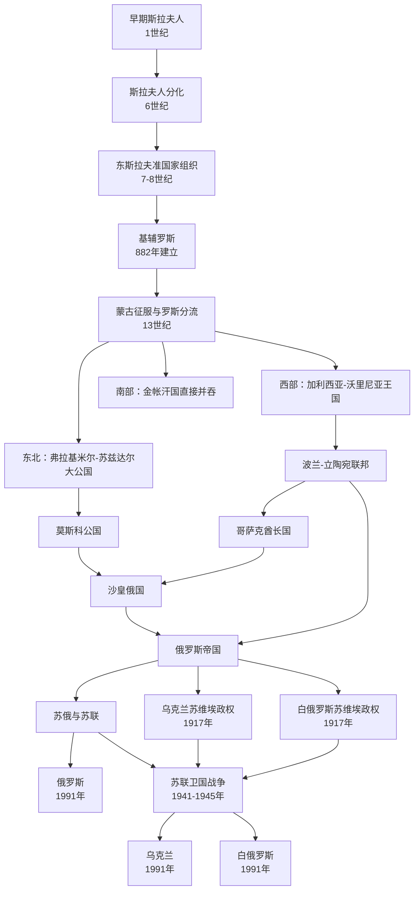

# 东斯拉夫历史演变

| 顺序 | 名称 | 时间 | 简要概括 |
| --- | --- | --- | --- |
| 1 | [早期斯拉夫人](/%E4%BA%BA%E6%96%87%E7%A7%91%E5%AD%A6/%E5%8E%86%E5%8F%B2-%E5%A4%96%E5%9B%BD/%E4%B8%9C%E6%96%AF%E6%8B%89%E5%A4%AB/%E6%97%A9%E6%9C%9F%E6%96%AF%E6%8B%89%E5%A4%AB%E4%BA%BA.md) | 1世纪 | 斯拉夫人分布在中东欧的第聂伯河、奥得河、维斯瓦河及布格河流域。 |
| 2 | [斯拉夫人分化](/%E4%BA%BA%E6%96%87%E7%A7%91%E5%AD%A6/%E5%8E%86%E5%8F%B2-%E5%A4%96%E5%9B%BD/%E4%B8%9C%E6%96%AF%E6%8B%89%E5%A4%AB/%E6%96%AF%E6%8B%89%E5%A4%AB%E4%BA%BA%E5%88%86%E5%8C%96.md) | 6世纪 | 斯拉夫人分化为东斯拉夫人、西斯拉夫人和南斯拉夫人。 |
| 3 | [东斯拉夫准国家组织](/%E4%BA%BA%E6%96%87%E7%A7%91%E5%AD%A6/%E5%8E%86%E5%8F%B2-%E5%A4%96%E5%9B%BD/%E4%B8%9C%E6%96%AF%E6%8B%89%E5%A4%AB/%E4%B8%9C%E6%96%AF%E6%8B%89%E5%A4%AB%E5%87%86%E5%9B%BD%E5%AE%B6%E7%BB%84%E7%BB%87.md) | 7-8世纪 | 东斯拉夫人形成以基辅和诺夫哥罗德为中心的两个准国家组织。 |
| 4 | [基辅罗斯](/%E4%BA%BA%E6%96%87%E7%A7%91%E5%AD%A6/%E5%8E%86%E5%8F%B2-%E5%A4%96%E5%9B%BD/%E4%B8%9C%E6%96%AF%E6%8B%89%E5%A4%AB/%E5%9F%BA%E8%BE%85%E7%BD%97%E6%96%AF.md) | 862年-13世纪 | 瓦良格人留里克开启罗斯历史上的留里克王朝，奥列格于882年建立以基辅为中心的基辅罗斯。 |
| 5 | [蒙古征服与罗斯分流](/%E4%BA%BA%E6%96%87%E7%A7%91%E5%AD%A6/%E5%8E%86%E5%8F%B2-%E5%A4%96%E5%9B%BD/%E4%B8%9C%E6%96%AF%E6%8B%89%E5%A4%AB/%E8%92%99%E5%8F%A4%E5%BE%81%E6%9C%8D%E4%B8%8E%E7%BD%97%E6%96%AF%E5%88%86%E6%B5%81.md) | 13世纪 | 基辅罗斯被蒙古人的金帐汗国占领，旧罗斯地区分化为东北、西部、南部三条走向。 |
| 6 | [弗拉基米尔-苏兹达尔大公国](/%E4%BA%BA%E6%96%87%E7%A7%91%E5%AD%A6/%E5%8E%86%E5%8F%B2-%E5%A4%96%E5%9B%BD/%E4%B8%9C%E6%96%AF%E6%8B%89%E5%A4%AB/%E5%BC%97%E6%8B%89%E5%9F%BA%E7%B1%B3%E5%B0%94-%E8%8B%8F%E5%85%B9%E8%BE%BE%E5%B0%94%E5%A4%A7%E5%85%AC%E5%9B%BD.md) | 13世纪以后 | 东北罗斯一支，后来发展出莫斯科公国，被视为俄罗斯前身。 |
| 7 | [加利西亚-沃里尼亚王国](/%E4%BA%BA%E6%96%87%E7%A7%91%E5%AD%A6/%E5%8E%86%E5%8F%B2-%E5%A4%96%E5%9B%BD/%E4%B8%9C%E6%96%AF%E6%8B%89%E5%A4%AB/%E5%8A%A0%E5%88%A9%E8%A5%BF%E4%BA%9A-%E6%B2%83%E9%87%8C%E5%B0%BC%E4%BA%9A%E7%8E%8B%E5%9B%BD.md) | 13世纪以后 | 西部罗斯一支，又称卢森尼亚王国，被视为乌克兰前身。 |
| 8 | [莫斯科公国](/%E4%BA%BA%E6%96%87%E7%A7%91%E5%AD%A6/%E5%8E%86%E5%8F%B2-%E5%A4%96%E5%9B%BD/%E4%B8%9C%E6%96%AF%E6%8B%89%E5%A4%AB/%E8%8E%AB%E6%96%AF%E7%A7%91%E5%85%AC%E5%9B%BD.md) | 15世纪以后 | 1480年伊凡三世推翻蒙古统治，莫斯科公国获得独立并持续扩张。 |
| 9 | [波兰-立陶宛联邦](/%E4%BA%BA%E6%96%87%E7%A7%91%E5%AD%A6/%E5%8E%86%E5%8F%B2-%E5%A4%96%E5%9B%BD/%E4%B8%9C%E6%96%AF%E6%8B%89%E5%A4%AB/%E6%B3%A2%E5%85%B0-%E7%AB%8B%E9%99%B6%E5%AE%9B%E8%81%94%E9%82%A6.md) | 16-18世纪 | 西罗斯和部分乌克兰地区进入波兰-立陶宛体系，后来衰落并被俄、普、奥三次瓜分。 |
| 10 | [哥萨克酋长国](/%E4%BA%BA%E6%96%87%E7%A7%91%E5%AD%A6/%E5%8E%86%E5%8F%B2-%E5%A4%96%E5%9B%BD/%E4%B8%9C%E6%96%AF%E6%8B%89%E5%A4%AB/%E5%93%A5%E8%90%A8%E5%85%8B%E9%85%8B%E9%95%BF%E5%9B%BD.md) | 1648年-18世纪 | 赫梅利尼茨基起义后建立，1654年与沙皇俄国结盟，后来被俄罗斯帝国吞并。 |
| 11 | [沙皇俄国](/%E4%BA%BA%E6%96%87%E7%A7%91%E5%AD%A6/%E5%8E%86%E5%8F%B2-%E5%A4%96%E5%9B%BD/%E4%B8%9C%E6%96%AF%E6%8B%89%E5%A4%AB/%E6%B2%99%E7%9A%87%E4%BF%84%E5%9B%BD.md) | 16世纪-1721年 | 莫斯科国家扩张形成沙皇俄国，并吸纳东乌克兰和哥萨克酋长国。 |
| 12 | [俄罗斯帝国](/%E4%BA%BA%E6%96%87%E7%A7%91%E5%AD%A6/%E5%8E%86%E5%8F%B2-%E5%A4%96%E5%9B%BD/%E4%B8%9C%E6%96%AF%E6%8B%89%E5%A4%AB/%E4%BF%84%E7%BD%97%E6%96%AF%E5%B8%9D%E5%9B%BD.md) | 1721年-1917年 | 在东欧持续扩张，白俄罗斯和西乌克兰等旧罗斯地区先后并入其版图。 |
| 13 | [乌克兰苏维埃政权](/%E4%BA%BA%E6%96%87%E7%A7%91%E5%AD%A6/%E5%8E%86%E5%8F%B2-%E5%A4%96%E5%9B%BD/%E4%B8%9C%E6%96%AF%E6%8B%89%E5%A4%AB/%E4%B9%8C%E5%85%8B%E5%85%B0%E8%8B%8F%E7%BB%B4%E5%9F%83%E6%94%BF%E6%9D%83.md) | 1917年-1991年 | 1917年乌克兰苏维埃政权成立，西乌克兰在1939年并入乌克兰苏维埃社会主义共和国。 |
| 14 | [白俄罗斯苏维埃政权](/%E4%BA%BA%E6%96%87%E7%A7%91%E5%AD%A6/%E5%8E%86%E5%8F%B2-%E5%A4%96%E5%9B%BD/%E4%B8%9C%E6%96%AF%E6%8B%89%E5%A4%AB/%E7%99%BD%E4%BF%84%E7%BD%97%E6%96%AF%E8%8B%8F%E7%BB%B4%E5%9F%83%E6%94%BF%E6%9D%83.md) | 1917年-1991年 | 1917年白俄罗斯苏维埃政权建立，西白俄罗斯在1939年并入白俄罗斯苏维埃社会主义共和国。 |
| 15 | [苏俄与苏联](/%E4%BA%BA%E6%96%87%E7%A7%91%E5%AD%A6/%E5%8E%86%E5%8F%B2-%E5%A4%96%E5%9B%BD/%E4%B8%9C%E6%96%AF%E6%8B%89%E5%A4%AB/%E8%8B%8F%E4%BF%84%E4%B8%8E%E8%8B%8F%E8%81%94.md) | 1917年-1991年 | 1917年苏俄成立，1922年苏联成立，俄罗斯苏维埃联邦成为苏联核心加盟共和国。 |
| 16 | [苏联卫国战争](/%E4%BA%BA%E6%96%87%E7%A7%91%E5%AD%A6/%E5%8E%86%E5%8F%B2-%E5%A4%96%E5%9B%BD/%E4%B8%9C%E6%96%AF%E6%8B%89%E5%A4%AB/%E8%8B%8F%E8%81%94%E5%8D%AB%E5%9B%BD%E6%88%98%E4%BA%89.md) | 1941-1945年 | 乌克兰和白俄罗斯在1941年被德国占领，1944年分别解放。 |
| 17 | [乌克兰](/%E4%BA%BA%E6%96%87%E7%A7%91%E5%AD%A6/%E5%8E%86%E5%8F%B2-%E5%A4%96%E5%9B%BD/%E4%B8%9C%E6%96%AF%E6%8B%89%E5%A4%AB/%E4%B9%8C%E5%85%8B%E5%85%B0.md) | 1991年至今 | 1991年8月24日宣布脱离苏联独立。 |
| 18 | [俄罗斯](/%E4%BA%BA%E6%96%87%E7%A7%91%E5%AD%A6/%E5%8E%86%E5%8F%B2-%E5%A4%96%E5%9B%BD/%E4%B8%9C%E6%96%AF%E6%8B%89%E5%A4%AB/%E4%BF%84%E7%BD%97%E6%96%AF.md) | 1991年至今 | 1991年12月25日苏联解体，俄罗斯联邦成为苏联唯一继承国。 |
| 19 | [白俄罗斯](/%E4%BA%BA%E6%96%87%E7%A7%91%E5%AD%A6/%E5%8E%86%E5%8F%B2-%E5%A4%96%E5%9B%BD/%E4%B8%9C%E6%96%AF%E6%8B%89%E5%A4%AB/%E7%99%BD%E4%BF%84%E7%BD%97%E6%96%AF.md) | 1991年至今 | 1991年8月25日宣布脱离苏联独立。 |
