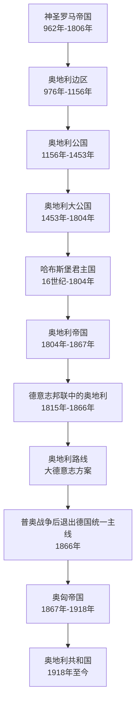

# 奥地利历史

奥地利是德意志世界的重要分支，长期处在神圣罗马帝国和德意志邦联的核心位置。1866年普奥战争后，奥地利被排除出普鲁士主导的德意志统一进程，随后转向奥匈帝国和现代奥地利共和国的发展路径。

| 顺序 | 阶段 | 时间 | 简要概括 |
| --- | --- | --- | --- |
| 1 | [奥地利边区](%E4%BA%BA%E6%96%87%E7%A7%91%E5%AD%A6/%E5%8E%86%E5%8F%B2-%E5%A4%96%E5%9B%BD/%E5%BE%B7%E6%84%8F%E5%BF%97/%E5%A5%A5%E5%9C%B0%E5%88%A9/%E5%A5%A5%E5%9C%B0%E5%88%A9%E8%BE%B9%E5%8C%BA.md) | 976年-1156年 | 神圣罗马帝国东部边区，是奥地利政治实体的早期形态。 |
| 2 | [奥地利公国](%E4%BA%BA%E6%96%87%E7%A7%91%E5%AD%A6/%E5%8E%86%E5%8F%B2-%E5%A4%96%E5%9B%BD/%E5%BE%B7%E6%84%8F%E5%BF%97/%E5%A5%A5%E5%9C%B0%E5%88%A9/%E5%A5%A5%E5%9C%B0%E5%88%A9%E5%85%AC%E5%9B%BD.md) | 1156年-1453年 | 奥地利由边区升格为公国。 |
| 3 | [奥地利大公国](%E4%BA%BA%E6%96%87%E7%A7%91%E5%AD%A6/%E5%8E%86%E5%8F%B2-%E5%A4%96%E5%9B%BD/%E5%BE%B7%E6%84%8F%E5%BF%97/%E5%A5%A5%E5%9C%B0%E5%88%A9/%E5%A5%A5%E5%9C%B0%E5%88%A9%E5%A4%A7%E5%85%AC%E5%9B%BD.md) | 1453年-1804年 | 哈布斯堡家族核心领地，长期影响神圣罗马帝国。 |
| 4 | [哈布斯堡君主国](%E4%BA%BA%E6%96%87%E7%A7%91%E5%AD%A6/%E5%8E%86%E5%8F%B2-%E5%A4%96%E5%9B%BD/%E5%BE%B7%E6%84%8F%E5%BF%97/%E5%A5%A5%E5%9C%B0%E5%88%A9/%E5%93%88%E5%B8%83%E6%96%AF%E5%A0%A1%E5%90%9B%E4%B8%BB%E5%9B%BD.md) | 16世纪-1804年 | 哈布斯堡家族统治下的复合君主国。 |
| 5 | [奥地利帝国](%E4%BA%BA%E6%96%87%E7%A7%91%E5%AD%A6/%E5%8E%86%E5%8F%B2-%E5%A4%96%E5%9B%BD/%E5%BE%B7%E6%84%8F%E5%BF%97/%E5%A5%A5%E5%9C%B0%E5%88%A9/%E5%A5%A5%E5%9C%B0%E5%88%A9%E5%B8%9D%E5%9B%BD.md) | 1804年-1867年 | 神圣罗马帝国末期建立，后在德意志邦联中与普鲁士竞争。 |
| 6 | [奥匈帝国](%E4%BA%BA%E6%96%87%E7%A7%91%E5%AD%A6/%E5%8E%86%E5%8F%B2-%E5%A4%96%E5%9B%BD/%E5%BE%B7%E6%84%8F%E5%BF%97/%E5%A5%A5%E5%9C%B0%E5%88%A9/%E5%A5%A5%E5%8C%88%E5%B8%9D%E5%9B%BD.md) | 1867年-1918年 | 普奥战争后奥地利转向多民族帝国路径。 |
| 7 | [奥地利共和国](%E4%BA%BA%E6%96%87%E7%A7%91%E5%AD%A6/%E5%8E%86%E5%8F%B2-%E5%A4%96%E5%9B%BD/%E5%BE%B7%E6%84%8F%E5%BF%97/%E5%A5%A5%E5%9C%B0%E5%88%A9/%E5%A5%A5%E5%9C%B0%E5%88%A9%E5%85%B1%E5%92%8C%E5%9B%BD.md) | 1918年至今 | 一战后形成现代奥地利国家。 |
