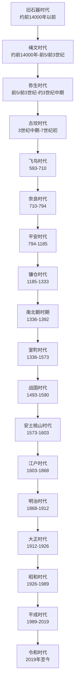

# 日本历史

这页是 `人文科学/历史-外国/日本` 目录的 README 导览页。详细说明已拆分到同目录下的各时代笔记；本页只保留演变总图、按时间顺序排列的导航、统治者世系入口，以及原总览中的中日时期对照。

## 历史演进流程图

## 阶段导航

| 顺序 | 名称 | 时间 | 简要概括 |
| --- | --- | --- | --- |
| 1 | [旧石器时代](%E6%97%A7%E7%9F%B3%E5%99%A8%E6%97%B6%E4%BB%A3.md) | 约公元前14000年左右以前 | 日本列岛旧石器文化阶段，早于绳文时代。 |
| 2 | [绳文时代](%E7%BB%B3%E6%96%87%E6%97%B6%E4%BB%A3.md) | 约前14000年-前5世纪至前3世纪 | 以绳文土器为代表的狩猎采集和渔猎社会阶段。 |
| 3 | [弥生时代](%E5%BC%A5%E7%94%9F%E6%97%B6%E4%BB%A3.md) | 前5世纪至前3世纪-约3世纪中期 | 水稻种植普及，社会分化和早期政治共同体发展。 |
| 4 | [古坟时代](%E5%8F%A4%E5%9D%9F%E6%97%B6%E4%BB%A3.md) | 3世纪中期-7世纪初 | 统治者大量营建古坟，早期王权逐渐形成。 |
| 5 | [飞鸟时代](%E9%A3%9E%E9%B8%9F%E6%97%B6%E4%BB%A3.md) | 593-710 | 佛教传入和制度改革推动古代国家成形。 |
| 6 | [奈良时代](%E5%A5%88%E8%89%AF%E6%97%B6%E4%BB%A3.md) | 710-794 | 以平城京为中心，律令国家继续发展。 |
| 7 | [平安时代](%E5%B9%B3%E5%AE%89%E6%97%B6%E4%BB%A3.md) | 794-1185 | 贵族文化高度发展，武士阶级开始形成。 |
| 8 | [镰仓时代](%E9%95%B0%E4%BB%93%E6%97%B6%E4%BB%A3.md) | 1185-1333 | 武家政权兴起，北条氏执权长期掌握幕府实权。 |
| 9 | [南北朝时期](%E5%8D%97%E5%8C%97%E6%9C%9D%E6%97%B6%E6%9C%9F.md) | 1336-1392 | 建武新政失败后，南朝与北朝分裂对立。 |
| 10 | [室町时代](%E5%AE%A4%E7%94%BA%E6%97%B6%E4%BB%A3.md) | 1336-1573 | 足利幕府统治，前期与南北朝重叠，后期走向战国。 |
| 11 | [战国时代](%E6%88%98%E5%9B%BD%E6%97%B6%E4%BB%A3.md) | 1493-1590 | 各地大名割据，战争频繁。 |
| 12 | [安土桃山时代](%E5%AE%89%E5%9C%9F%E6%A1%83%E5%B1%B1%E6%97%B6%E4%BB%A3.md) | 1573-1603 | 织田信长、丰臣秀吉推动日本从乱世走向统一。 |
| 13 | [江户时代](%E6%B1%9F%E6%88%B7%E6%97%B6%E4%BB%A3.md) | 1603-1868 | 德川幕府统治下的近世日本，长期稳定并实行锁国政策。 |
| 14 | [明治时代](%E6%98%8E%E6%B2%BB%E6%97%B6%E4%BB%A3.md) | 1868-1912 | 明治维新后，日本进入近代国家建设阶段。 |
| 15 | [大正时代](%E5%A4%A7%E6%AD%A3%E6%97%B6%E4%BB%A3.md) | 1912-1926 | 明治之后、昭和之前的近代时期，政党政治和社会运动活跃。 |
| 16 | [昭和时代](%E6%98%AD%E5%92%8C%E6%97%B6%E4%BB%A3.md) | 1926-1989 | 横跨战前扩张、战败、占领改革和战后经济增长。 |
| 17 | [平成时代](%E5%B9%B3%E6%88%90%E6%97%B6%E4%BB%A3.md) | 1989-2019 | 泡沫经济破裂后，日本进入低增长和成熟社会阶段。 |
| 18 | [令和时代](%E4%BB%A4%E5%92%8C%E6%97%B6%E4%BB%A3.md) | 2019年至今 | 当代日本年号时期，延续战后宪政和议会内阁制。 |

## 统治者世系入口

| 世系 | 覆盖范围 | 说明 |
| --- | --- | --- |
| [天皇世系表](%E5%A4%A9%E7%9A%87%E4%B8%96%E7%B3%BB%E8%A1%A8.md) | 神武天皇至德仁天皇 | 日本传统皇统完整编号表；南北朝时期另列北朝天皇附表。 |
| [镰仓幕府将军与北条执权](%E9%95%B0%E4%BB%93%E6%97%B6%E4%BB%A3.md) | 1192-1333 | 镰仓幕府名义将军和实际掌权的北条氏执权。 |
| [南北朝南朝与北朝天皇](%E5%8D%97%E5%8C%97%E6%9C%9D%E6%97%B6%E6%9C%9F.md) | 1336-1392 | 南朝正统天皇、北朝天皇和早期足利将军。 |
| [足利将军世系](%E5%AE%A4%E7%94%BA%E6%97%B6%E4%BB%A3.md) | 1338-1573 | 室町幕府足利将军完整表。 |
| [安土桃山统一政权掌权者](%E5%AE%89%E5%9C%9F%E6%A1%83%E5%B1%B1%E6%97%B6%E4%BB%A3.md) | 1573-1603 | 织田、丰臣到德川的统一权力转移。 |
| [德川将军世系](%E6%B1%9F%E6%88%B7%E6%97%B6%E4%BB%A3.md) | 1603-1867 | 江户幕府15代德川将军。 |

## 日本时代与中国时期对照

| 日本大时期 | 日本时代 | 时间 | 对应中国时期 |
| --- | --- | --- | --- |
| 史前时代・原始时代 | 旧石器时代 | 约公元前14000年左右以前 | 中国史前时期 |
| 史前时代・原始时代 | 绳文时代 | 约前14000年-前5世纪至前3世纪 | 中国史前时期、夏、商、西周、东周前中期 |
| 史前时代・原始时代 | 弥生时代 | 前5世纪至前3世纪-约3世纪中期 | 东周后期、秦、西汉、东汉、三国前期 |
| 古代 | 古坟时代 | 3世纪中期-7世纪初 | 三国后期、两晋、南北朝、隋、唐初 |
| 古代 | 飞鸟时代 | 593-710 | 隋、唐初 |
| 古代 | 奈良时代 | 710-794 | 唐 |
| 古代 | 平安时代 | 794-1185 | 唐后期、五代十国、北宋、南宋初期 |
| 中世 | 镰仓时代 | 1185-1333 | 南宋、元 |
| 中世 | 南北朝时期 | 1336-1392 | 元末、明初 |
| 中世 | 室町时代 | 1336-1573 | 元末、明 |
| 中世 | 战国时代 | 1493-1590 | 明 |
| 近世 | 安土桃山时代 | 1573-1603 | 明 |
| 近世 | 江户时代 | 1603-1868 | 明后期、后金、清 |
| 近现代 | 明治时代 | 1868-1912 | 清末、中华民国初年 |
| 近现代 | 大正时代 | 1912-1926 | 中华民国北洋政府时期 |
| 近现代 | 昭和时代 | 1926-1989 | 中华民国南京国民政府时期、中华人民共和国成立后 |
| 近现代 | 平成时代 | 1989-2019 | 中华人民共和国 |
| 近现代 | 令和时代 | 2019年至今 | 中华人民共和国 |
