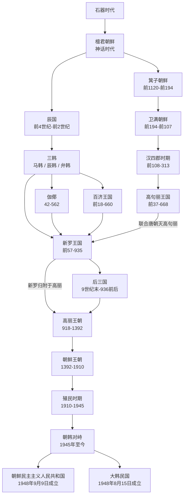

# 朝鲜半岛

这页是 `人文科学/历史-外国/朝鲜半岛` 目录的 README 导览页。详细说明已拆分到同目录下的各阶段笔记；本页只保留演变总图和按存在顺序排列的导航。

## 历史演进流程图

## 阶段导航

| 顺序 | 名称 | 时间 | 简要概括 |
| --- | --- | --- | --- |
| 1 | [石器时代](%E4%BA%BA%E6%96%87%E7%A7%91%E5%AD%A6/%E5%8E%86%E5%8F%B2-%E5%A4%96%E5%9B%BD/%E6%9C%9D%E9%B2%9C%E5%8D%8A%E5%B2%9B/%E7%9F%B3%E5%99%A8%E6%97%B6%E4%BB%A3.md) | 石器时代 | 朝鲜半岛历史演变图中的最早阶段。 |
| 2 | [檀君朝鲜](%E4%BA%BA%E6%96%87%E7%A7%91%E5%AD%A6/%E5%8E%86%E5%8F%B2-%E5%A4%96%E5%9B%BD/%E6%9C%9D%E9%B2%9C%E5%8D%8A%E5%B2%9B/%E6%AA%80%E5%90%9B%E6%9C%9D%E9%B2%9C.md) | 神话时代 | 神话时代节点，之后分出箕子朝鲜与辰国两条脉络。 |
| 3 | [箕子朝鲜](%E4%BA%BA%E6%96%87%E7%A7%91%E5%AD%A6/%E5%8E%86%E5%8F%B2-%E5%A4%96%E5%9B%BD/%E6%9C%9D%E9%B2%9C%E5%8D%8A%E5%B2%9B/%E7%AE%95%E5%AD%90%E6%9C%9D%E9%B2%9C.md) | 前1120-前194 | 商纣王叔父箕子在朝鲜半岛建立的政权，后被卫满所灭。 |
| 4 | [卫满朝鲜](%E4%BA%BA%E6%96%87%E7%A7%91%E5%AD%A6/%E5%8E%86%E5%8F%B2-%E5%A4%96%E5%9B%BD/%E6%9C%9D%E9%B2%9C%E5%8D%8A%E5%B2%9B/%E5%8D%AB%E6%BB%A1%E6%9C%9D%E9%B2%9C.md) | 前194-前107 | 卫满推翻箕子朝鲜后建立，前107年被汉武帝所灭。 |
| 5 | [汉四郡时期](%E4%BA%BA%E6%96%87%E7%A7%91%E5%AD%A6/%E5%8E%86%E5%8F%B2-%E5%A4%96%E5%9B%BD/%E6%9C%9D%E9%B2%9C%E5%8D%8A%E5%B2%9B/%E6%B1%89%E5%9B%9B%E9%83%A1%E6%97%B6%E6%9C%9F.md) | 前108-313 | 汉武帝灭卫满朝鲜后在半岛建立四郡。 |
| 6 | [高句丽王国](%E4%BA%BA%E6%96%87%E7%A7%91%E5%AD%A6/%E5%8E%86%E5%8F%B2-%E5%A4%96%E5%9B%BD/%E6%9C%9D%E9%B2%9C%E5%8D%8A%E5%B2%9B/%E9%AB%98%E5%8F%A5%E4%B8%BD%E7%8E%8B%E5%9B%BD.md) | 前37-668 | 扶余人朱蒙建立，后迁至平壤，5世纪进入鼎盛。 |
| 7 | [辰国](%E4%BA%BA%E6%96%87%E7%A7%91%E5%AD%A6/%E5%8E%86%E5%8F%B2-%E5%A4%96%E5%9B%BD/%E6%9C%9D%E9%B2%9C%E5%8D%8A%E5%B2%9B/%E8%BE%B0%E5%9B%BD.md) | 前4世纪-前2世纪 | 朝鲜半岛中南部部落联盟，是三韩的前身。 |
| 8 | [三韩](%E4%BA%BA%E6%96%87%E7%A7%91%E5%AD%A6/%E5%8E%86%E5%8F%B2-%E5%A4%96%E5%9B%BD/%E6%9C%9D%E9%B2%9C%E5%8D%8A%E5%B2%9B/%E4%B8%89%E9%9F%A9.md) | 未单独标注 | 马韩、辰韩、弁韩并列，分别通向百济、新罗、伽倻脉络。 |
| 9 | [百济王国](%E4%BA%BA%E6%96%87%E7%A7%91%E5%AD%A6/%E5%8E%86%E5%8F%B2-%E5%A4%96%E5%9B%BD/%E6%9C%9D%E9%B2%9C%E5%8D%8A%E5%B2%9B/%E7%99%BE%E6%B5%8E%E7%8E%8B%E5%9B%BD.md) | 前18-660 | 由马韩脉络发展而来，4世纪达到鼎盛。 |
| 10 | [伽倻](%E4%BA%BA%E6%96%87%E7%A7%91%E5%AD%A6/%E5%8E%86%E5%8F%B2-%E5%A4%96%E5%9B%BD/%E6%9C%9D%E9%B2%9C%E5%8D%8A%E5%B2%9B/%E4%BC%BD%E5%80%BB.md) | 42-562 | 由弁韩发展起来的古代联盟国家，后被新罗吸收。 |
| 11 | [新罗王国](%E4%BA%BA%E6%96%87%E7%A7%91%E5%AD%A6/%E5%8E%86%E5%8F%B2-%E5%A4%96%E5%9B%BD/%E6%9C%9D%E9%B2%9C%E5%8D%8A%E5%B2%9B/%E6%96%B0%E7%BD%97%E7%8E%8B%E5%9B%BD.md) | 前57-935 | 7世纪后期借唐朝力量统一大同江以南地区，后分裂为后三国。 |
| 12 | [后三国](%E4%BA%BA%E6%96%87%E7%A7%91%E5%AD%A6/%E5%8E%86%E5%8F%B2-%E5%A4%96%E5%9B%BD/%E6%9C%9D%E9%B2%9C%E5%8D%8A%E5%B2%9B/%E5%90%8E%E4%B8%89%E5%9B%BD.md) | 9世纪末-936前后 | 新罗内乱后的分裂阶段，主要包括后百济和后高句丽 / 泰封。 |
| 13 | [高丽王朝](%E4%BA%BA%E6%96%87%E7%A7%91%E5%AD%A6/%E5%8E%86%E5%8F%B2-%E5%A4%96%E5%9B%BD/%E6%9C%9D%E9%B2%9C%E5%8D%8A%E5%B2%9B/%E9%AB%98%E4%B8%BD%E7%8E%8B%E6%9C%9D.md) | 918-1392 | 王建建立，合并新罗、灭后百济，实现“三韩一统”。 |
| 14 | [朝鲜王朝](%E4%BA%BA%E6%96%87%E7%A7%91%E5%AD%A6/%E5%8E%86%E5%8F%B2-%E5%A4%96%E5%9B%BD/%E6%9C%9D%E9%B2%9C%E5%8D%8A%E5%B2%9B/%E6%9C%9D%E9%B2%9C%E7%8E%8B%E6%9C%9D.md) | 1392-1910 | 李成桂取代高丽建国，后发展为大韩帝国并于1910年灭亡。 |
| 15 | [殖民时期](%E4%BA%BA%E6%96%87%E7%A7%91%E5%AD%A6/%E5%8E%86%E5%8F%B2-%E5%A4%96%E5%9B%BD/%E6%9C%9D%E9%B2%9C%E5%8D%8A%E5%B2%9B/%E6%AE%96%E6%B0%91%E6%97%B6%E6%9C%9F.md) | 1910-1945 | 朝鲜半岛并入大日本帝国，成为日本领土。 |
| 16 | [朝韩对峙](%E4%BA%BA%E6%96%87%E7%A7%91%E5%AD%A6/%E5%8E%86%E5%8F%B2-%E5%A4%96%E5%9B%BD/%E6%9C%9D%E9%B2%9C%E5%8D%8A%E5%B2%9B/%E6%9C%9D%E9%9F%A9%E5%AF%B9%E5%B3%99.md) | 1945年至今 | 日本投降后，美苏分别进驻三八线南北，形成南北对峙格局。 |
| 17 | [朝鲜民主主义人民共和国](%E4%BA%BA%E6%96%87%E7%A7%91%E5%AD%A6/%E5%8E%86%E5%8F%B2-%E5%A4%96%E5%9B%BD/%E6%9C%9D%E9%B2%9C%E5%8D%8A%E5%B2%9B/%E6%9C%9D%E9%B2%9C%E6%B0%91%E4%B8%BB%E4%B8%BB%E4%B9%89%E4%BA%BA%E6%B0%91%E5%85%B1%E5%92%8C%E5%9B%BD.md) | 1948年9月9日成立 | 朝韩对峙格局下形成的现代国家之一。 |
| 18 | [大韩民国](%E4%BA%BA%E6%96%87%E7%A7%91%E5%AD%A6/%E5%8E%86%E5%8F%B2-%E5%A4%96%E5%9B%BD/%E6%9C%9D%E9%B2%9C%E5%8D%8A%E5%B2%9B/%E5%A4%A7%E9%9F%A9%E6%B0%91%E5%9B%BD.md) | 1948年8月15日成立 | 朝韩对峙格局下形成的现代国家之一。 |
