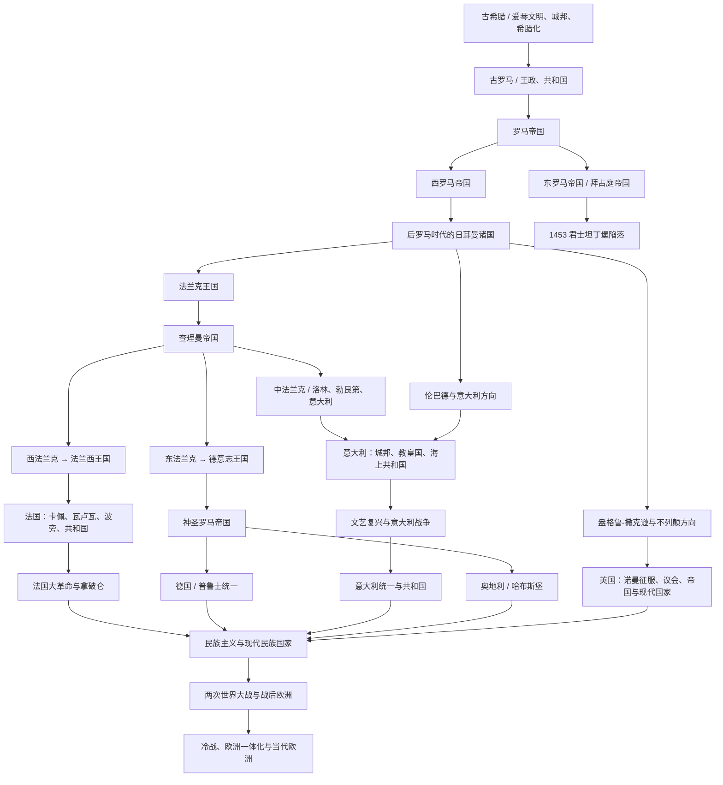

# 欧洲历史

## 历史主线

欧洲历史可以先按“地中海古典世界 → 罗马统一与分裂 → 后罗马日耳曼诸国 → 法兰克分化 → 中世纪基督教与帝国秩序 → 城邦、王权国家与文艺复兴 → 革命、民族国家和现代欧洲”来理解。古希腊提供城邦、公民政治、哲学和艺术传统；古罗马把意大利半岛和地中海世界整合进共和国、帝国和罗马法秩序；西罗马灭亡后，西欧进入日耳曼诸国、教会和封建制度交织的后罗马时代；法兰克王国和查理曼帝国分裂后，西法兰克发展为法国方向，东法兰克发展为德意志和神圣罗马帝国方向，中部和意大利方向长期与教皇、城邦和外来王朝纠缠。近代以后，英国、法国较早形成王权和议会国家，德国、意大利在19世纪完成民族统一，奥地利从哈布斯堡复合君主国转为现代国家。

## 欧洲历史演变脉络图

## 核心阶段导航

| 顺序 | 阶段 | 时间 | 入口 | 简要概括 |
|---|---|---|---|---|
| 1 | 古希腊 | 约前3千纪-前146年 | [古希腊](/%E4%BA%BA%E6%96%87%E7%A7%91%E5%AD%A6/%E5%8E%86%E5%8F%B2-%E5%A4%96%E5%9B%BD/%E6%AC%A7%E6%B4%B2/_%E9%80%9A%E5%8F%B2/%E5%8F%A4%E5%B8%8C%E8%85%8A.md) | 爱琴文明、希腊城邦、马其顿和希腊化世界构成欧洲古典文明源头。 |
| 2 | 古罗马 | 传统前753年-前27年 | [古罗马](/%E4%BA%BA%E6%96%87%E7%A7%91%E5%AD%A6/%E5%8E%86%E5%8F%B2-%E5%A4%96%E5%9B%BD/%E6%AC%A7%E6%B4%B2/_%E9%80%9A%E5%8F%B2/%E5%8F%A4%E7%BD%97%E9%A9%AC.md) | 罗马从拉丁城邦发展为共和国，统一意大利并扩张为地中海霸权。 |
| 3 | 罗马帝国 | 前27年-476年；东部延续至1453年 | [罗马帝国](/%E4%BA%BA%E6%96%87%E7%A7%91%E5%AD%A6/%E5%8E%86%E5%8F%B2-%E5%A4%96%E5%9B%BD/%E6%AC%A7%E6%B4%B2/%E6%84%8F%E5%A4%A7%E5%88%A9/%E7%BD%97%E9%A9%AC%E5%B8%9D%E5%9B%BD%E6%97%B6%E6%9C%9F.md) | 罗马帝国整合地中海世界，后期分化为西罗马和东罗马。 |
| 4 | 西罗马帝国 | 395年-476年 | [西罗马帝国](/%E4%BA%BA%E6%96%87%E7%A7%91%E5%AD%A6/%E5%8E%86%E5%8F%B2-%E5%A4%96%E5%9B%BD/%E6%AC%A7%E6%B4%B2/_%E9%80%9A%E5%8F%B2/%E8%A5%BF%E7%BD%97%E9%A9%AC%E5%B8%9D%E5%9B%BD.md) | 西部帝国衰亡后，西欧进入日耳曼诸国和中世纪格局。 |
| 5 | 东罗马 / 拜占庭 | 395年-1453年 | [东罗马 / 拜占庭](/%E4%BA%BA%E6%96%87%E7%A7%91%E5%AD%A6/%E5%8E%86%E5%8F%B2-%E5%A4%96%E5%9B%BD/%E6%AC%A7%E6%B4%B2/_%E9%80%9A%E5%8F%B2/%E4%B8%9C%E7%BD%97%E9%A9%AC%E5%B8%9D%E5%9B%BD%E4%B8%8E%E6%8B%9C%E5%8D%A0%E5%BA%AD%E5%B8%9D%E5%9B%BD.md) | 东罗马延续罗马法统，成为中世纪东地中海核心强权。 |
| 6 | 后罗马时代的日耳曼诸国 | 5世纪-8世纪 | [后罗马时代的日耳曼诸国](/%E4%BA%BA%E6%96%87%E7%A7%91%E5%AD%A6/%E5%8E%86%E5%8F%B2-%E5%A4%96%E5%9B%BD/%E6%AC%A7%E6%B4%B2/_%E9%80%9A%E5%8F%B2/%E5%90%8E%E7%BD%97%E9%A9%AC%E6%97%B6%E4%BB%A3%E7%9A%84%E6%97%A5%E8%80%B3%E6%9B%BC%E8%AF%B8%E5%9B%BD.md) | 西哥特、东哥特、法兰克、伦巴德、盎格鲁-撒克逊等重组西欧。 |
| 7 | 法兰克王国 | 486年-843年 | [法兰克王国](/%E4%BA%BA%E6%96%87%E7%A7%91%E5%AD%A6/%E5%8E%86%E5%8F%B2-%E5%A4%96%E5%9B%BD/%E6%AC%A7%E6%B4%B2/_%E9%80%9A%E5%8F%B2/%E6%B3%95%E5%85%B0%E5%85%8B%E7%8E%8B%E5%9B%BD.md) | 墨洛温和加洛林王朝把高卢、日耳曼和意大利北部纳入同一政治传统。 |
| 8 | 神圣罗马帝国 | 962年-1806年 | [神圣罗马帝国（德意志共同历史）](/%E4%BA%BA%E6%96%87%E7%A7%91%E5%AD%A6/%E5%8E%86%E5%8F%B2-%E5%A4%96%E5%9B%BD/%E6%AC%A7%E6%B4%B2/%E5%BE%B7%E6%84%8F%E5%BF%97/%E5%85%B1%E5%90%8C%E5%8E%86%E5%8F%B2/%E7%A5%9E%E5%9C%A3%E7%BD%97%E9%A9%AC%E5%B8%9D%E5%9B%BD/README.md) | 东法兰克和德意志王国发展出的中欧帝国框架，归入德意志共同历史。 |
| 9 | 欧洲民族国家形成 | 中世纪晚期-20世纪 | [欧洲民族国家形成](/%E4%BA%BA%E6%96%87%E7%A7%91%E5%AD%A6/%E5%8E%86%E5%8F%B2-%E5%A4%96%E5%9B%BD/%E6%AC%A7%E6%B4%B2/_%E9%80%9A%E5%8F%B2/%E6%AC%A7%E6%B4%B2%E6%B0%91%E6%97%8F%E5%9B%BD%E5%AE%B6%E5%BD%A2%E6%88%90.md) | 英国、法国、德国、意大利、奥地利等以不同路径形成现代国家。 |

## 国家与区域入口

| 区域 / 国家 | 入口 | 主线提示 |
|---|---|---|
| 英国 | [英国](/%E4%BA%BA%E6%96%87%E7%A7%91%E5%AD%A6/%E5%8E%86%E5%8F%B2-%E5%A4%96%E5%9B%BD/%E6%AC%A7%E6%B4%B2/%E8%8B%B1%E5%9B%BD/README.md) | 从不列颠史前、罗马不列颠、盎格鲁-撒克逊到诺曼征服、议会国家和现代英国。 |
| 法国 | [法国](/%E4%BA%BA%E6%96%87%E7%A7%91%E5%AD%A6/%E5%8E%86%E5%8F%B2-%E5%A4%96%E5%9B%BD/%E6%AC%A7%E6%B4%B2/%E6%B3%95%E5%9B%BD/README.md) | 从高卢、法兰克、西法兰克到法兰西王国、大革命和共和国。 |
| 德意志 | [德意志](/%E4%BA%BA%E6%96%87%E7%A7%91%E5%AD%A6/%E5%8E%86%E5%8F%B2-%E5%A4%96%E5%9B%BD/%E6%AC%A7%E6%B4%B2/%E5%BE%B7%E6%84%8F%E5%BF%97/README.md) | 从日耳曼部落、东法兰克、神圣罗马帝国到德国和奥地利分化。 |
| 德国 | [德国](/%E4%BA%BA%E6%96%87%E7%A7%91%E5%AD%A6/%E5%8E%86%E5%8F%B2-%E5%A4%96%E5%9B%BD/%E6%AC%A7%E6%B4%B2/%E5%BE%B7%E6%84%8F%E5%BF%97/%E5%BE%B7%E5%9B%BD/README.md) | 从普鲁士、德意志邦联、德意志帝国到现代德国。 |
| 奥地利 | [奥地利](/%E4%BA%BA%E6%96%87%E7%A7%91%E5%AD%A6/%E5%8E%86%E5%8F%B2-%E5%A4%96%E5%9B%BD/%E6%AC%A7%E6%B4%B2/%E5%BE%B7%E6%84%8F%E5%BF%97/%E5%A5%A5%E5%9C%B0%E5%88%A9/README.md) | 从奥地利边区、哈布斯堡君主国到奥地利共和国。 |
| 意大利 | [意大利](/%E4%BA%BA%E6%96%87%E7%A7%91%E5%AD%A6/%E5%8E%86%E5%8F%B2-%E5%A4%96%E5%9B%BD/%E6%AC%A7%E6%B4%B2/%E6%84%8F%E5%A4%A7%E5%88%A9/README.md) | 从伊特鲁里亚、罗马、城邦、文艺复兴到意大利统一和共和国。 |
| 东斯拉夫 | [东斯拉夫](/%E4%BA%BA%E6%96%87%E7%A7%91%E5%AD%A6/%E5%8E%86%E5%8F%B2-%E5%A4%96%E5%9B%BD/%E6%AC%A7%E6%B4%B2/%E4%B8%9C%E6%96%AF%E6%8B%89%E5%A4%AB/README.md) | 从早期斯拉夫、基辅罗斯到俄罗斯、乌克兰、白俄罗斯等方向。 |
| 十字军东征 | [十字军东征](/%E4%BA%BA%E6%96%87%E7%A7%91%E5%AD%A6/%E5%8E%86%E5%8F%B2-%E5%A4%96%E5%9B%BD/%E6%AC%A7%E6%B4%B2/_%E9%80%9A%E5%8F%B2/%E5%8D%81%E5%AD%97%E5%86%9B%E4%B8%9C%E5%BE%81/README.md) | 中世纪西欧基督教世界对东地中海的军事、宗教和政治运动。 |
| 欧洲历史脉络 | [欧洲历史脉络](/%E4%BA%BA%E6%96%87%E7%A7%91%E5%AD%A6/%E5%8E%86%E5%8F%B2-%E5%A4%96%E5%9B%BD/%E6%AC%A7%E6%B4%B2/_%E9%80%9A%E5%8F%B2/%E6%AC%A7%E6%B4%B2%E5%8E%86%E5%8F%B2%E8%84%89%E7%BB%9C.md) | 原有欧洲通史简表和阶段要点。 |

## 关键分化关系

- 古希腊不是现代欧洲国家的直接政治前身，但提供城邦、公民政治、哲学、艺术和古典教育传统。
- 古罗马统一意大利并扩张为地中海帝国；罗马帝国不是现代意大利国家，但罗马法、拉丁语、城市和教会传统深刻影响欧洲。
- 西罗马灭亡后，西欧不是立即形成现代国家，而是进入日耳曼诸国、教会和地方军事贵族并存的后罗马秩序。
- 法兰克王国是法国和德意志分化的重要共同源头：843年《凡尔登条约》后，西法兰克通向法兰西，东法兰克通向德意志和神圣罗马帝国。
- 意大利方向同时继承罗马遗产、伦巴德 / 加洛林秩序、教皇国、城邦和外来王朝影响，因此长期分裂，到19世纪才统一。
- 奥地利是德意志和神圣罗马帝国体系中的哈布斯堡核心，后来成为多民族帝国中心，再在一战后转为共和国。
