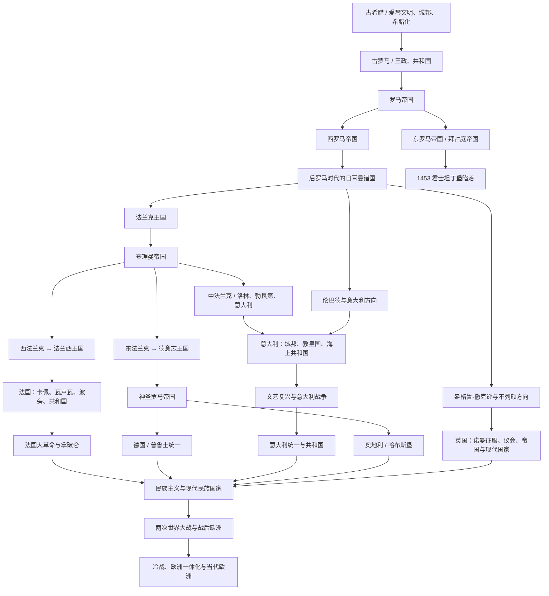

# 欧洲历史

## 历史主线

欧洲历史可以先按“地中海古典世界 → 罗马统一与分裂 → 后罗马日耳曼诸国 → 法兰克分化 → 中世纪基督教与帝国秩序 → 城邦、王权国家与文艺复兴 → 革命、民族国家和现代欧洲”来理解。古希腊提供城邦、公民政治、哲学和艺术传统；古罗马把意大利半岛和地中海世界整合进共和国、帝国和罗马法秩序；西罗马灭亡后，西欧进入日耳曼诸国、教会和封建制度交织的后罗马时代；法兰克王国和查理曼帝国分裂后，西法兰克发展为法国方向，东法兰克发展为德意志和神圣罗马帝国方向，中部和意大利方向长期与教皇、城邦和外来王朝纠缠。近代以后，英国、法国较早形成王权和议会国家，德国、意大利在19世纪完成民族统一，奥地利从哈布斯堡复合君主国转为现代国家。

## 欧洲历史演变脉络图

## 核心阶段导航

| 顺序  | 阶段          | 时间                   | 入口                                                                                                                                                                                                                                                                 | 简要概括                            |
| --- | ----------- | -------------------- | ------------------------------------------------------------------------------------------------------------------------------------------------------------------------------------------------------------------------------------------------------------------ | ------------------------------- |
| 1   | 古希腊         | 约前3千纪-前146年          | [古希腊](/%E4%BA%BA%E6%96%87%E7%A7%91%E5%AD%A6/%E5%8E%86%E5%8F%B2-%E5%A4%96%E5%9B%BD/%E6%AC%A7%E6%B4%B2/_%E9%80%9A%E5%8F%B2/%E5%8F%A4%E5%B8%8C%E8%85%8A/README.md)                                                                                                    | 爱琴文明、希腊城邦、马其顿和希腊化世界构成欧洲古典文明源头。  |
| 2   | 古罗马         | 传统前753年-前27年         | [古罗马](/%E4%BA%BA%E6%96%87%E7%A7%91%E5%AD%A6/%E5%8E%86%E5%8F%B2-%E5%A4%96%E5%9B%BD/%E6%AC%A7%E6%B4%B2/_%E9%80%9A%E5%8F%B2/%E5%8F%A4%E7%BD%97%E9%A9%AC/README.md)                                                                                                    | 罗马从拉丁城邦发展为共和国，统一意大利并扩张为地中海霸权。   |
| 3   | 罗马帝国        | 前27年-476年；东部延续至1453年 | [罗马帝国](/%E4%BA%BA%E6%96%87%E7%A7%91%E5%AD%A6/%E5%8E%86%E5%8F%B2-%E5%A4%96%E5%9B%BD/%E6%AC%A7%E6%B4%B2/_%E9%80%9A%E5%8F%B2/%E5%8F%A4%E7%BD%97%E9%A9%AC/%E7%BD%97%E9%A9%AC%E5%B8%9D%E5%9B%BD.md)                                                                     | 罗马帝国整合地中海世界，后期分化为西罗马和东罗马。       |
| 4   | 西罗马帝国       | 395年-476年            | [西罗马帝国](/%E4%BA%BA%E6%96%87%E7%A7%91%E5%AD%A6/%E5%8E%86%E5%8F%B2-%E5%A4%96%E5%9B%BD/%E6%AC%A7%E6%B4%B2/_%E9%80%9A%E5%8F%B2/%E5%8F%A4%E7%BD%97%E9%A9%AC/%E8%A5%BF%E7%BD%97%E9%A9%AC%E5%B8%9D%E5%9B%BD.md)                                                           | 西部帝国衰亡后，西欧进入日耳曼诸国和中世纪格局。        |
| 5   | 东罗马 / 拜占庭   | 395年-1453年           | [东罗马 / 拜占庭](/%E4%BA%BA%E6%96%87%E7%A7%91%E5%AD%A6/%E5%8E%86%E5%8F%B2-%E5%A4%96%E5%9B%BD/%E6%AC%A7%E6%B4%B2/_%E9%80%9A%E5%8F%B2/%E5%8F%A4%E7%BD%97%E9%A9%AC/%E4%B8%9C%E7%BD%97%E9%A9%AC%E5%B8%9D%E5%9B%BD%E4%B8%8E%E6%8B%9C%E5%8D%A0%E5%BA%AD%E5%B8%9D%E5%9B%BD.md) | 东罗马延续罗马法统，成为中世纪东地中海核心强权。        |
| 6   | 后罗马时代的日耳曼诸国 | 5世纪-8世纪              | [后罗马时代的日耳曼诸国](/%E4%BA%BA%E6%96%87%E7%A7%91%E5%AD%A6/%E5%8E%86%E5%8F%B2-%E5%A4%96%E5%9B%BD/%E6%AC%A7%E6%B4%B2/_%E9%80%9A%E5%8F%B2/%E5%90%8E%E7%BD%97%E9%A9%AC%E6%97%B6%E4%BB%A3%E7%9A%84%E6%97%A5%E8%80%B3%E6%9B%BC%E8%AF%B8%E5%9B%BD/README.md)                           | 西哥特、东哥特、法兰克、伦巴德、盎格鲁-撒克逊等重组西欧。   |
| 7   | 法兰克王国       | 486年-843年            | [法兰克王国](/%E4%BA%BA%E6%96%87%E7%A7%91%E5%AD%A6/%E5%8E%86%E5%8F%B2-%E5%A4%96%E5%9B%BD/%E6%AC%A7%E6%B4%B2/_%E9%80%9A%E5%8F%B2/%E5%90%8E%E7%BD%97%E9%A9%AC%E6%97%B6%E4%BB%A3%E7%9A%84%E6%97%A5%E8%80%B3%E6%9B%BC%E8%AF%B8%E5%9B%BD/%E6%B3%95%E5%85%B0%E5%85%8B%E7%8E%8B%E5%9B%BD/README.md)                                                                                       | 墨洛温和加洛林王朝把高卢、日耳曼和意大利北部纳入同一政治传统。 |
| 8   | 神圣罗马帝国      | 962年-1806年           | [神圣罗马帝国（德意志）](/%E4%BA%BA%E6%96%87%E7%A7%91%E5%AD%A6/%E5%8E%86%E5%8F%B2-%E5%A4%96%E5%9B%BD/%E6%AC%A7%E6%B4%B2/%E5%BE%B7%E6%84%8F%E5%BF%97/%E7%A5%9E%E5%9C%A3%E7%BD%97%E9%A9%AC%E5%B8%9D%E5%9B%BD/README.md)                | 东法兰克和德意志王国发展出的中欧帝国框架，归入德意志历史。 |

## 国家与区域入口

| 区域 / 国家 | 入口 | 主线提示 |
|---|---|---|
| 英国 | [英国](/%E4%BA%BA%E6%96%87%E7%A7%91%E5%AD%A6/%E5%8E%86%E5%8F%B2-%E5%A4%96%E5%9B%BD/%E6%AC%A7%E6%B4%B2/%E8%8B%B1%E5%9B%BD/README.md) | 从不列颠史前、罗马不列颠、盎格鲁-撒克逊到诺曼征服、议会国家和现代英国。 |
| 法国 | [法国](/%E4%BA%BA%E6%96%87%E7%A7%91%E5%AD%A6/%E5%8E%86%E5%8F%B2-%E5%A4%96%E5%9B%BD/%E6%AC%A7%E6%B4%B2/%E6%B3%95%E5%9B%BD/README.md) | 从高卢、法兰克、西法兰克到法兰西王国、大革命和共和国。 |
| 德意志 | [德意志](/%E4%BA%BA%E6%96%87%E7%A7%91%E5%AD%A6/%E5%8E%86%E5%8F%B2-%E5%A4%96%E5%9B%BD/%E6%AC%A7%E6%B4%B2/%E5%BE%B7%E6%84%8F%E5%BF%97/README.md) | 从日耳曼部落、东法兰克、神圣罗马帝国到德国和奥地利分化。 |
| 德国 | [德国](/%E4%BA%BA%E6%96%87%E7%A7%91%E5%AD%A6/%E5%8E%86%E5%8F%B2-%E5%A4%96%E5%9B%BD/%E6%AC%A7%E6%B4%B2/%E5%BE%B7%E6%84%8F%E5%BF%97/%E5%BE%B7%E5%9B%BD/README.md) | 从普鲁士、德意志邦联、德意志帝国到现代德国。 |
| 奥地利 | [奥地利](/%E4%BA%BA%E6%96%87%E7%A7%91%E5%AD%A6/%E5%8E%86%E5%8F%B2-%E5%A4%96%E5%9B%BD/%E6%AC%A7%E6%B4%B2/%E5%BE%B7%E6%84%8F%E5%BF%97/%E5%A5%A5%E5%9C%B0%E5%88%A9/README.md) | 从奥地利边区、哈布斯堡君主国到奥地利共和国。 |
| 意大利 | [意大利](/%E4%BA%BA%E6%96%87%E7%A7%91%E5%AD%A6/%E5%8E%86%E5%8F%B2-%E5%A4%96%E5%9B%BD/%E6%AC%A7%E6%B4%B2/%E6%84%8F%E5%A4%A7%E5%88%A9/README.md) | 从伊特鲁里亚、罗马、城邦、文艺复兴到意大利统一和共和国。 |
| 东斯拉夫 | [东斯拉夫](/%E4%BA%BA%E6%96%87%E7%A7%91%E5%AD%A6/%E5%8E%86%E5%8F%B2-%E5%A4%96%E5%9B%BD/%E6%AC%A7%E6%B4%B2/%E4%B8%9C%E6%96%AF%E6%8B%89%E5%A4%AB/README.md) | 从早期斯拉夫、基辅罗斯到俄罗斯、乌克兰、白俄罗斯等方向。 |
| 十字军东征 | [十字军东征](/%E4%BA%BA%E6%96%87%E7%A7%91%E5%AD%A6/%E5%8E%86%E5%8F%B2-%E5%A4%96%E5%9B%BD/%E6%AC%A7%E6%B4%B2/_%E9%80%9A%E5%8F%B2/%E5%8D%81%E5%AD%97%E5%86%9B%E4%B8%9C%E5%BE%81/README.md) | 中世纪西欧基督教世界对东地中海的军事、宗教和政治运动。 |

## 主线时间表

| 顺序 | 阶段 | 大致时间 | 简要概括 |
|---:|---|---:|---|
| 1 | 希腊时期 | 前3千纪-前4世纪 | 克里特、迈锡尼和希腊城邦构成欧洲古典文明源头，希波战争和城邦竞争塑造希腊政治文化。 |
| 2 | 亚历山大与希腊化时代 | 前4世纪-前1世纪 | 马其顿统一希腊并向东方扩张，亚历山大帝国瓦解后形成希腊化世界。 |
| 3 | 罗马时期 | 前8世纪-476年 | 罗马从王政、共和国走向帝国，建立环地中海大帝国；西罗马灭亡后欧洲进入中古格局。 |
| 4 | 中世纪 | 476年-15世纪 | 东罗马延续，西欧形成封建、教会和王权并存的秩序；日耳曼诸王国、法兰克王国和神圣罗马帝国影响深远。 |
| 5 | 文艺复兴 | 14世纪-16世纪 | 人文主义、古典文化复兴、城市经济和艺术科学发展推动近代欧洲思想转型。 |
| 6 | 大航海时代 | 15世纪-17世纪 | 葡萄牙、西班牙率先扩张到亚洲、美洲和非洲，英国、法国、荷兰随后加入海洋竞争。 |
| 7 | 大革命时期 | 17世纪-18世纪末 | 英国革命确立议会和君主立宪传统，美国独立战争冲击殖民秩序，法国大革命重塑欧洲政治语言。 |
| 8 | 拿破仑时期 | 1799年-1815年 | 拿破仑扩张将法国革命成果和法典制度推向欧洲，也引发反法同盟和维也纳体系。 |
| 9 | 德意志与意大利统一 | 19世纪 | 普鲁士推动德国统一，意大利复兴运动完成民族国家整合，欧洲大陆均势改变。 |
| 10 | 第一次世界大战 | 1914年-1918年 | 欧洲旧帝国体系崩溃，奥匈、德意志、俄罗斯、奥斯曼等帝国发生剧变。 |
| 11 | 第二次世界大战与冷战 | 1939年-20世纪后期 | 欧洲中心地位下降，战后形成美苏冷战、欧洲分裂与欧洲一体化。 |

## 阶段要点

### 希腊与罗马

- 克里特文明和迈锡尼文明是爱琴文明的重要组成部分。
- 希腊城邦崇尚公民政治、哲学、艺术和竞技传统；斯巴达以军事化城邦著称，雅典以民主政治和文化繁荣著称。
- 希波战争强化希腊世界共同体意识，马其顿在腓力二世和亚历山大时期崛起并形成希腊化世界。
- 罗马经历王政、共和国、帝国三个主要阶段，罗马法、道路、城市和行政制度影响深远。
- 帝国后期分裂为东罗马帝国和西罗马帝国，西罗马帝国灭亡通常被视为欧洲古代史与中世纪的分界点之一。

### 中世纪

- 东罗马 / 拜占庭帝国延续罗马法统千年，最终在1453年被奥斯曼帝国终结。
- 西罗马灭亡后，日耳曼诸王国在西欧建立政权，教会、封建领主和王权长期共同塑造中世纪秩序。
- 法兰克王国在查理曼时期达到高峰，其后分裂出后来法国、德意志和意大利相关的早期政治基础。
- 神圣罗马帝国延续东法兰克和德意志王国方向，形成中欧复合帝国框架。

### 文艺复兴、大航海与革命

- 文艺复兴从意大利城市兴起，强调人文主义和古典文化复兴。
- 大航海时代中，葡萄牙开辟到亚洲的海路，西班牙通过哥伦布航行进入美洲扩张，英国、法国、荷兰后来加入殖民和海权竞争。
- 英国通过革命和制度调整，逐步形成议会制与君主立宪制。
- 法国大革命提出自由、平等、民族主权等政治观念，冲击欧洲旧制度。
- 拿破仑战争传播革命制度，同时激发欧洲民族主义和反法同盟；维也纳体系试图恢复欧洲均势。

### 民族国家与世界大战

- 普鲁士领导下的德意志统一改变欧洲大陆力量平衡。
- 意大利通过复兴运动统一，结束长期城邦、外来王朝和教皇国并存格局。
- 第一次世界大战后欧洲旧帝国体系瓦解，民族国家和国际组织尝试重建秩序。
- 第二次世界大战后西欧衰落，美苏成为主导力量，欧洲进入冷战分裂与战后重建阶段。

## 欧洲民族国家形成

欧洲民族国家形成不是单一路径：英国和法国较早形成王权国家，德意志和意大利长期分裂并在19世纪统一，奥地利则从哈布斯堡复合君主国转向现代共和国。

| 方向 | 时间 | 身份 / 关系 | 说明 |
|---|---|---|---|
| 英国方向 | 1066以后，尤其16-18世纪 | 王权、议会和海权国家 | 诺曼征服、都铎、斯图亚特和光荣革命塑造英格兰 / 英国国家。 |
| 法国方向 | 987以后，尤其12-18世纪 | 卡佩王权到绝对君主制 | 西法兰克逐渐变为法兰西王国，大革命后进入现代政治。 |
| 德意志方向 | 843以后，尤其1871年 | 东法兰克、神圣罗马帝国、普鲁士统一 | 长期邦国分裂，19世纪由普鲁士主导统一。 |
| 意大利方向 | 中世纪城邦到1861年 | 城邦、外国支配、复兴运动 | 长期分裂，19世纪通过复兴运动统一。 |
| 奥地利方向 | 中世纪边区到1918年以后 | 哈布斯堡君主国核心 | 从帝国王朝中心转变为共和国。 |

### 重要节点

| 时间 | 事件 | 意义 |
|---|---|---|
| 1648年 | 威斯特伐利亚体系 | 常被视为近代国家主权秩序的重要节点。 |
| 1789年以后 | 法国大革命和拿破仑战争 | 传播民族主权与公民政治观念。 |
| 1861-1870年 | 意大利统一 | 意大利完成统一主体并取得罗马。 |
| 1871年 | 德意志帝国成立 | 德国统一改变欧洲均势。 |
| 1918年以后 | 中东欧帝国解体 | 民族国家地图重组。 |

## 关键分化关系

- 古希腊不是现代欧洲国家的直接政治前身，但提供城邦、公民政治、哲学、艺术和古典教育传统。
- 古罗马统一意大利并扩张为地中海帝国；罗马帝国不是现代意大利国家，但罗马法、拉丁语、城市和教会传统深刻影响欧洲。
- 西罗马灭亡后，西欧不是立即形成现代国家，而是进入日耳曼诸国、教会和地方军事贵族并存的后罗马秩序。
- 法兰克王国是法国和德意志分化的重要共同源头：843年《凡尔登条约》后，西法兰克通向法兰西，东法兰克通向德意志和神圣罗马帝国。
- 意大利方向同时继承罗马遗产、伦巴德 / 加洛林秩序、教皇国、城邦和外来王朝影响，因此长期分裂，到19世纪才统一。
- 奥地利是德意志和神圣罗马帝国体系中的哈布斯堡核心，后来成为多民族帝国中心，再在一战后转为共和国。

## 关键转折点

| 转折点 | 意义 |
|---|---|
| 希波战争 | 希腊城邦抵抗波斯，强化希腊世界的共同体意识。 |
| 亚历山大东征 | 把希腊文化扩展到西亚、埃及和中亚，形成希腊化时代。 |
| 罗马帝国建立 | 地中海世界进入统一帝国秩序，罗马法、道路、城市和行政制度影响深远。 |
| 西罗马帝国灭亡 | 西欧进入日耳曼王国、封建制度和教会主导的中世纪格局。 |
| 查理曼加冕 | 象征西欧帝国传统复兴，也为法国和德意志历史分化埋下基础。 |
| 文艺复兴 | 人文主义、艺术、科学和城市经济发展推动近代欧洲思想转型。 |
| 大航海 | 欧洲从地区性文明中心转向全球扩张力量。 |
| 法国大革命 | 旧制度被冲击，民族主权、公民权利和现代政治意识形态扩散。 |
| 拿破仑战争 | 传播革命制度，同时激发欧洲民族主义和反法同盟。 |
| 德意志统一 | 改变欧洲均势，是一战前欧洲紧张格局的重要背景。 |
| 两次世界大战 | 欧洲传统列强体系崩溃，世界权力中心转向美国和苏联。 |
