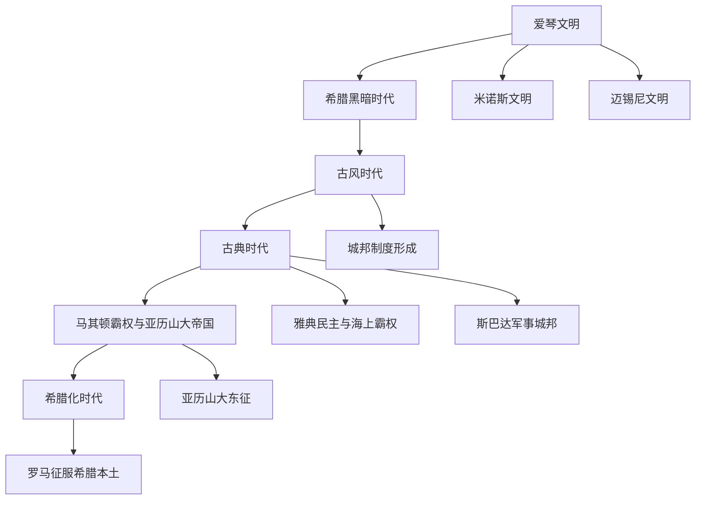

# 古希腊

## 概括

古希腊不是一个统一国家，而是从爱琴青铜时代文明、黑暗时代重组、城邦世界，到马其顿帝国和希腊化王国连续演变出的文化与政治共同体。它的核心遗产包括城邦制度、公民政治、哲学、戏剧、史学、艺术、科学和泛希腊宗教竞技传统。

## 演变图

## 按时间排序的时期导航

| 顺序 | 名称 | 时间 | 简要概括 |
|---|---|---|---|
| 1 | [爱琴文明](/%E4%BA%BA%E6%96%87%E7%A7%91%E5%AD%A6/%E5%8E%86%E5%8F%B2-%E5%A4%96%E5%9B%BD/%E6%AC%A7%E6%B4%B2/_%E9%80%9A%E5%8F%B2/%E5%8F%A4%E5%B8%8C%E8%85%8A/%E7%88%B1%E7%90%B4%E6%96%87%E6%98%8E.md) | 约前3000年-前1100年 | 以克里特米诺斯文明和希腊本土迈锡尼文明为核心的青铜时代文明，是后来希腊神话、英雄史诗和城邦文化的重要背景。 |
| 2 | [希腊黑暗时代](/%E4%BA%BA%E6%96%87%E7%A7%91%E5%AD%A6/%E5%8E%86%E5%8F%B2-%E5%A4%96%E5%9B%BD/%E6%AC%A7%E6%B4%B2/_%E9%80%9A%E5%8F%B2/%E5%8F%A4%E5%B8%8C%E8%85%8A/%E5%B8%8C%E8%85%8A%E9%BB%91%E6%9A%97%E6%97%B6%E4%BB%A3.md) | 约前1100年-前800年 | 迈锡尼宫殿体系崩溃后，希腊进入文字和城市衰退、人口流动和小共同体重组阶段，为城邦兴起积累条件。 |
| 3 | [古风时代](/%E4%BA%BA%E6%96%87%E7%A7%91%E5%AD%A6/%E5%8E%86%E5%8F%B2-%E5%A4%96%E5%9B%BD/%E6%AC%A7%E6%B4%B2/_%E9%80%9A%E5%8F%B2/%E5%8F%A4%E5%B8%8C%E8%85%8A/%E5%8F%A4%E9%A3%8E%E6%97%B6%E4%BB%A3.md) | 约前800年-前500年 | 希腊城邦制度、字母文字、殖民扩张、重装步兵、公民共同体和早期僭主政治逐渐形成。 |
| 4 | [古典时代](/%E4%BA%BA%E6%96%87%E7%A7%91%E5%AD%A6/%E5%8E%86%E5%8F%B2-%E5%A4%96%E5%9B%BD/%E6%AC%A7%E6%B4%B2/_%E9%80%9A%E5%8F%B2/%E5%8F%A4%E5%B8%8C%E8%85%8A/%E5%8F%A4%E5%85%B8%E6%97%B6%E4%BB%A3.md) | 约前500年-前338年 | 雅典、斯巴达、底比斯等城邦竞争，希波战争、雅典民主、伯罗奔尼撒战争和希腊思想艺术达到高峰。 |
| 5 | [马其顿霸权与亚历山大帝国](/%E4%BA%BA%E6%96%87%E7%A7%91%E5%AD%A6/%E5%8E%86%E5%8F%B2-%E5%A4%96%E5%9B%BD/%E6%AC%A7%E6%B4%B2/_%E9%80%9A%E5%8F%B2/%E5%8F%A4%E5%B8%8C%E8%85%8A/%E9%A9%AC%E5%85%B6%E9%A1%BF%E9%9C%B8%E6%9D%83%E4%B8%8E%E4%BA%9A%E5%8E%86%E5%B1%B1%E5%A4%A7%E5%B8%9D%E5%9B%BD.md) | 前338年-前323年 | 马其顿击败希腊城邦后统一希腊政治军事力量，亚历山大东征建立横跨欧亚非的短暂帝国。 |
| 6 | [希腊化时代](/%E4%BA%BA%E6%96%87%E7%A7%91%E5%AD%A6/%E5%8E%86%E5%8F%B2-%E5%A4%96%E5%9B%BD/%E6%AC%A7%E6%B4%B2/_%E9%80%9A%E5%8F%B2/%E5%8F%A4%E5%B8%8C%E8%85%8A/%E5%B8%8C%E8%85%8A%E5%8C%96%E6%97%B6%E4%BB%A3.md) | 前323年-前146年 | 亚历山大帝国瓦解后，托勒密、塞琉古、安提柯等希腊化王国扩散希腊文化，最终被罗马逐步纳入统治。 |

## 关键辨析

- 古希腊不是现代民族国家，而是一组共享语言、神话、宗教仪式、竞技传统和文化认同的城邦与王国世界。
- “希腊城邦”主要对应古风时代和古典时代；雅典、斯巴达、科林斯、底比斯等是独立政治共同体。
- 马其顿霸权把希腊城邦纳入统一军事政治框架，但马其顿帝国很快在亚历山大死后分裂。
- 希腊化时代的重点不再只是希腊本土，而是希腊文化向埃及、西亚和中亚扩散。

## 相关笔记

- [欧洲历史](/%E4%BA%BA%E6%96%87%E7%A7%91%E5%AD%A6/%E5%8E%86%E5%8F%B2-%E5%A4%96%E5%9B%BD/%E6%AC%A7%E6%B4%B2/README.md)
- [古罗马](/%E4%BA%BA%E6%96%87%E7%A7%91%E5%AD%A6/%E5%8E%86%E5%8F%B2-%E5%A4%96%E5%9B%BD/%E6%AC%A7%E6%B4%B2/_%E9%80%9A%E5%8F%B2/%E5%8F%A4%E7%BD%97%E9%A9%AC/README.md)
- [意大利历史](/%E4%BA%BA%E6%96%87%E7%A7%91%E5%AD%A6/%E5%8E%86%E5%8F%B2-%E5%A4%96%E5%9B%BD/%E6%AC%A7%E6%B4%B2/%E6%84%8F%E5%A4%A7%E5%88%A9/README.md)
