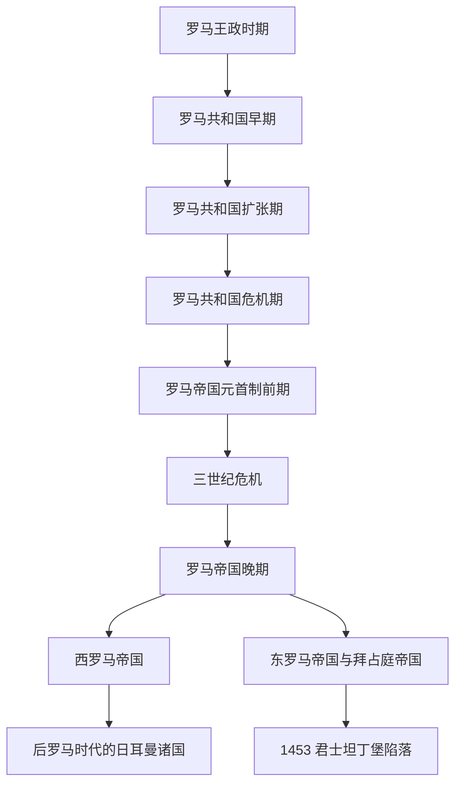

# 古罗马

## 概括

古罗马从意大利中部台伯河畔的拉丁城邦起步，经王政、共和国、帝国三个大阶段，最终形成横跨欧洲、北非和西亚的地中海帝国。其政治制度、罗马法、道路城市、拉丁语、基督教帝国传统和“罗马帝国”观念持续影响欧洲中世纪与近现代国家。

## 名称辨析

| 名称 | 含义 | 说明 |
|---|---|---|
| 古罗马 | 从罗马城邦到西罗马灭亡的整体古代罗马史，也可广义包含东罗马延续 | 本目录按“王政—共和国—帝国—东西分治”整理。 |
| 罗马共和国 | 前509年-前27年 | 共和制度、元老院、执政官、公民大会和军事扩张是主线。 |
| 罗马帝国 | 前27年以后 | 前期以元首制包装共和国传统，晚期转为更公开的君主制和东西分治。 |
| 西罗马 / 东罗马 | 395年后长期分治的两个帝国中心 | 西罗马476年灭亡；东罗马延续至1453年，后世称拜占庭帝国。 |

## 演变图

## 按时间排序的时期导航

| 顺序 | 名称 | 时间 | 简要概括 |
|---|---|---|---|
| 1 | [罗马王政时期](/%E4%BA%BA%E6%96%87%E7%A7%91%E5%AD%A6/%E5%8E%86%E5%8F%B2-%E5%A4%96%E5%9B%BD/%E6%AC%A7%E6%B4%B2/_%E9%80%9A%E5%8F%B2/%E5%8F%A4%E7%BD%97%E9%A9%AC/%E7%BD%97%E9%A9%AC%E7%8E%8B%E6%94%BF%E6%97%B6%E6%9C%9F.md) | 传统前753年-前509年 | 罗马从拉丁人城邦发展为早期城市国家，传统七王传说中保留了拉丁、萨宾和伊特鲁里亚影响。 |
| 2 | [罗马共和国早期](/%E4%BA%BA%E6%96%87%E7%A7%91%E5%AD%A6/%E5%8E%86%E5%8F%B2-%E5%A4%96%E5%9B%BD/%E6%AC%A7%E6%B4%B2/_%E9%80%9A%E5%8F%B2/%E5%8F%A4%E7%BD%97%E9%A9%AC/%E7%BD%97%E9%A9%AC%E5%85%B1%E5%92%8C%E5%9B%BD%E6%97%A9%E6%9C%9F.md) | 前509年-前264年 | 罗马驱逐王政后建立共和国，通过贵族与平民斗争、同盟体系和连续战争统一意大利半岛。 |
| 3 | [罗马共和国扩张期](/%E4%BA%BA%E6%96%87%E7%A7%91%E5%AD%A6/%E5%8E%86%E5%8F%B2-%E5%A4%96%E5%9B%BD/%E6%AC%A7%E6%B4%B2/_%E9%80%9A%E5%8F%B2/%E5%8F%A4%E7%BD%97%E9%A9%AC/%E7%BD%97%E9%A9%AC%E5%85%B1%E5%92%8C%E5%9B%BD%E6%89%A9%E5%BC%A0%E6%9C%9F.md) | 前264年-前133年 | 罗马通过布匿战争击败迦太基，并介入希腊化世界，成为地中海霸权。 |
| 4 | [罗马共和国危机期](/%E4%BA%BA%E6%96%87%E7%A7%91%E5%AD%A6/%E5%8E%86%E5%8F%B2-%E5%A4%96%E5%9B%BD/%E6%AC%A7%E6%B4%B2/_%E9%80%9A%E5%8F%B2/%E5%8F%A4%E7%BD%97%E9%A9%AC/%E7%BD%97%E9%A9%AC%E5%85%B1%E5%92%8C%E5%9B%BD%E5%8D%B1%E6%9C%BA%E6%9C%9F.md) | 前133年-前27年 | 土地、军队、公民权和行省财富带来的矛盾激化，共和制度被军事强人和内战逐步瓦解。 |
| 5 | [罗马帝国元首制前期](/%E4%BA%BA%E6%96%87%E7%A7%91%E5%AD%A6/%E5%8E%86%E5%8F%B2-%E5%A4%96%E5%9B%BD/%E6%AC%A7%E6%B4%B2/_%E9%80%9A%E5%8F%B2/%E5%8F%A4%E7%BD%97%E9%A9%AC/%E7%BD%97%E9%A9%AC%E5%B8%9D%E5%9B%BD%E5%85%83%E9%A6%96%E5%88%B6%E5%89%8D%E6%9C%9F.md) | 前27年-284年 | 奥古斯都建立元首制，帝国在朱里亚-克劳狄、弗拉维、安敦尼和塞维鲁等时期扩张并制度化。 |
| 6 | [三世纪危机](/%E4%BA%BA%E6%96%87%E7%A7%91%E5%AD%A6/%E5%8E%86%E5%8F%B2-%E5%A4%96%E5%9B%BD/%E6%AC%A7%E6%B4%B2/_%E9%80%9A%E5%8F%B2/%E5%8F%A4%E7%BD%97%E9%A9%AC/%E4%B8%89%E4%B8%96%E7%BA%AA%E5%8D%B1%E6%9C%BA.md) | 235年-284年 | 军人皇帝、内战、财政压力、瘟疫和边境入侵使罗马帝国接近分裂，最终由戴克里先改革收束。 |
| 7 | [罗马帝国晚期](/%E4%BA%BA%E6%96%87%E7%A7%91%E5%AD%A6/%E5%8E%86%E5%8F%B2-%E5%A4%96%E5%9B%BD/%E6%AC%A7%E6%B4%B2/_%E9%80%9A%E5%8F%B2/%E5%8F%A4%E7%BD%97%E9%A9%AC/%E7%BD%97%E9%A9%AC%E5%B8%9D%E5%9B%BD%E6%99%9A%E6%9C%9F.md) | 284年-395年 | 戴克里先和君士坦丁改革帝国行政、税制、军制与宗教格局，帝国长期东西分治。 |
| 8 | [西罗马帝国](/%E4%BA%BA%E6%96%87%E7%A7%91%E5%AD%A6/%E5%8E%86%E5%8F%B2-%E5%A4%96%E5%9B%BD/%E6%AC%A7%E6%B4%B2/_%E9%80%9A%E5%8F%B2/%E5%8F%A4%E7%BD%97%E9%A9%AC/%E8%A5%BF%E7%BD%97%E9%A9%AC%E5%B8%9D%E5%9B%BD.md) | 395年-476年 | 罗马帝国西部在日耳曼迁徙、财政军事困境和军人政治中衰亡，476年西部皇帝被废。 |
| 9 | [东罗马帝国与拜占庭帝国](/%E4%BA%BA%E6%96%87%E7%A7%91%E5%AD%A6/%E5%8E%86%E5%8F%B2-%E5%A4%96%E5%9B%BD/%E6%AC%A7%E6%B4%B2/_%E9%80%9A%E5%8F%B2/%E5%8F%A4%E7%BD%97%E9%A9%AC/%E4%B8%9C%E7%BD%97%E9%A9%AC%E5%B8%9D%E5%9B%BD%E4%B8%8E%E6%8B%9C%E5%8D%A0%E5%BA%AD%E5%B8%9D%E5%9B%BD.md) | 395年-1453年 | 以君士坦丁堡为中心的东部帝国延续罗马法统，后世常称拜占庭帝国，直到1453年被奥斯曼攻灭。 |

## 综合专题入口

- [罗马帝国](/%E4%BA%BA%E6%96%87%E7%A7%91%E5%AD%A6/%E5%8E%86%E5%8F%B2-%E5%A4%96%E5%9B%BD/%E6%AC%A7%E6%B4%B2/_%E9%80%9A%E5%8F%B2/%E5%8F%A4%E7%BD%97%E9%A9%AC/%E7%BD%97%E9%A9%AC%E5%B8%9D%E5%9B%BD.md)：集中说明从元首制、三世纪危机、晚期帝国到东西分治的帝国整体结构。

## 相关笔记

- [欧洲历史](/%E4%BA%BA%E6%96%87%E7%A7%91%E5%AD%A6/%E5%8E%86%E5%8F%B2-%E5%A4%96%E5%9B%BD/%E6%AC%A7%E6%B4%B2/README.md)
- [古希腊](/%E4%BA%BA%E6%96%87%E7%A7%91%E5%AD%A6/%E5%8E%86%E5%8F%B2-%E5%A4%96%E5%9B%BD/%E6%AC%A7%E6%B4%B2/_%E9%80%9A%E5%8F%B2/%E5%8F%A4%E5%B8%8C%E8%85%8A/README.md)
- [后罗马时代的日耳曼诸国](/%E4%BA%BA%E6%96%87%E7%A7%91%E5%AD%A6/%E5%8E%86%E5%8F%B2-%E5%A4%96%E5%9B%BD/%E6%AC%A7%E6%B4%B2/_%E9%80%9A%E5%8F%B2/%E5%90%8E%E7%BD%97%E9%A9%AC%E6%97%B6%E4%BB%A3%E7%9A%84%E6%97%A5%E8%80%B3%E6%9B%BC%E8%AF%B8%E5%9B%BD/README.md)
- [意大利历史](/%E4%BA%BA%E6%96%87%E7%A7%91%E5%AD%A6/%E5%8E%86%E5%8F%B2-%E5%A4%96%E5%9B%BD/%E6%AC%A7%E6%B4%B2/%E6%84%8F%E5%A4%A7%E5%88%A9/README.md)
