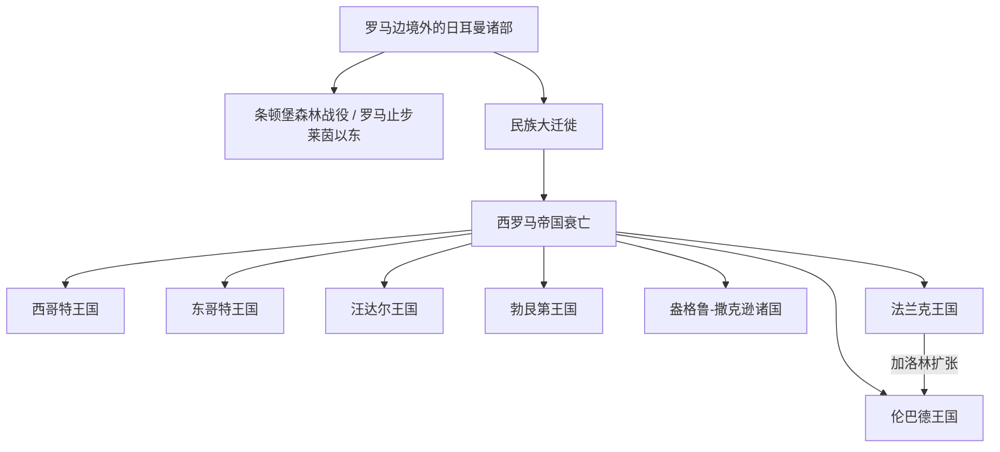

# 后罗马时代的日耳曼诸国

## 时间

约公元前后-8世纪；核心后罗马王国阶段为5世纪-8世纪

## 概括

日耳曼部落原本不是一个统一国家，而是罗马人对一批语言、生活方式和地域相近族群的概称。罗马帝国时期，日耳曼诸部主要分布在莱茵河以东、多瑙河以北以及北欧一带，与罗马帝国既有贸易、军事和雇佣关系，也长期发生边境冲突。4-5世纪民族大迁徙后，部分日耳曼集团进入罗马帝国境内；西罗马衰亡后，西欧出现西哥特、东哥特、汪达尔、勃艮第、盎格鲁-撒克逊、法兰克、伦巴德等日耳曼政权。

## 历史主线

西罗马帝国衰亡并不意味着罗马秩序立即消失，而是由一批日耳曼军事集团、罗马地方行政、教会网络和旧贵族共同重组。西哥特、东哥特、汪达尔等政权多在罗马旧行省中建立；法兰克王国则逐渐成为西欧最有持续性的日耳曼继承政权，并在加洛林时代整合西欧。

## 按时间排序的诸国导航

| 顺序 | 名称 | 时间 | 简要概括 |
|---|---|---|---|
| 1 | [日耳曼部落](/%E4%BA%BA%E6%96%87%E7%A7%91%E5%AD%A6/%E5%8E%86%E5%8F%B2-%E5%A4%96%E5%9B%BD/%E6%AC%A7%E6%B4%B2/_%E9%80%9A%E5%8F%B2/%E5%90%8E%E7%BD%97%E9%A9%AC%E6%97%B6%E4%BB%A3%E7%9A%84%E6%97%A5%E8%80%B3%E6%9B%BC%E8%AF%B8%E5%9B%BD/%E6%97%A5%E8%80%B3%E6%9B%BC%E9%83%A8%E8%90%BD.md) | 约公元前后-5世纪 | 罗马边境外一批语言、生活方式和地域相近族群的概称，不是统一国家。 |
| 2 | [西哥特王国](/%E4%BA%BA%E6%96%87%E7%A7%91%E5%AD%A6/%E5%8E%86%E5%8F%B2-%E5%A4%96%E5%9B%BD/%E6%AC%A7%E6%B4%B2/_%E9%80%9A%E5%8F%B2/%E5%90%8E%E7%BD%97%E9%A9%AC%E6%97%B6%E4%BB%A3%E7%9A%84%E6%97%A5%E8%80%B3%E6%9B%BC%E8%AF%B8%E5%9B%BD/%E8%A5%BF%E5%93%A5%E7%89%B9%E7%8E%8B%E5%9B%BD.md) | 418年-711年 | 早期在高卢南部建国，后以伊比利亚托莱多为核心。 |
| 3 | [汪达尔王国](/%E4%BA%BA%E6%96%87%E7%A7%91%E5%AD%A6/%E5%8E%86%E5%8F%B2-%E5%A4%96%E5%9B%BD/%E6%AC%A7%E6%B4%B2/_%E9%80%9A%E5%8F%B2/%E5%90%8E%E7%BD%97%E9%A9%AC%E6%97%B6%E4%BB%A3%E7%9A%84%E6%97%A5%E8%80%B3%E6%9B%BC%E8%AF%B8%E5%9B%BD/%E6%B1%AA%E8%BE%BE%E5%B0%94%E7%8E%8B%E5%9B%BD.md) | 439年-534年 | 控制北非迦太基和西地中海海权，后被拜占庭灭亡。 |
| 4 | [勃艮第王国](/%E4%BA%BA%E6%96%87%E7%A7%91%E5%AD%A6/%E5%8E%86%E5%8F%B2-%E5%A4%96%E5%9B%BD/%E6%AC%A7%E6%B4%B2/_%E9%80%9A%E5%8F%B2/%E5%90%8E%E7%BD%97%E9%A9%AC%E6%97%B6%E4%BB%A3%E7%9A%84%E6%97%A5%E8%80%B3%E6%9B%BC%E8%AF%B8%E5%9B%BD/%E5%8B%83%E8%89%AE%E7%AC%AC%E7%8E%8B%E5%9B%BD.md) | 5世纪-534年 | 位于罗讷河流域，后被法兰克王国并入；后续“勃艮第”更多进入法国史主线。 |
| 5 | [东哥特王国](/%E4%BA%BA%E6%96%87%E7%A7%91%E5%AD%A6/%E5%8E%86%E5%8F%B2-%E5%A4%96%E5%9B%BD/%E6%AC%A7%E6%B4%B2/_%E9%80%9A%E5%8F%B2/%E5%90%8E%E7%BD%97%E9%A9%AC%E6%97%B6%E4%BB%A3%E7%9A%84%E6%97%A5%E8%80%B3%E6%9B%BC%E8%AF%B8%E5%9B%BD/%E4%B8%9C%E5%93%A5%E7%89%B9%E7%8E%8B%E5%9B%BD.md) | 493年-553年 | 狄奥多里克在意大利建立，维持许多罗马行政传统。 |
| 6 | [盎格鲁-撒克逊诸国](/%E4%BA%BA%E6%96%87%E7%A7%91%E5%AD%A6/%E5%8E%86%E5%8F%B2-%E5%A4%96%E5%9B%BD/%E6%AC%A7%E6%B4%B2/_%E9%80%9A%E5%8F%B2/%E5%90%8E%E7%BD%97%E9%A9%AC%E6%97%B6%E4%BB%A3%E7%9A%84%E6%97%A5%E8%80%B3%E6%9B%BC%E8%AF%B8%E5%9B%BD/%E7%9B%8E%E6%A0%BC%E9%B2%81-%E6%92%92%E5%85%8B%E9%80%8A%E8%AF%B8%E5%9B%BD.md) | 5世纪-1066年 | 不列颠的早期日耳曼诸王国，细节归入[英国史的盎格鲁-撒克逊时期](/%E4%BA%BA%E6%96%87%E7%A7%91%E5%AD%A6/%E5%8E%86%E5%8F%B2-%E5%A4%96%E5%9B%BD/%E6%AC%A7%E6%B4%B2/%E8%8B%B1%E5%9B%BD/%E7%9B%8E%E6%A0%BC%E9%B2%81-%E6%92%92%E5%85%8B%E9%80%8A%E6%97%B6%E6%9C%9F.md)。 |
| 7 | [法兰克王国](/%E4%BA%BA%E6%96%87%E7%A7%91%E5%AD%A6/%E5%8E%86%E5%8F%B2-%E5%A4%96%E5%9B%BD/%E6%AC%A7%E6%B4%B2/_%E9%80%9A%E5%8F%B2/%E5%90%8E%E7%BD%97%E9%A9%AC%E6%97%B6%E4%BB%A3%E7%9A%84%E6%97%A5%E8%80%B3%E6%9B%BC%E8%AF%B8%E5%9B%BD/%E6%B3%95%E5%85%B0%E5%85%8B%E7%8E%8B%E5%9B%BD/README.md) | 481/486年-843年 | 克洛维及其后继者统一大部分高卢，后扩张为加洛林帝国。 |
| 8 | [伦巴德王国](/%E4%BA%BA%E6%96%87%E7%A7%91%E5%AD%A6/%E5%8E%86%E5%8F%B2-%E5%A4%96%E5%9B%BD/%E6%AC%A7%E6%B4%B2/_%E9%80%9A%E5%8F%B2/%E5%90%8E%E7%BD%97%E9%A9%AC%E6%97%B6%E4%BB%A3%E7%9A%84%E6%97%A5%E8%80%B3%E6%9B%BC%E8%AF%B8%E5%9B%BD/%E4%BC%A6%E5%B7%B4%E5%BE%B7%E7%8E%8B%E5%9B%BD.md) | 568年-774年 | 进入意大利北部，与拜占庭、教皇势力并存，后被查理曼征服。 |

## 重要事件

- 公元前1世纪，凯撒在高卢战争中强化“日耳曼”作为罗马边疆概念。
- 9年，条顿堡森林战役后，罗马未能长期控制莱茵河以东广大地区。
- 4-5世纪，民族大迁徙改变罗马边境和西欧政治结构。
- 5世纪，日耳曼军事集团在西罗马境内建立多个继承政权。
- 496年前后，克洛维皈依天主教，法兰克王权与高卢教会结合。
- 568年，伦巴德进入意大利。
- 774年，查理曼征服伦巴德王国。

## 演变关系

- 前一节点：[西罗马帝国](/%E4%BA%BA%E6%96%87%E7%A7%91%E5%AD%A6/%E5%8E%86%E5%8F%B2-%E5%A4%96%E5%9B%BD/%E6%AC%A7%E6%B4%B2/_%E9%80%9A%E5%8F%B2/%E5%8F%A4%E7%BD%97%E9%A9%AC/%E8%A5%BF%E7%BD%97%E9%A9%AC%E5%B8%9D%E5%9B%BD.md)。
- 主要后续节点：[法兰克王国](/%E4%BA%BA%E6%96%87%E7%A7%91%E5%AD%A6/%E5%8E%86%E5%8F%B2-%E5%A4%96%E5%9B%BD/%E6%AC%A7%E6%B4%B2/_%E9%80%9A%E5%8F%B2/%E5%90%8E%E7%BD%97%E9%A9%AC%E6%97%B6%E4%BB%A3%E7%9A%84%E6%97%A5%E8%80%B3%E6%9B%BC%E8%AF%B8%E5%9B%BD/%E6%B3%95%E5%85%B0%E5%85%8B%E7%8E%8B%E5%9B%BD/README.md)。
- 德意志方向：日耳曼诸部中的萨克森人、巴伐利亚人、阿勒曼尼人、法兰克人等，后来与[东法兰克王国](/%E4%BA%BA%E6%96%87%E7%A7%91%E5%AD%A6/%E5%8E%86%E5%8F%B2-%E5%A4%96%E5%9B%BD/%E6%AC%A7%E6%B4%B2/_%E9%80%9A%E5%8F%B2/%E5%90%8E%E7%BD%97%E9%A9%AC%E6%97%B6%E4%BB%A3%E7%9A%84%E6%97%A5%E8%80%B3%E6%9B%BC%E8%AF%B8%E5%9B%BD/%E6%B3%95%E5%85%B0%E5%85%8B%E7%8E%8B%E5%9B%BD/%E4%B8%9C%E6%B3%95%E5%85%B0%E5%85%8B%E7%8E%8B%E5%9B%BD.md)和[神圣罗马帝国](/%E4%BA%BA%E6%96%87%E7%A7%91%E5%AD%A6/%E5%8E%86%E5%8F%B2-%E5%A4%96%E5%9B%BD/%E6%AC%A7%E6%B4%B2/%E5%BE%B7%E6%84%8F%E5%BF%97/%E7%A5%9E%E5%9C%A3%E7%BD%97%E9%A9%AC%E5%B8%9D%E5%9B%BD/README.md)相关。

## 相关笔记

- [法兰克王国](/%E4%BA%BA%E6%96%87%E7%A7%91%E5%AD%A6/%E5%8E%86%E5%8F%B2-%E5%A4%96%E5%9B%BD/%E6%AC%A7%E6%B4%B2/_%E9%80%9A%E5%8F%B2/%E5%90%8E%E7%BD%97%E9%A9%AC%E6%97%B6%E4%BB%A3%E7%9A%84%E6%97%A5%E8%80%B3%E6%9B%BC%E8%AF%B8%E5%9B%BD/%E6%B3%95%E5%85%B0%E5%85%8B%E7%8E%8B%E5%9B%BD/README.md)
- [德意志历史](/%E4%BA%BA%E6%96%87%E7%A7%91%E5%AD%A6/%E5%8E%86%E5%8F%B2-%E5%A4%96%E5%9B%BD/%E6%AC%A7%E6%B4%B2/%E5%BE%B7%E6%84%8F%E5%BF%97/README.md)
- [法国历史](/%E4%BA%BA%E6%96%87%E7%A7%91%E5%AD%A6/%E5%8E%86%E5%8F%B2-%E5%A4%96%E5%9B%BD/%E6%AC%A7%E6%B4%B2/%E6%B3%95%E5%9B%BD/README.md)
- [意大利历史](/%E4%BA%BA%E6%96%87%E7%A7%91%E5%AD%A6/%E5%8E%86%E5%8F%B2-%E5%A4%96%E5%9B%BD/%E6%AC%A7%E6%B4%B2/%E6%84%8F%E5%A4%A7%E5%88%A9/README.md)
- [欧洲历史](/%E4%BA%BA%E6%96%87%E7%A7%91%E5%AD%A6/%E5%8E%86%E5%8F%B2-%E5%A4%96%E5%9B%BD/%E6%AC%A7%E6%B4%B2/README.md)
