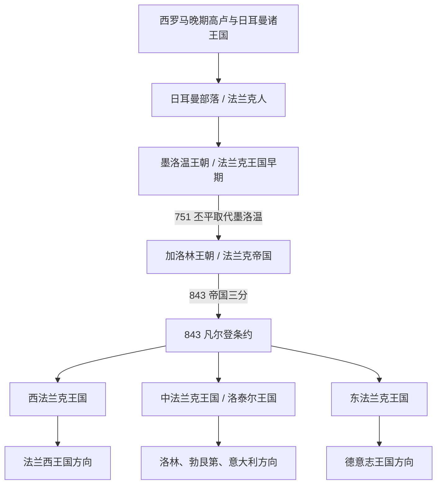

# 法兰克王国

## 时间

481/486年-843年；后续三分王国延续并分化至10世纪

## 概括

法兰克王国是法兰克人在西罗马帝国瓦解后的西欧建立的王国，由莱茵河下游法兰克人政权扩展而成。它先由墨洛温王朝统一高卢北部并与高卢罗马教会结合，后由加洛林王朝扩张为横跨西欧的帝国。843年《凡尔登条约》后三分为西法兰克、中法兰克、东法兰克，分别影响后来的法国、洛林 / 勃艮第 / 意大利和德意志历史。

## 历史主线

法兰克王国不是法国、德国或意大利任一国家的单独历史，而是西罗马瓦解后西欧共同政治秩序的一段源头史。法国史继承其西部高卢核心和西法兰克主线；德意志史继承东法兰克与后来的德意志王国主线；意大利北部、洛林、勃艮第等地则深受中法兰克分化影响。

## 关键君主与实际掌权者

| 类型 | 人物 | 时间 | 说明 |
|---|---|---|---|
| 墨洛温王朝君主 | **克洛维一世** | 481/482-511 | 统一大部分法兰克人，击败苏瓦松罗马残余政权，并皈依天主教。 |
| 墨洛温王朝君主 | 克洛泰尔一世 | 511-561；558-561统一 | 克洛维之子，短暂重新统一法兰克王国。 |
| 宫相 / 实际掌权者 | 查理·马特 | 714-741 | 墨洛温后期宫相权力上升的代表，732年图尔-普瓦捷战役提升法兰克威望。 |
| 加洛林王朝君主 | 丕平三世 | 751-768 | 获教皇支持称王，取代墨洛温王朝，开创加洛林王朝。 |
| 皇帝 / 君主 | **查理曼** | 768-814；800年加冕皇帝 | 扩张为西欧大帝国，被教皇加冕为“罗马人的皇帝”。 |
| 末期君主 | 虔诚者路易及其诸子 | 814-843 | 继承冲突导致843年帝国分裂。 |

## 按时间排序的时期导航

| 顺序 | 名称 | 时间 | 简要概括 |
|---|---|---|---|
| 1 | [墨洛温王朝](/%E4%BA%BA%E6%96%87%E7%A7%91%E5%AD%A6/%E5%8E%86%E5%8F%B2-%E5%A4%96%E5%9B%BD/%E6%AC%A7%E6%B4%B2/_%E9%80%9A%E5%8F%B2/%E5%90%8E%E7%BD%97%E9%A9%AC%E6%97%B6%E4%BB%A3%E7%9A%84%E6%97%A5%E8%80%B3%E6%9B%BC%E8%AF%B8%E5%9B%BD/%E6%B3%95%E5%85%B0%E5%85%8B%E7%8E%8B%E5%9B%BD/%E5%A2%A8%E6%B4%9B%E6%B8%A9%E7%8E%8B%E6%9C%9D.md) | 486年-751年 | 克洛维建立高卢法兰克王国并皈依天主教，王国反复分割，宫相权力上升，最终被加洛林家族取代。 |
| 2 | [加洛林王朝](/%E4%BA%BA%E6%96%87%E7%A7%91%E5%AD%A6/%E5%8E%86%E5%8F%B2-%E5%A4%96%E5%9B%BD/%E6%AC%A7%E6%B4%B2/_%E9%80%9A%E5%8F%B2/%E5%90%8E%E7%BD%97%E9%A9%AC%E6%97%B6%E4%BB%A3%E7%9A%84%E6%97%A5%E8%80%B3%E6%9B%BC%E8%AF%B8%E5%9B%BD/%E6%B3%95%E5%85%B0%E5%85%8B%E7%8E%8B%E5%9B%BD/%E5%8A%A0%E6%B4%9B%E6%9E%97%E7%8E%8B%E6%9C%9D.md) | 751年-843年；西法兰克加洛林延至987年 | 丕平篡立后，查理曼建立西欧帝国；843年《凡尔登条约》三分帝国。 |
| 3 | [西法兰克王国](/%E4%BA%BA%E6%96%87%E7%A7%91%E5%AD%A6/%E5%8E%86%E5%8F%B2-%E5%A4%96%E5%9B%BD/%E6%AC%A7%E6%B4%B2/_%E9%80%9A%E5%8F%B2/%E5%90%8E%E7%BD%97%E9%A9%AC%E6%97%B6%E4%BB%A3%E7%9A%84%E6%97%A5%E8%80%B3%E6%9B%BC%E8%AF%B8%E5%9B%BD/%E6%B3%95%E5%85%B0%E5%85%8B%E7%8E%8B%E5%9B%BD/%E8%A5%BF%E6%B3%95%E5%85%B0%E5%85%8B%E7%8E%8B%E5%9B%BD.md) | 843年-987年 | 秃头查理所得西部王国，逐渐演化为法兰西王国，是法国史主线的直接前身。 |
| 4 | [中法兰克王国](/%E4%BA%BA%E6%96%87%E7%A7%91%E5%AD%A6/%E5%8E%86%E5%8F%B2-%E5%A4%96%E5%9B%BD/%E6%AC%A7%E6%B4%B2/_%E9%80%9A%E5%8F%B2/%E5%90%8E%E7%BD%97%E9%A9%AC%E6%97%B6%E4%BB%A3%E7%9A%84%E6%97%A5%E8%80%B3%E6%9B%BC%E8%AF%B8%E5%9B%BD/%E6%B3%95%E5%85%B0%E5%85%8B%E7%8E%8B%E5%9B%BD/%E4%B8%AD%E6%B3%95%E5%85%B0%E5%85%8B%E7%8E%8B%E5%9B%BD.md) | 843年-855年；后续分化至10世纪 | 洛泰尔一世所得中部王国，后分出洛林、勃艮第、意大利等复杂区域。 |
| 5 | [东法兰克王国](/%E4%BA%BA%E6%96%87%E7%A7%91%E5%AD%A6/%E5%8E%86%E5%8F%B2-%E5%A4%96%E5%9B%BD/%E6%AC%A7%E6%B4%B2/_%E9%80%9A%E5%8F%B2/%E5%90%8E%E7%BD%97%E9%A9%AC%E6%97%B6%E4%BB%A3%E7%9A%84%E6%97%A5%E8%80%B3%E6%9B%BC%E8%AF%B8%E5%9B%BD/%E6%B3%95%E5%85%B0%E5%85%8B%E7%8E%8B%E5%9B%BD/%E4%B8%9C%E6%B3%95%E5%85%B0%E5%85%8B%E7%8E%8B%E5%9B%BD.md) | 843年-962年 | 日耳曼人路易所得东部王国，逐渐演化为德意志王国，并成为神圣罗马帝国核心。 |

## 重要转折与时间节点

| 时间 | 事件 | 意义 |
|---|---|---|
| 486年 | 克洛维击败苏瓦松罗马残余政权 | 法兰克王国取得北高卢核心地位。 |
| 496年前后 | 克洛维皈依天主教 | 法兰克王权与高卢罗马教会结合。 |
| 732年 | 图尔-普瓦捷战役 | 查理·马特提升宫相家族威望，阻止倭马亚军队继续北进。 |
| 751年 | 丕平废黜希尔德里克三世 | 加洛林王朝取代墨洛温王朝。 |
| 800年 | 查理曼在罗马加冕为皇帝 | 法兰克王国达到帝国形态。 |
| 843年 | 《凡尔登条约》 | 帝国三分，西法兰克、中法兰克、东法兰克分别走向不同历史方向；东法兰克成为德意志历史主线的重要前身。 |
| 987年 | 雨果·卡佩即位 | 西法兰克王权转入卡佩王朝，法兰西王国主线逐渐清晰。 |

## 演变关系

- 前一节点：[后罗马时代的日耳曼诸国](/%E4%BA%BA%E6%96%87%E7%A7%91%E5%AD%A6/%E5%8E%86%E5%8F%B2-%E5%A4%96%E5%9B%BD/%E6%AC%A7%E6%B4%B2/_%E9%80%9A%E5%8F%B2/%E5%90%8E%E7%BD%97%E9%A9%AC%E6%97%B6%E4%BB%A3%E7%9A%84%E6%97%A5%E8%80%B3%E6%9B%BC%E8%AF%B8%E5%9B%BD/README.md)。
- 德意志方向：[东法兰克王国](/%E4%BA%BA%E6%96%87%E7%A7%91%E5%AD%A6/%E5%8E%86%E5%8F%B2-%E5%A4%96%E5%9B%BD/%E6%AC%A7%E6%B4%B2/_%E9%80%9A%E5%8F%B2/%E5%90%8E%E7%BD%97%E9%A9%AC%E6%97%B6%E4%BB%A3%E7%9A%84%E6%97%A5%E8%80%B3%E6%9B%BC%E8%AF%B8%E5%9B%BD/%E6%B3%95%E5%85%B0%E5%85%8B%E7%8E%8B%E5%9B%BD/%E4%B8%9C%E6%B3%95%E5%85%B0%E5%85%8B%E7%8E%8B%E5%9B%BD.md)，后续通向[神圣罗马帝国](/%E4%BA%BA%E6%96%87%E7%A7%91%E5%AD%A6/%E5%8E%86%E5%8F%B2-%E5%A4%96%E5%9B%BD/%E6%AC%A7%E6%B4%B2/%E5%BE%B7%E6%84%8F%E5%BF%97/%E7%A5%9E%E5%9C%A3%E7%BD%97%E9%A9%AC%E5%B8%9D%E5%9B%BD/README.md)。
- 法国方向：[西法兰克王国](/%E4%BA%BA%E6%96%87%E7%A7%91%E5%AD%A6/%E5%8E%86%E5%8F%B2-%E5%A4%96%E5%9B%BD/%E6%AC%A7%E6%B4%B2/_%E9%80%9A%E5%8F%B2/%E5%90%8E%E7%BD%97%E9%A9%AC%E6%97%B6%E4%BB%A3%E7%9A%84%E6%97%A5%E8%80%B3%E6%9B%BC%E8%AF%B8%E5%9B%BD/%E6%B3%95%E5%85%B0%E5%85%8B%E7%8E%8B%E5%9B%BD/%E8%A5%BF%E6%B3%95%E5%85%B0%E5%85%8B%E7%8E%8B%E5%9B%BD.md)，后续通向[法国历史](/%E4%BA%BA%E6%96%87%E7%A7%91%E5%AD%A6/%E5%8E%86%E5%8F%B2-%E5%A4%96%E5%9B%BD/%E6%AC%A7%E6%B4%B2/%E6%B3%95%E5%9B%BD/README.md)。
- 中部方向：[中法兰克王国](/%E4%BA%BA%E6%96%87%E7%A7%91%E5%AD%A6/%E5%8E%86%E5%8F%B2-%E5%A4%96%E5%9B%BD/%E6%AC%A7%E6%B4%B2/_%E9%80%9A%E5%8F%B2/%E5%90%8E%E7%BD%97%E9%A9%AC%E6%97%B6%E4%BB%A3%E7%9A%84%E6%97%A5%E8%80%B3%E6%9B%BC%E8%AF%B8%E5%9B%BD/%E6%B3%95%E5%85%B0%E5%85%8B%E7%8E%8B%E5%9B%BD/%E4%B8%AD%E6%B3%95%E5%85%B0%E5%85%8B%E7%8E%8B%E5%9B%BD.md)，后续影响洛林、勃艮第和意大利北部。

## 相关笔记

- [德意志历史](/%E4%BA%BA%E6%96%87%E7%A7%91%E5%AD%A6/%E5%8E%86%E5%8F%B2-%E5%A4%96%E5%9B%BD/%E6%AC%A7%E6%B4%B2/%E5%BE%B7%E6%84%8F%E5%BF%97/README.md)
- [法国历史](/%E4%BA%BA%E6%96%87%E7%A7%91%E5%AD%A6/%E5%8E%86%E5%8F%B2-%E5%A4%96%E5%9B%BD/%E6%AC%A7%E6%B4%B2/%E6%B3%95%E5%9B%BD/README.md)
- [意大利历史](/%E4%BA%BA%E6%96%87%E7%A7%91%E5%AD%A6/%E5%8E%86%E5%8F%B2-%E5%A4%96%E5%9B%BD/%E6%AC%A7%E6%B4%B2/%E6%84%8F%E5%A4%A7%E5%88%A9/README.md)
- [欧洲历史](/%E4%BA%BA%E6%96%87%E7%A7%91%E5%AD%A6/%E5%8E%86%E5%8F%B2-%E5%A4%96%E5%9B%BD/%E6%AC%A7%E6%B4%B2/README.md)
