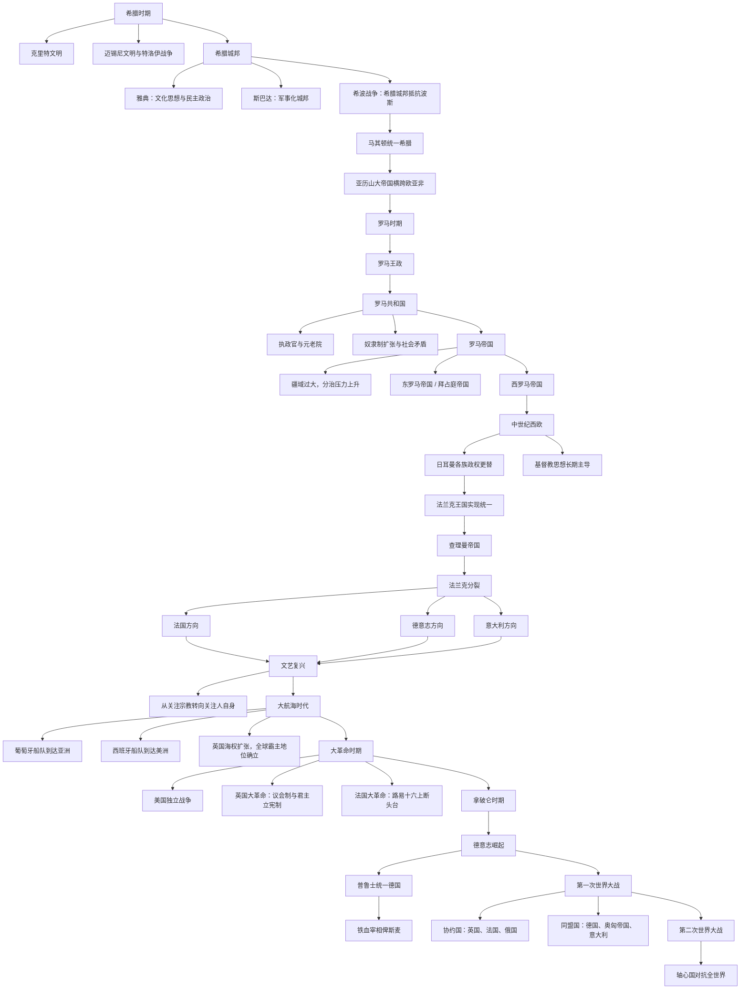

# 欧洲历史脉络

## 概括

这篇笔记按时间顺序整理欧洲通史的主线：从爱琴文明、希腊城邦和罗马帝国，到中世纪基督教世界、文艺复兴、大航海、资产阶级革命、拿破仑战争、德意志统一，再到两次世界大战。

这是一条极简脉络，适合先建立时代框架。具体国家、王朝、战争和制度演变需要再进入专题笔记细化。

## 主线时间表

| 顺序 | 阶段 | 大致时间 | 简要概括 |
|---:|---|---:|---|
| 1 | 希腊时期 | 前3千纪-前4世纪 | 克里特、迈锡尼和希腊城邦构成欧洲古典文明源头，希波战争和城邦竞争塑造希腊政治文化。 |
| 2 | 亚历山大与希腊化时代 | 前4世纪-前1世纪 | 马其顿统一希腊并向东方扩张，亚历山大帝国瓦解后形成希腊化世界。 |
| 3 | 罗马时期 | 前8世纪-476年 | 罗马从王政、共和国走向帝国，建立环地中海大帝国；西罗马灭亡后欧洲进入中古格局。 |
| 4 | 中世纪 | 476年-15世纪 | 东罗马延续，西欧形成封建、教会和王权并存的秩序；日耳曼诸王国、法兰克王国和神圣罗马帝国影响深远。 |
| 5 | 文艺复兴 | 14世纪-16世纪 | 从关注宗教转向关注人自身，古典文化复兴、城市经济和艺术科学发展推动近代欧洲形成。 |
| 6 | 大航海时代 | 15世纪-17世纪 | 葡萄牙、西班牙率先扩张到亚洲、美洲和非洲，英国、法国、荷兰随后加入海洋竞争。 |
| 7 | 大革命时期 | 17世纪-18世纪末 | 英国革命确立议会和君主立宪传统，美国独立战争冲击殖民秩序，法国大革命重塑欧洲政治语言。 |
| 8 | 拿破仑时期 | 1799年-1815年 | 拿破仑扩张将法国革命成果和法典制度推向欧洲，也引发反法同盟和维也纳体系。 |
| 9 | 德意志崛起 | 19世纪 | 普鲁士通过铁血政策推动德国统一，德意志帝国成为欧洲大陆新强权。 |
| 10 | 第一次世界大战 | 1914年-1918年 | 协约国与同盟国对抗，欧洲旧帝国体系崩溃，奥匈、德意志、俄罗斯、奥斯曼等帝国发生剧变。 |
| 11 | 第二次世界大战 | 1939年-1945年 | 轴心国与同盟国对抗，欧洲中心地位进一步下降，战后形成美苏冷战格局。 |

## 阶段要点

### 希腊时期

- 克里特文明和迈锡尼文明是爱琴文明的重要组成部分。
- 希腊城邦崇尚公民政治、哲学、艺术和竞技传统。
- 斯巴达以军事化城邦著称，雅典以民主政治和文化繁荣著称。
- 希波战争中，希腊城邦抵抗波斯入侵。
- 马其顿在腓力二世和亚历山大时期崛起，统一希腊并建立横跨欧亚非的帝国。

### 罗马时期

- 罗马经历王政、共和国、帝国三个主要阶段。
- 罗马共和国的扩张带来奴隶制大规模发展，社会矛盾加剧。
- 罗马帝国鼎盛时控制地中海周边，但疆域过大导致治理困难。
- 帝国后期分裂为东罗马帝国和西罗马帝国。
- 西罗马帝国灭亡通常被视为欧洲古代史与中世纪的分界点之一。

### 中世纪

- 东罗马帝国，即拜占庭帝国，延续千年，最终被奥斯曼帝国终结。
- 西罗马灭亡后，日耳曼诸王国在西欧建立政权。
- 法兰克王国在查理曼时期达到高峰，其后分裂出后来法国、德意志和意大利的早期政治基础。
- 中世纪欧洲长期以基督教会、封建领主和王权之间的关系为核心。

### 文艺复兴与大航海

- 文艺复兴从意大利城市兴起，强调人文主义和古典文化复兴。
- 大航海时代中，葡萄牙开辟到亚洲的海路，西班牙通过哥伦布航行进入美洲扩张。
- 英国、法国、荷兰后来加入殖民和海权竞争。
- 海外扩张将欧洲纳入全球贸易网络，也带来殖民、奴隶贸易和世界体系重组。

### 大革命、拿破仑与民族国家

- 英国通过革命和制度调整，逐步形成议会制与君主立宪制。
- 法国大革命提出自由、平等、民族主权等政治观念，冲击欧洲旧制度。
- 拿破仑通过战争重塑欧洲秩序，莱茵邦联等安排直接动摇神圣罗马帝国。
- 拿破仑失败后，维也纳体系试图恢复欧洲均势，但民族主义和自由主义继续发展。
- 普鲁士领导下的德意志统一改变欧洲大陆力量平衡。

### 两次世界大战

- 第一次世界大战主要表现为协约国与同盟国之间的总体战争。
- 英国、法国、俄国等协约国对抗德国、奥匈帝国、奥斯曼帝国等同盟国。
- 战后欧洲旧帝国体系瓦解，民族国家和国际组织尝试重建秩序。
- 第二次世界大战中，德国、意大利、日本等轴心国对抗同盟国。
- 二战后西欧衰落，美苏成为主导力量，欧洲进入冷战分裂与战后重建阶段。

## 演进关系

## 关键转折点

| 转折点 | 意义 |
|---|---|
| 希波战争 | 希腊城邦抵抗波斯，强化希腊世界的共同体意识。 |
| 亚历山大东征 | 把希腊文化扩展到西亚、埃及和中亚，形成希腊化时代。 |
| 罗马帝国建立 | 地中海世界进入统一帝国秩序，罗马法、道路、城市和行政制度影响深远。 |
| 西罗马帝国灭亡 | 西欧进入日耳曼王国、封建制度和教会主导的中世纪格局。 |
| 查理曼加冕 | 象征西欧帝国传统复兴，也为法国和德意志历史分化埋下基础。 |
| 文艺复兴 | 人文主义、艺术、科学和城市经济发展推动近代欧洲思想转型。 |
| 大航海 | 欧洲从地区性文明中心转向全球扩张力量。 |
| 法国大革命 | 旧制度被冲击，民族主权、公民权利和现代政治意识形态扩散。 |
| 拿破仑战争 | 传播革命制度，同时激发欧洲民族主义和反法同盟。 |
| 德意志统一 | 改变欧洲均势，是一战前欧洲紧张格局的重要背景。 |
| 两次世界大战 | 欧洲传统列强体系崩溃，世界权力中心转向美国和苏联。 |

## 相关笔记

- [世界大帝国时空图](/%E4%BA%BA%E6%96%87%E7%A7%91%E5%AD%A6/%E5%8E%86%E5%8F%B2-%E5%A4%96%E5%9B%BD/_%E9%80%9A%E5%8F%B2/%E4%B8%96%E7%95%8C%E5%A4%A7%E5%B8%9D%E5%9B%BD%E6%97%B6%E7%A9%BA%E5%9B%BE.md)
- [欧洲四大帝王与四大名将](/%E4%BA%BA%E6%96%87%E7%A7%91%E5%AD%A6/%E5%8E%86%E5%8F%B2-%E5%A4%96%E5%9B%BD/%E6%AC%A7%E6%B4%B2/_%E9%80%9A%E5%8F%B2/%E6%AC%A7%E6%B4%B2%E5%9B%9B%E5%A4%A7%E5%B8%9D%E7%8E%8B%E4%B8%8E%E5%9B%9B%E5%A4%A7%E5%90%8D%E5%B0%86.md)
