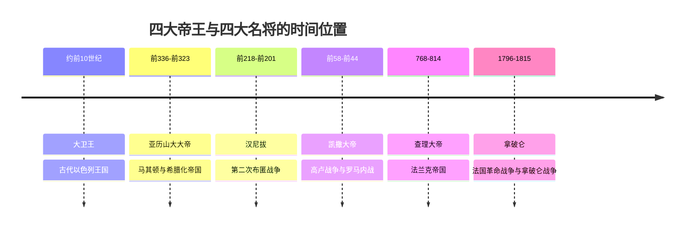

# 欧洲四大帝王与四大名将

## 概括

这篇笔记整理两组通俗历史名单：一组来自扑克牌 K 牌常见象征人物，另一组是西方军事史中常被并称的“四大名将”。这些名单不是严格学术分类，而是便于记忆古代以色列、希腊化世界、罗马、法兰克与近代法国等历史节点。

需要注意：大卫王和汉尼拔严格说不属于“欧洲君主 / 欧洲将领”，但在地中海与西方传统叙事中常与欧洲历史人物并列。

## 四大帝王

| 纸牌 | 人物 | 时代 | 主要身份 | 记忆要点 |
|---|---|---:|---|---|
| 黑桃 K | 大卫王 | 约前10世纪 | 以色列联合王国国王 | 希伯来传统中的理想君王形象，常被视为以色列王国强盛期的代表。 |
| 梅花 K | 亚历山大大帝 | 前336年-前323年在位 | 马其顿国王、希腊同盟统帅、埃及法老、波斯国王、亚细亚霸主 | 东征建立横跨巴尔干、埃及、西亚到中亚的帝国，推动希腊化时代。 |
| 方块 K | 凯撒大帝 | 前1世纪 | 罗马共和国独裁官、执政官 | 通过高卢战争和内战改变罗马政治格局，是共和国向帝国转型的关键人物。 |
| 红桃 K | 查理大帝 / 查理曼 | 768年-814年在位 | 法兰克国王、伦巴第国王、罗马人的皇帝 | 扩张法兰克王国，800年加冕为皇帝，象征西欧帝国传统的复兴。 |

## 四大名将

| 人物 | 时代 | 所属政治体 | 代表战役 / 行动 | 主要特点 |
|---|---:|---|---|---|
| 亚历山大大帝 | 前4世纪 | 马其顿王国 | 格拉尼库斯河、伊苏斯、高加米拉、印度河流域远征 | 高速机动、骑兵突击与政治整合结合，建立希腊化帝国。 |
| 汉尼拔 | 前3世纪-前2世纪 | 迦太基 | 第二次布匿战争、坎尼会战、翻越阿尔卑斯山入侵意大利 | 以少胜多和战术包围的代表，长期牵制罗马本土。 |
| 凯撒大帝 | 前1世纪 | 罗马共和国 | 高卢战争、阿莱西亚围城、法萨卢斯战役 | 战争、政治和宣传能力结合，军事胜利直接改变罗马政体。 |
| 拿破仑 | 18世纪末-19世纪初 | 法兰西第一共和国 / 法兰西第一帝国 | 意大利战役、奥斯特里茨、耶拿、滑铁卢 | 大兵团机动、军团制和近代国家战争动员的代表。 |

## 时间线

## 对照关系

| 关系 | 说明 |
|---|---|
| 亚历山大大帝与凯撒大帝 | 同时出现在“四大帝王”和“四大名将”中，兼具统治者与军事统帅身份。 |
| 大卫王与查理大帝 | 更偏向王权与宗教政治象征，不以纯军事统帅身份进入“四大名将”。 |
| 汉尼拔与拿破仑 | 更突出军事史意义；汉尼拔未建立帝国，拿破仑虽然称帝，但不在扑克牌 K 牌传统中。 |
| 凯撒与拿破仑 | 都以军事胜利撬动政体转型：凯撒推动罗马共和国走向帝制，拿破仑重塑革命后的法国和欧洲秩序。 |

## 相关笔记

- [欧洲历史脉络](/%E4%BA%BA%E6%96%87%E7%A7%91%E5%AD%A6/%E5%8E%86%E5%8F%B2-%E5%A4%96%E5%9B%BD/%E6%AC%A7%E6%B4%B2/_%E9%80%9A%E5%8F%B2/%E6%AC%A7%E6%B4%B2%E5%8E%86%E5%8F%B2%E8%84%89%E7%BB%9C.md)
- [世界大帝国时空图](/%E4%BA%BA%E6%96%87%E7%A7%91%E5%AD%A6/%E5%8E%86%E5%8F%B2-%E5%A4%96%E5%9B%BD/_%E9%80%9A%E5%8F%B2/%E4%B8%96%E7%95%8C%E5%A4%A7%E5%B8%9D%E5%9B%BD%E6%97%B6%E7%A9%BA%E5%9B%BE.md)
