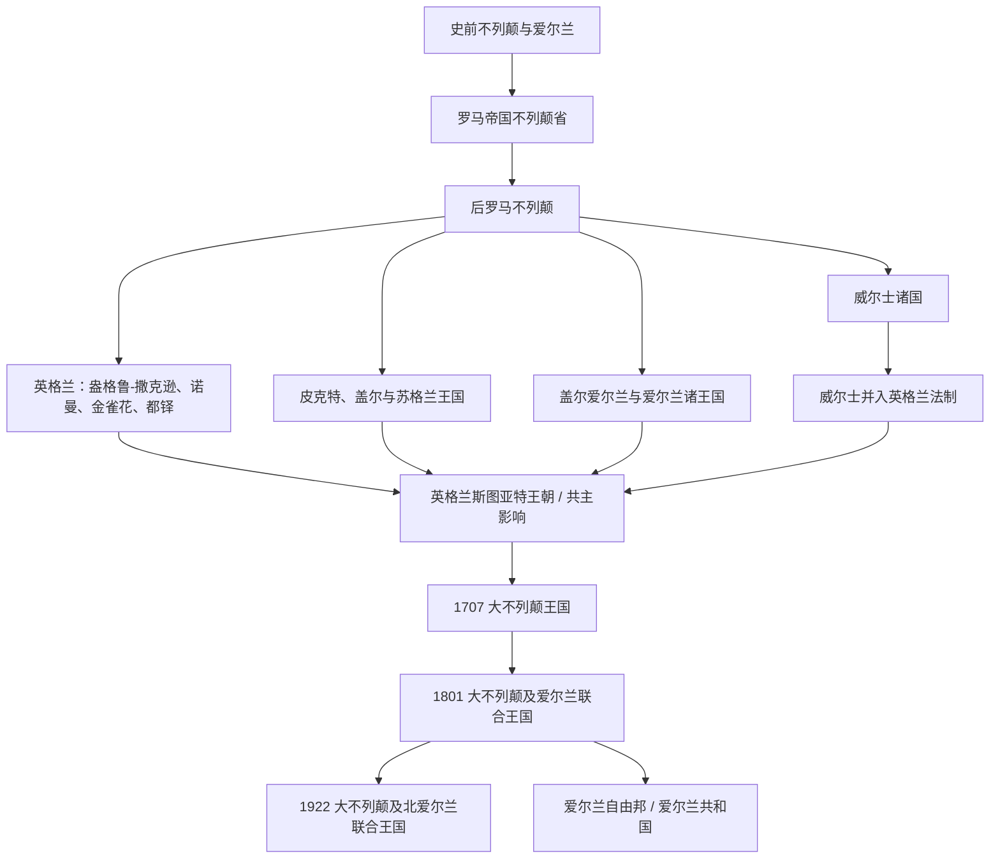

# 不列颠群岛

## 概括

不列颠群岛包括大不列颠岛、爱尔兰岛及周边岛屿。这里的历史不等同于单一“英国”国家史：史前不列颠、罗马不列颠、凯尔特诸王国、盎格鲁-撒克逊英格兰、苏格兰王国、威尔士诸国、爱尔兰诸王国以及后来的大不列颠王国、联合王国共同构成区域主线。

## 演变图

## 区域与国家入口

| 区域 / 国家方向 | 入口 | 主线提示 |
|---|---|---|
| 英格兰 | [英格兰](/%E4%BA%BA%E6%96%87%E7%A7%91%E5%AD%A6/%E5%8E%86%E5%8F%B2-%E5%A4%96%E5%9B%BD/%E6%AC%A7%E6%B4%B2/%E4%B8%8D%E5%88%97%E9%A2%A0%E7%BE%A4%E5%B2%9B/%E8%8B%B1%E6%A0%BC%E5%85%B0/README.md) | 从盎格鲁-撒克逊、诺曼征服、金雀花、兰开斯特、约克、都铎到与苏格兰共主。 |
| 苏格兰 | [苏格兰](/%E4%BA%BA%E6%96%87%E7%A7%91%E5%AD%A6/%E5%8E%86%E5%8F%B2-%E5%A4%96%E5%9B%BD/%E6%AC%A7%E6%B4%B2/%E4%B8%8D%E5%88%97%E9%A2%A0%E7%BE%A4%E5%B2%9B/%E8%8B%8F%E6%A0%BC%E5%85%B0/README.md) | 从皮克特、达尔里阿达和阿尔巴王国到苏格兰王国、斯图亚特和1707年合并。 |
| 爱尔兰 | [爱尔兰](/%E4%BA%BA%E6%96%87%E7%A7%91%E5%AD%A6/%E5%8E%86%E5%8F%B2-%E5%A4%96%E5%9B%BD/%E6%AC%A7%E6%B4%B2/%E4%B8%8D%E5%88%97%E9%A2%A0%E7%BE%A4%E5%B2%9B/%E7%88%B1%E5%B0%94%E5%85%B0/README.md) | 从盖尔爱尔兰、基督教化、诺曼入侵到爱尔兰王国、联合王国、独立与分治。 |
| 威尔士 | [威尔士](/%E4%BA%BA%E6%96%87%E7%A7%91%E5%AD%A6/%E5%8E%86%E5%8F%B2-%E5%A4%96%E5%9B%BD/%E6%AC%A7%E6%B4%B2/%E4%B8%8D%E5%88%97%E9%A2%A0%E7%BE%A4%E5%B2%9B/%E5%A8%81%E5%B0%94%E5%A3%AB/README.md) | 从罗马后布立吞诸国、威尔士诸王国到英格兰征服和现代威尔士自治。 |
| 联合王国 | [联合王国](/%E4%BA%BA%E6%96%87%E7%A7%91%E5%AD%A6/%E5%8E%86%E5%8F%B2-%E5%A4%96%E5%9B%BD/%E6%AC%A7%E6%B4%B2/%E4%B8%8D%E5%88%97%E9%A2%A0%E7%BE%A4%E5%B2%9B/%E8%81%94%E5%90%88%E7%8E%8B%E5%9B%BD/README.md) | 从1707年大不列颠王国、1801年联合王国到现代英国国家。 |

## 共同历史节点

| 顺序 | 阶段 | 时间 | 入口 | 说明 |
|---:|---|---|---|---|
| 1 | 史前不列颠时期 | 约前8000年-公元43年 | [史前不列颠时期](/%E4%BA%BA%E6%96%87%E7%A7%91%E5%AD%A6/%E5%8E%86%E5%8F%B2-%E5%A4%96%E5%9B%BD/%E6%AC%A7%E6%B4%B2/%E4%B8%8D%E5%88%97%E9%A2%A0%E7%BE%A4%E5%B2%9B/%E5%8F%B2%E5%89%8D%E4%B8%8D%E5%88%97%E9%A2%A0%E6%97%B6%E6%9C%9F.md) | 不列颠岛史前社会和凯尔特语族部落背景。 |
| 2 | 罗马帝国不列颠省 | 43年-410年前后 | [罗马帝国不列颠省](/%E4%BA%BA%E6%96%87%E7%A7%91%E5%AD%A6/%E5%8E%86%E5%8F%B2-%E5%A4%96%E5%9B%BD/%E6%AC%A7%E6%B4%B2/%E4%B8%8D%E5%88%97%E9%A2%A0%E7%BE%A4%E5%B2%9B/%E7%BD%97%E9%A9%AC%E5%B8%9D%E5%9B%BD%E4%B8%8D%E5%88%97%E9%A2%A0%E7%9C%81.md) | 罗马统治主要覆盖不列颠南部，不等同于英格兰单独历史。 |

## 名称辨析

- “英格兰”是大不列颠岛南部和东部的王国 / 国家方向，不应等同于整个英国。
- “大不列颠”通常指英格兰、苏格兰、威尔士所在的大岛，也指1707年形成的大不列颠王国。
- “爱尔兰”既可指爱尔兰岛，也可指现代爱尔兰共和国；北爱尔兰则属于现代联合王国。
- “联合王国 / 英国”在现代通常指大不列颠及北爱尔兰联合王国，适合放入[联合王国](/%E4%BA%BA%E6%96%87%E7%A7%91%E5%AD%A6/%E5%8E%86%E5%8F%B2-%E5%A4%96%E5%9B%BD/%E6%AC%A7%E6%B4%B2/%E4%B8%8D%E5%88%97%E9%A2%A0%E7%BE%A4%E5%B2%9B/%E8%81%94%E5%90%88%E7%8E%8B%E5%9B%BD/README.md)主线。
