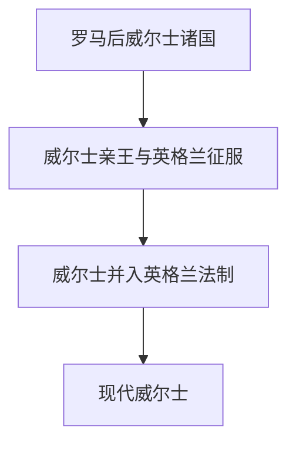

# 威尔士

## 历史主线

威尔士主线以罗马后布立吞诸国和凯尔特语言文化延续为基础。中世纪威尔士诸王国长期与英格兰竞争，1283年后被英格兰征服，16世纪并入英格兰法制；现代威尔士则以语言复兴、工业化遗产和自治议会为关键线索。

## 演变图

## 时期导航

| 顺序 | 阶段 | 时间 | 入口 | 简要概括 |
|---:|---|---|---|---|
| 1 | 罗马后威尔士诸国 | 5世纪-9世纪 | [罗马后威尔士诸国](/%E4%BA%BA%E6%96%87%E7%A7%91%E5%AD%A6/%E5%8E%86%E5%8F%B2-%E5%A4%96%E5%9B%BD/%E6%AC%A7%E6%B4%B2/%E4%B8%8D%E5%88%97%E9%A2%A0%E7%BE%A4%E5%B2%9B/%E5%A8%81%E5%B0%94%E5%A3%AB/%E7%BD%97%E9%A9%AC%E5%90%8E%E5%A8%81%E5%B0%94%E5%A3%AB%E8%AF%B8%E5%9B%BD.md) | 罗马撤离后，威尔士地区形成多个布立吞王国，如格温内斯、波伊斯、德赫巴思等 |
| 2 | 威尔士亲王与英格兰征服 | 9世纪-1283年 | [威尔士亲王与英格兰征服](/%E4%BA%BA%E6%96%87%E7%A7%91%E5%AD%A6/%E5%8E%86%E5%8F%B2-%E5%A4%96%E5%9B%BD/%E6%AC%A7%E6%B4%B2/%E4%B8%8D%E5%88%97%E9%A2%A0%E7%BE%A4%E5%B2%9B/%E5%A8%81%E5%B0%94%E5%A3%AB/%E5%A8%81%E5%B0%94%E5%A3%AB%E4%BA%B2%E7%8E%8B%E4%B8%8E%E8%8B%B1%E6%A0%BC%E5%85%B0%E5%BE%81%E6%9C%8D.md) | 威尔士诸王国在格温内斯等势力下多次尝试整合；卢埃林大帝和卢埃林·阿普·格 |
| 3 | 威尔士并入英格兰法制 | 1284年-1536/1543年 | [威尔士并入英格兰法制](/%E4%BA%BA%E6%96%87%E7%A7%91%E5%AD%A6/%E5%8E%86%E5%8F%B2-%E5%A4%96%E5%9B%BD/%E6%AC%A7%E6%B4%B2/%E4%B8%8D%E5%88%97%E9%A2%A0%E7%BE%A4%E5%B2%9B/%E5%A8%81%E5%B0%94%E5%A3%AB/%E5%A8%81%E5%B0%94%E5%A3%AB%E5%B9%B6%E5%85%A5%E8%8B%B1%E6%A0%BC%E5%85%B0%E6%B3%95%E5%88%B6.md) | 爱德华一世征服后，威尔士被纳入英格兰王权控制；都铎时期《威尔士法案》使其 |
| 4 | 现代威尔士 | 19世纪至今 | [现代威尔士](/%E4%BA%BA%E6%96%87%E7%A7%91%E5%AD%A6/%E5%8E%86%E5%8F%B2-%E5%A4%96%E5%9B%BD/%E6%AC%A7%E6%B4%B2/%E4%B8%8D%E5%88%97%E9%A2%A0%E7%BE%A4%E5%B2%9B/%E5%A8%81%E5%B0%94%E5%A3%AB/%E7%8E%B0%E4%BB%A3%E5%A8%81%E5%B0%94%E5%A3%AB.md) | 工业化、非国教传统、威尔士语复兴和1999年后权力下放塑造现代威尔士政治 |
