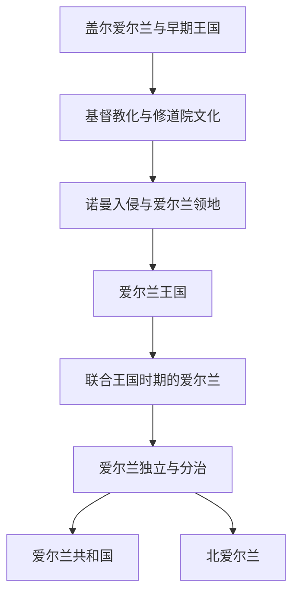

# 爱尔兰

## 历史主线

爱尔兰历史不能简单并入英国史。它从盖尔诸王国和修道院文化出发，经历诺曼入侵、英格兰 / 英国控制、殖民和宗教冲突；1801年并入联合王国，20世纪通过独立战争形成爱尔兰自由邦 / 爱尔兰共和国，同时北爱尔兰留在联合王国。

## 演变图

## 时期导航

| 顺序 | 阶段 | 时间 | 入口 | 简要概括 |
|---:|---|---|---|---|
| 1 | 盖尔爱尔兰与早期王国 | 史前-12世纪 | [盖尔爱尔兰与早期王国](/%E4%BA%BA%E6%96%87%E7%A7%91%E5%AD%A6/%E5%8E%86%E5%8F%B2-%E5%A4%96%E5%9B%BD/%E6%AC%A7%E6%B4%B2/%E4%B8%8D%E5%88%97%E9%A2%A0%E7%BE%A4%E5%B2%9B/%E7%88%B1%E5%B0%94%E5%85%B0/%E7%9B%96%E5%B0%94%E7%88%B1%E5%B0%94%E5%85%B0%E4%B8%8E%E6%97%A9%E6%9C%9F%E7%8E%8B%E5%9B%BD.md) | 爱尔兰长期由盖尔诸王国、高王权名义和地方亲族政治构成，没有形成稳定统一王 |
| 2 | 爱尔兰基督教化与修道院文化 | 5世纪-12世纪 | [爱尔兰基督教化与修道院文化](/%E4%BA%BA%E6%96%87%E7%A7%91%E5%AD%A6/%E5%8E%86%E5%8F%B2-%E5%A4%96%E5%9B%BD/%E6%AC%A7%E6%B4%B2/%E4%B8%8D%E5%88%97%E9%A2%A0%E7%BE%A4%E5%B2%9B/%E7%88%B1%E5%B0%94%E5%85%B0/%E7%88%B1%E5%B0%94%E5%85%B0%E5%9F%BA%E7%9D%A3%E6%95%99%E5%8C%96%E4%B8%8E%E4%BF%AE%E9%81%93%E9%99%A2%E6%96%87%E5%8C%96.md) | 基督教传播和修道院网络使爱尔兰成为中世纪西欧重要学术和传教中心。 |
| 3 | 诺曼入侵与爱尔兰领地 | 1169年-1542年 | [诺曼入侵与爱尔兰领地](/%E4%BA%BA%E6%96%87%E7%A7%91%E5%AD%A6/%E5%8E%86%E5%8F%B2-%E5%A4%96%E5%9B%BD/%E6%AC%A7%E6%B4%B2/%E4%B8%8D%E5%88%97%E9%A2%A0%E7%BE%A4%E5%B2%9B/%E7%88%B1%E5%B0%94%E5%85%B0/%E8%AF%BA%E6%9B%BC%E5%85%A5%E4%BE%B5%E4%B8%8E%E7%88%B1%E5%B0%94%E5%85%B0%E9%A2%86%E5%9C%B0.md) | 诺曼贵族进入爱尔兰，英格兰王权建立爱尔兰领地，但实际控制范围长期有限。 |
| 4 | 爱尔兰王国 | 1542年-1801年 | [爱尔兰王国](/%E4%BA%BA%E6%96%87%E7%A7%91%E5%AD%A6/%E5%8E%86%E5%8F%B2-%E5%A4%96%E5%9B%BD/%E6%AC%A7%E6%B4%B2/%E4%B8%8D%E5%88%97%E9%A2%A0%E7%BE%A4%E5%B2%9B/%E7%88%B1%E5%B0%94%E5%85%B0/%E7%88%B1%E5%B0%94%E5%85%B0%E7%8E%8B%E5%9B%BD.md) | 都铎王权把爱尔兰提升为王国并加强征服、殖民和宗教控制，引发长期冲突。 |
| 5 | 联合王国时期的爱尔兰 | 1801年-1922年 | [联合王国时期的爱尔兰](/%E4%BA%BA%E6%96%87%E7%A7%91%E5%AD%A6/%E5%8E%86%E5%8F%B2-%E5%A4%96%E5%9B%BD/%E6%AC%A7%E6%B4%B2/%E4%B8%8D%E5%88%97%E9%A2%A0%E7%BE%A4%E5%B2%9B/%E7%88%B1%E5%B0%94%E5%85%B0/%E8%81%94%E5%90%88%E7%8E%8B%E5%9B%BD%E6%97%B6%E6%9C%9F%E7%9A%84%E7%88%B1%E5%B0%94%E5%85%B0.md) | 1801年爱尔兰并入联合王国，19世纪经历天主教解放、大饥荒、自治运动和 |
| 6 | 爱尔兰独立与分治 | 1916年-1922年 | [爱尔兰独立与分治](/%E4%BA%BA%E6%96%87%E7%A7%91%E5%AD%A6/%E5%8E%86%E5%8F%B2-%E5%A4%96%E5%9B%BD/%E6%AC%A7%E6%B4%B2/%E4%B8%8D%E5%88%97%E9%A2%A0%E7%BE%A4%E5%B2%9B/%E7%88%B1%E5%B0%94%E5%85%B0/%E7%88%B1%E5%B0%94%E5%85%B0%E7%8B%AC%E7%AB%8B%E4%B8%8E%E5%88%86%E6%B2%BB.md) | 复活节起义、独立战争和英爱条约导致爱尔兰自由邦成立，同时北爱尔兰留在联合 |
| 7 | 爱尔兰共和国 | 1922年至今 | [爱尔兰共和国](/%E4%BA%BA%E6%96%87%E7%A7%91%E5%AD%A6/%E5%8E%86%E5%8F%B2-%E5%A4%96%E5%9B%BD/%E6%AC%A7%E6%B4%B2/%E4%B8%8D%E5%88%97%E9%A2%A0%E7%BE%A4%E5%B2%9B/%E7%88%B1%E5%B0%94%E5%85%B0/%E7%88%B1%E5%B0%94%E5%85%B0%E5%85%B1%E5%92%8C%E5%9B%BD.md) | 爱尔兰自由邦逐步成为共和国，20世纪后期经济和社会结构发生深刻转型。 |
| 8 | 北爱尔兰 | 1921年至今 | [北爱尔兰](/%E4%BA%BA%E6%96%87%E7%A7%91%E5%AD%A6/%E5%8E%86%E5%8F%B2-%E5%A4%96%E5%9B%BD/%E6%AC%A7%E6%B4%B2/%E4%B8%8D%E5%88%97%E9%A2%A0%E7%BE%A4%E5%B2%9B/%E7%88%B1%E5%B0%94%E5%85%B0/%E5%8C%97%E7%88%B1%E5%B0%94%E5%85%B0.md) | 北爱尔兰留在联合王国，长期存在联合派与民族派冲突，1998年《贝尔法斯特 |
