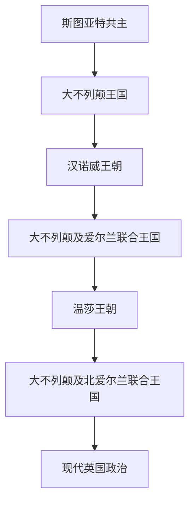

# 联合王国

## 历史主线

联合王国主线从1707年大不列颠王国开始，1801年合并爱尔兰成为大不列颠及爱尔兰联合王国，1922年爱尔兰自由邦成立后形成现代“大不列颠及北爱尔兰联合王国”。因此，汉诺威王朝和温莎王朝更适合放在联合王国目录下，而非单独英格兰史。

## 演变图

## 时期导航

| 顺序 | 阶段 | 时间 | 入口 | 简要概括 |
|---:|---|---|---|---|
| 1 | 大不列颠王国 | 1707年-1801年 | [大不列颠王国](/%E4%BA%BA%E6%96%87%E7%A7%91%E5%AD%A6/%E5%8E%86%E5%8F%B2-%E5%A4%96%E5%9B%BD/%E6%AC%A7%E6%B4%B2/%E4%B8%8D%E5%88%97%E9%A2%A0%E7%BE%A4%E5%B2%9B/%E8%81%94%E5%90%88%E7%8E%8B%E5%9B%BD/%E5%A4%A7%E4%B8%8D%E5%88%97%E9%A2%A0%E7%8E%8B%E5%9B%BD.md) | 英格兰与苏格兰合并后的国家结构。 |
| 2 | 汉诺威王朝 | 1714年-1901年 | [汉诺威王朝](/%E4%BA%BA%E6%96%87%E7%A7%91%E5%AD%A6/%E5%8E%86%E5%8F%B2-%E5%A4%96%E5%9B%BD/%E6%AC%A7%E6%B4%B2/%E4%B8%8D%E5%88%97%E9%A2%A0%E7%BE%A4%E5%B2%9B/%E8%81%94%E5%90%88%E7%8E%8B%E5%9B%BD/%E6%B1%89%E8%AF%BA%E5%A8%81%E7%8E%8B%E6%9C%9D.md) | 新教继承、内阁制、工业革命和帝国扩张。 |
| 3 | 大不列颠及爱尔兰联合王国 | 1801年-1922年 | [大不列颠及爱尔兰联合王国](/%E4%BA%BA%E6%96%87%E7%A7%91%E5%AD%A6/%E5%8E%86%E5%8F%B2-%E5%A4%96%E5%9B%BD/%E6%AC%A7%E6%B4%B2/%E4%B8%8D%E5%88%97%E9%A2%A0%E7%BE%A4%E5%B2%9B/%E8%81%94%E5%90%88%E7%8E%8B%E5%9B%BD/%E5%A4%A7%E4%B8%8D%E5%88%97%E9%A2%A0%E5%8F%8A%E7%88%B1%E5%B0%94%E5%85%B0%E8%81%94%E5%90%88%E7%8E%8B%E5%9B%BD.md) | 爱尔兰并入后的联合王国与大英帝国高峰。 |
| 4 | 温莎王朝 | 1901年至今 | [温莎王朝](/%E4%BA%BA%E6%96%87%E7%A7%91%E5%AD%A6/%E5%8E%86%E5%8F%B2-%E5%A4%96%E5%9B%BD/%E6%AC%A7%E6%B4%B2/%E4%B8%8D%E5%88%97%E9%A2%A0%E7%BE%A4%E5%B2%9B/%E8%81%94%E5%90%88%E7%8E%8B%E5%9B%BD/%E6%B8%A9%E8%8E%8E%E7%8E%8B%E6%9C%9D.md) | 从萨克森-科堡-哥达到温莎，现代君主制与英联邦。 |
| 5 | 大不列颠及北爱尔兰联合王国 | 1922年至今 | [大不列颠及北爱尔兰联合王国](/%E4%BA%BA%E6%96%87%E7%A7%91%E5%AD%A6/%E5%8E%86%E5%8F%B2-%E5%A4%96%E5%9B%BD/%E6%AC%A7%E6%B4%B2/%E4%B8%8D%E5%88%97%E9%A2%A0%E7%BE%A4%E5%B2%9B/%E8%81%94%E5%90%88%E7%8E%8B%E5%9B%BD/%E5%A4%A7%E4%B8%8D%E5%88%97%E9%A2%A0%E5%8F%8A%E5%8C%97%E7%88%B1%E5%B0%94%E5%85%B0%E8%81%94%E5%90%88%E7%8E%8B%E5%9B%BD.md) | 爱尔兰分治后的现代国家。 |
| 6 | 现代英国政治 | 20世纪至今 | [现代英国政治](/%E4%BA%BA%E6%96%87%E7%A7%91%E5%AD%A6/%E5%8E%86%E5%8F%B2-%E5%A4%96%E5%9B%BD/%E6%AC%A7%E6%B4%B2/%E4%B8%8D%E5%88%97%E9%A2%A0%E7%BE%A4%E5%B2%9B/%E8%81%94%E5%90%88%E7%8E%8B%E5%9B%BD/%E7%8E%B0%E4%BB%A3%E8%8B%B1%E5%9B%BD%E6%94%BF%E6%B2%BB.md) | 议会君主制、政党政治、权力下放和欧洲关系。 |
