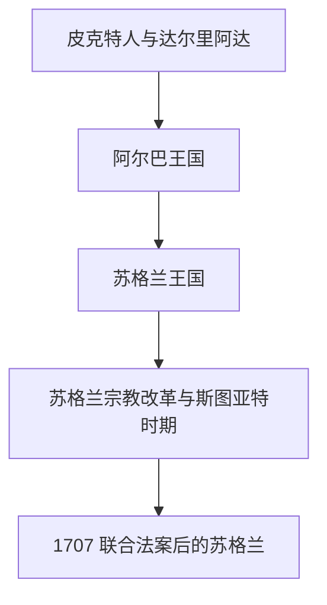

# 苏格兰

## 历史主线

苏格兰从皮克特、盖尔、布立吞和盎格鲁边缘势力交错中形成。阿尔巴王国发展为苏格兰王国，长期与英格兰竞争；1603年进入斯图亚特共主，1707年通过联合法案进入大不列颠和联合王国结构。

## 演变图

## 时期导航

| 顺序 | 阶段 | 时间 | 入口 | 简要概括 |
|---:|---|---|---|---|
| 1 | 皮克特人与达尔里阿达 | 5世纪-9世纪 | [皮克特人与达尔里阿达](/%E4%BA%BA%E6%96%87%E7%A7%91%E5%AD%A6/%E5%8E%86%E5%8F%B2-%E5%A4%96%E5%9B%BD/%E6%AC%A7%E6%B4%B2/%E4%B8%8D%E5%88%97%E9%A2%A0%E7%BE%A4%E5%B2%9B/%E8%8B%8F%E6%A0%BC%E5%85%B0/%E7%9A%AE%E5%85%8B%E7%89%B9%E4%BA%BA%E4%B8%8E%E8%BE%BE%E5%B0%94%E9%87%8C%E9%98%BF%E8%BE%BE.md) | 罗马撤离后，北部不列颠存在皮克特人、盖尔人的达尔里阿达、布立吞诸国和盎格 |
| 2 | 阿尔巴王国 | 843年左右-11世纪 | [阿尔巴王国](/%E4%BA%BA%E6%96%87%E7%A7%91%E5%AD%A6/%E5%8E%86%E5%8F%B2-%E5%A4%96%E5%9B%BD/%E6%AC%A7%E6%B4%B2/%E4%B8%8D%E5%88%97%E9%A2%A0%E7%BE%A4%E5%B2%9B/%E8%8B%8F%E6%A0%BC%E5%85%B0/%E9%98%BF%E5%B0%94%E5%B7%B4%E7%8E%8B%E5%9B%BD.md) | 传统上以肯尼思·麦克阿尔平统一皮克特与盖尔王权为起点，阿尔巴王国逐渐成为 |
| 3 | 苏格兰王国 | 11世纪-1707年 | [苏格兰王国](/%E4%BA%BA%E6%96%87%E7%A7%91%E5%AD%A6/%E5%8E%86%E5%8F%B2-%E5%A4%96%E5%9B%BD/%E6%AC%A7%E6%B4%B2/%E4%B8%8D%E5%88%97%E9%A2%A0%E7%BE%A4%E5%B2%9B/%E8%8B%8F%E6%A0%BC%E5%85%B0/%E8%8B%8F%E6%A0%BC%E5%85%B0%E7%8E%8B%E5%9B%BD.md) | 苏格兰王国在中世纪形成独立王权，与英格兰长期竞争并经历独立战争、斯图亚特 |
| 4 | 苏格兰宗教改革与斯图亚特时期 | 16世纪-1707年 | [苏格兰宗教改革与斯图亚特时期](/%E4%BA%BA%E6%96%87%E7%A7%91%E5%AD%A6/%E5%8E%86%E5%8F%B2-%E5%A4%96%E5%9B%BD/%E6%AC%A7%E6%B4%B2/%E4%B8%8D%E5%88%97%E9%A2%A0%E7%BE%A4%E5%B2%9B/%E8%8B%8F%E6%A0%BC%E5%85%B0/%E8%8B%8F%E6%A0%BC%E5%85%B0%E5%AE%97%E6%95%99%E6%94%B9%E9%9D%A9%E4%B8%8E%E6%96%AF%E5%9B%BE%E4%BA%9A%E7%89%B9%E6%97%B6%E6%9C%9F.md) | 苏格兰宗教改革确立长老会传统；1603年苏格兰斯图亚特国王詹姆斯六世继承 |
| 5 | 联合法案后的苏格兰 | 1707年至今 | [联合法案后的苏格兰](/%E4%BA%BA%E6%96%87%E7%A7%91%E5%AD%A6/%E5%8E%86%E5%8F%B2-%E5%A4%96%E5%9B%BD/%E6%AC%A7%E6%B4%B2/%E4%B8%8D%E5%88%97%E9%A2%A0%E7%BE%A4%E5%B2%9B/%E8%8B%8F%E6%A0%BC%E5%85%B0/%E8%81%94%E5%90%88%E6%B3%95%E6%A1%88%E5%90%8E%E7%9A%84%E8%8B%8F%E6%A0%BC%E5%85%B0.md) | 1707年苏格兰与英格兰组成大不列颠王国，保留独立法律、教会和教育传统， |

## 相关引用

- 斯图亚特王朝以英格兰政治主线为主，详见[英格兰目录中的斯图亚特王朝](/%E4%BA%BA%E6%96%87%E7%A7%91%E5%AD%A6/%E5%8E%86%E5%8F%B2-%E5%A4%96%E5%9B%BD/%E6%AC%A7%E6%B4%B2/%E4%B8%8D%E5%88%97%E9%A2%A0%E7%BE%A4%E5%B2%9B/%E8%8B%B1%E6%A0%BC%E5%85%B0/%E6%96%AF%E5%9B%BE%E4%BA%9A%E7%89%B9%E7%8E%8B%E6%9C%9D.md)；苏格兰目录保留宗教改革、共主和联合法案影响。
