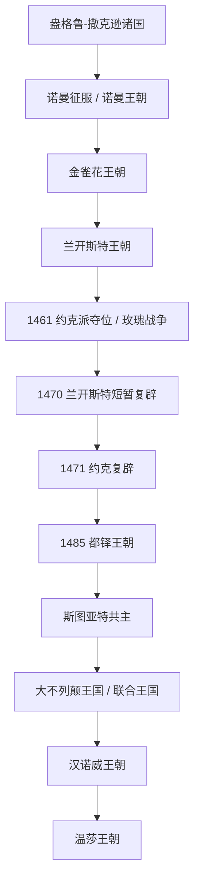

# 英格兰

## 历史主线

英格兰主线从罗马不列颠撤离后的盎格鲁-撒克逊诸王国开始，经历威塞克斯主导的统一、诺曼征服、金雀花王朝的普通法与议会发展、玫瑰战争和都铎王权强化。1603年后进入英格兰与苏格兰共主的斯图亚特阶段；1707年后英格兰不再作为单独国家延续，但王朝索引仍可继续列到联合王国时期，具体内容维护在[联合王国](/%E4%BA%BA%E6%96%87%E7%A7%91%E5%AD%A6/%E5%8E%86%E5%8F%B2-%E5%A4%96%E5%9B%BD/%E6%AC%A7%E6%B4%B2/%E4%B8%8D%E5%88%97%E9%A2%A0%E7%BE%A4%E5%B2%9B/%E8%81%94%E5%90%88%E7%8E%8B%E5%9B%BD/README.md)方向。

## 演变图

## 按时间排序的时期导航

|  顺序 | 阶段        | 时间                      | 入口                                                                                                                                                                                                                                                                 | 简要概括                                 |
| --: | --------- | ----------------------- | ------------------------------------------------------------------------------------------------------------------------------------------------------------------------------------------------------------------------------------------------------------------ | ------------------------------------ |
| 1 | 盎格鲁-撒克逊时期 | 5世纪-1066年 | [盎格鲁-撒克逊时期](/%E4%BA%BA%E6%96%87%E7%A7%91%E5%AD%A6/%E5%8E%86%E5%8F%B2-%E5%A4%96%E5%9B%BD/%E6%AC%A7%E6%B4%B2/%E4%B8%8D%E5%88%97%E9%A2%A0%E7%BE%A4%E5%B2%9B/%E8%8B%B1%E6%A0%BC%E5%85%B0/%E7%9B%8E%E6%A0%BC%E9%B2%81-%E6%92%92%E5%85%8B%E9%80%8A%E6%97%B6%E6%9C%9F.md) | 日耳曼诸王国并立，威塞克斯推动英格兰统一，并经历丹麦统治与诺曼征服前夕。 |
| 2 | 威廉征服时期 | 1066年-1154年 | [威廉征服时期](/%E4%BA%BA%E6%96%87%E7%A7%91%E5%AD%A6/%E5%8E%86%E5%8F%B2-%E5%A4%96%E5%9B%BD/%E6%AC%A7%E6%B4%B2/%E4%B8%8D%E5%88%97%E9%A2%A0%E7%BE%A4%E5%B2%9B/%E8%8B%B1%E6%A0%BC%E5%85%B0/%E5%A8%81%E5%BB%89%E5%BE%81%E6%9C%8D%E6%97%B6%E6%9C%9F.md) | 诺曼征服重塑英格兰贵族、土地和封建秩序，诺曼王朝与安茹继承奠定后续王权。 |
| 3 | 金雀花王朝 | 1154年-1399年 | [金雀花王朝](/%E4%BA%BA%E6%96%87%E7%A7%91%E5%AD%A6/%E5%8E%86%E5%8F%B2-%E5%A4%96%E5%9B%BD/%E6%AC%A7%E6%B4%B2/%E4%B8%8D%E5%88%97%E9%A2%A0%E7%BE%A4%E5%B2%9B/%E8%8B%B1%E6%A0%BC%E5%85%B0/%E9%87%91%E9%9B%80%E8%8A%B1%E7%8E%8B%E6%9C%9D.md) | 普通法、议会传统和王权财政发展，同时卷入英法领地冲突和百年战争前期。 |
| 4 | 兰开斯特王朝 | 1399年-1461年；1470年-1471年 | [兰开斯特王朝](/%E4%BA%BA%E6%96%87%E7%A7%91%E5%AD%A6/%E5%8E%86%E5%8F%B2-%E5%A4%96%E5%9B%BD/%E6%AC%A7%E6%B4%B2/%E4%B8%8D%E5%88%97%E9%A2%A0%E7%BE%A4%E5%B2%9B/%E8%8B%B1%E6%A0%BC%E5%85%B0/%E5%85%B0%E5%BC%80%E6%96%AF%E7%89%B9%E7%8E%8B%E6%9C%9D.md) | 金雀花支系夺位后建立；中期被约克派夺位，1470年短暂复辟。 |
| 5 | 约克王朝 | 1461年-1470年；1471年-1485年 | [约克王朝](/%E4%BA%BA%E6%96%87%E7%A7%91%E5%AD%A6/%E5%8E%86%E5%8F%B2-%E5%A4%96%E5%9B%BD/%E6%AC%A7%E6%B4%B2/%E4%B8%8D%E5%88%97%E9%A2%A0%E7%BE%A4%E5%B2%9B/%E8%8B%B1%E6%A0%BC%E5%85%B0/%E7%BA%A6%E5%85%8B%E7%8E%8B%E6%9C%9D.md) | 玫瑰战争中从兰开斯特王朝手中夺位，期间被亨利六世短暂复辟打断。 |
| 6 | 都铎王朝 | 1485年-1603年 | [都铎王朝](/%E4%BA%BA%E6%96%87%E7%A7%91%E5%AD%A6/%E5%8E%86%E5%8F%B2-%E5%A4%96%E5%9B%BD/%E6%AC%A7%E6%B4%B2/%E4%B8%8D%E5%88%97%E9%A2%A0%E7%BE%A4%E5%B2%9B/%E8%8B%B1%E6%A0%BC%E5%85%B0/%E9%83%BD%E9%93%8E%E7%8E%8B%E6%9C%9D.md) | 结束玫瑰战争，强化王权，推动英格兰宗教改革和早期海外扩张。 |
|   7 | 斯图亚特王朝    | 1603年-1714年             | [斯图亚特王朝](/%E4%BA%BA%E6%96%87%E7%A7%91%E5%AD%A6/%E5%8E%86%E5%8F%B2-%E5%A4%96%E5%9B%BD/%E6%AC%A7%E6%B4%B2/%E4%B8%8D%E5%88%97%E9%A2%A0%E7%BE%A4%E5%B2%9B/%E8%8B%B1%E6%A0%BC%E5%85%B0/%E6%96%AF%E5%9B%BE%E4%BA%9A%E7%89%B9%E7%8E%8B%E6%9C%9D.md)                       | 以英格兰王权、议会冲突和君主立宪转型为主，同时牵动苏格兰、爱尔兰。    |
|   8 | 汉诺威王朝     | 1714年-1901年             | [汉诺威王朝](/%E4%BA%BA%E6%96%87%E7%A7%91%E5%AD%A6/%E5%8E%86%E5%8F%B2-%E5%A4%96%E5%9B%BD/%E6%AC%A7%E6%B4%B2/%E4%B8%8D%E5%88%97%E9%A2%A0%E7%BE%A4%E5%B2%9B/%E8%81%94%E5%90%88%E7%8E%8B%E5%9B%BD/%E6%B1%89%E8%AF%BA%E5%A8%81%E7%8E%8B%E6%9C%9D.md)                        | 1707年后属于大不列颠 / 联合王国主线；作为英格兰王朝延续索引列出。 |
|   9 | 温莎王朝      | 1901年至今                 | [温莎王朝](/%E4%BA%BA%E6%96%87%E7%A7%91%E5%AD%A6/%E5%8E%86%E5%8F%B2-%E5%A4%96%E5%9B%BD/%E6%AC%A7%E6%B4%B2/%E4%B8%8D%E5%88%97%E9%A2%A0%E7%BE%A4%E5%B2%9B/%E8%81%94%E5%90%88%E7%8E%8B%E5%9B%BD/%E6%B8%A9%E8%8E%8E%E7%8E%8B%E6%9C%9D.md)                                  | 现代英国王室主线，具体内容维护在联合王国目录。              |

## 相关共同史

- 前置共同背景：[史前不列颠时期](/%E4%BA%BA%E6%96%87%E7%A7%91%E5%AD%A6/%E5%8E%86%E5%8F%B2-%E5%A4%96%E5%9B%BD/%E6%AC%A7%E6%B4%B2/%E4%B8%8D%E5%88%97%E9%A2%A0%E7%BE%A4%E5%B2%9B/%E5%8F%B2%E5%89%8D%E4%B8%8D%E5%88%97%E9%A2%A0%E6%97%B6%E6%9C%9F.md)、[罗马帝国不列颠省](/%E4%BA%BA%E6%96%87%E7%A7%91%E5%AD%A6/%E5%8E%86%E5%8F%B2-%E5%A4%96%E5%9B%BD/%E6%AC%A7%E6%B4%B2/%E4%B8%8D%E5%88%97%E9%A2%A0%E7%BE%A4%E5%B2%9B/%E7%BD%97%E9%A9%AC%E5%B8%9D%E5%9B%BD%E4%B8%8D%E5%88%97%E9%A2%A0%E7%9C%81.md)。
- 后续共同 / 联合国家阶段：[联合王国](/%E4%BA%BA%E6%96%87%E7%A7%91%E5%AD%A6/%E5%8E%86%E5%8F%B2-%E5%A4%96%E5%9B%BD/%E6%AC%A7%E6%B4%B2/%E4%B8%8D%E5%88%97%E9%A2%A0%E7%BE%A4%E5%B2%9B/%E8%81%94%E5%90%88%E7%8E%8B%E5%9B%BD/README.md)。
