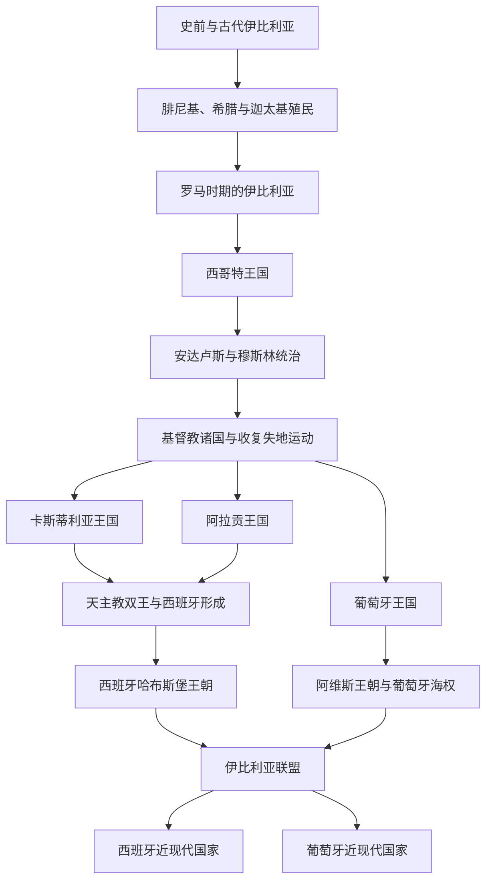

# 伊比利亚半岛

## 概括

伊比利亚半岛位于欧洲西南端，是地中海、大西洋和北非之间的枢纽。它的历史不能只归入西班牙或葡萄牙：罗马行省、日耳曼西哥特王国、穆斯林安达卢斯、基督教诸国、收复失地运动、大航海和殖民帝国共同塑造了半岛格局。现代方向主要分为[西班牙](/%E4%BA%BA%E6%96%87%E7%A7%91%E5%AD%A6/%E5%8E%86%E5%8F%B2-%E5%A4%96%E5%9B%BD/%E6%AC%A7%E6%B4%B2/%E4%BC%8A%E6%AF%94%E5%88%A9%E4%BA%9A%E5%8D%8A%E5%B2%9B/%E8%A5%BF%E7%8F%AD%E7%89%99/README.md)和[葡萄牙](/%E4%BA%BA%E6%96%87%E7%A7%91%E5%AD%A6/%E5%8E%86%E5%8F%B2-%E5%A4%96%E5%9B%BD/%E6%AC%A7%E6%B4%B2/%E4%BC%8A%E6%AF%94%E5%88%A9%E4%BA%9A%E5%8D%8A%E5%B2%9B/%E8%91%A1%E8%90%84%E7%89%99/README.md)两条国家主线。

## 演变图

## 按时间排序的时期导航

| 顺序 | 阶段 | 时间 | 入口 | 简要概括 |
|---:|---|---|---|---|
| 1 | 史前与古代伊比利亚 | 史前-前1千纪 | [史前与古代伊比利亚](/%E4%BA%BA%E6%96%87%E7%A7%91%E5%AD%A6/%E5%8E%86%E5%8F%B2-%E5%A4%96%E5%9B%BD/%E6%AC%A7%E6%B4%B2/%E4%BC%8A%E6%AF%94%E5%88%A9%E4%BA%9A%E5%8D%8A%E5%B2%9B/%E5%8F%B2%E5%89%8D%E4%B8%8E%E5%8F%A4%E4%BB%A3%E4%BC%8A%E6%AF%94%E5%88%A9%E4%BA%9A.md) | 伊比利亚人、凯尔特伊比利亚人、塔尔特索斯等构成半岛古代族群背景。 |
| 2 | 腓尼基、希腊与迦太基殖民 | 约前9世纪-前2世纪 | [腓尼基、希腊与迦太基殖民](/%E4%BA%BA%E6%96%87%E7%A7%91%E5%AD%A6/%E5%8E%86%E5%8F%B2-%E5%A4%96%E5%9B%BD/%E6%AC%A7%E6%B4%B2/%E4%BC%8A%E6%AF%94%E5%88%A9%E4%BA%9A%E5%8D%8A%E5%B2%9B/%E8%85%93%E5%B0%BC%E5%9F%BA%E3%80%81%E5%B8%8C%E8%85%8A%E4%B8%8E%E8%BF%A6%E5%A4%AA%E5%9F%BA%E6%AE%96%E6%B0%91.md) | 地中海贸易城邦与迦太基势力进入半岛。 |
| 3 | 罗马时期的伊比利亚 | 前218年-5世纪 | [罗马时期的伊比利亚](/%E4%BA%BA%E6%96%87%E7%A7%91%E5%AD%A6/%E5%8E%86%E5%8F%B2-%E5%A4%96%E5%9B%BD/%E6%AC%A7%E6%B4%B2/%E4%BC%8A%E6%AF%94%E5%88%A9%E4%BA%9A%E5%8D%8A%E5%B2%9B/%E7%BD%97%E9%A9%AC%E6%97%B6%E6%9C%9F%E7%9A%84%E4%BC%8A%E6%AF%94%E5%88%A9%E4%BA%9A.md) | 罗马把半岛纳入行省体系，拉丁化和城市化深刻影响后世。 |
| 4 | 西哥特王国 | 5世纪-711年 | [西哥特王国](/%E4%BA%BA%E6%96%87%E7%A7%91%E5%AD%A6/%E5%8E%86%E5%8F%B2-%E5%A4%96%E5%9B%BD/%E6%AC%A7%E6%B4%B2/%E4%BC%8A%E6%AF%94%E5%88%A9%E4%BA%9A%E5%8D%8A%E5%B2%9B/%E8%A5%BF%E5%93%A5%E7%89%B9%E7%8E%8B%E5%9B%BD.md) | 西哥特以托莱多为中心统治大部分半岛。 |
| 5 | 安达卢斯与穆斯林统治 | 711年-1492年 | [安达卢斯与穆斯林统治](/%E4%BA%BA%E6%96%87%E7%A7%91%E5%AD%A6/%E5%8E%86%E5%8F%B2-%E5%A4%96%E5%9B%BD/%E6%AC%A7%E6%B4%B2/%E4%BC%8A%E6%AF%94%E5%88%A9%E4%BA%9A%E5%8D%8A%E5%B2%9B/%E5%AE%89%E8%BE%BE%E5%8D%A2%E6%96%AF%E4%B8%8E%E7%A9%86%E6%96%AF%E6%9E%97%E7%BB%9F%E6%B2%BB.md) | 倭马亚、泰法、穆拉比特、穆瓦希德、纳斯尔王朝构成穆斯林伊比利亚主线。 |
| 6 | 基督教诸国与收复失地运动 | 8世纪-1492年 | [基督教诸国与收复失地运动](/%E4%BA%BA%E6%96%87%E7%A7%91%E5%AD%A6/%E5%8E%86%E5%8F%B2-%E5%A4%96%E5%9B%BD/%E6%AC%A7%E6%B4%B2/%E4%BC%8A%E6%AF%94%E5%88%A9%E4%BA%9A%E5%8D%8A%E5%B2%9B/%E5%9F%BA%E7%9D%A3%E6%95%99%E8%AF%B8%E5%9B%BD%E4%B8%8E%E6%94%B6%E5%A4%8D%E5%A4%B1%E5%9C%B0%E8%BF%90%E5%8A%A8.md) | 阿斯图里亚斯、莱昂、卡斯蒂利亚、阿拉贡、纳瓦拉、葡萄牙逐步南扩。 |
| 7 | 天主教双王与西班牙形成 | 1469年-1516年 | [天主教双王与西班牙形成](/%E4%BA%BA%E6%96%87%E7%A7%91%E5%AD%A6/%E5%8E%86%E5%8F%B2-%E5%A4%96%E5%9B%BD/%E6%AC%A7%E6%B4%B2/%E4%BC%8A%E6%AF%94%E5%88%A9%E4%BA%9A%E5%8D%8A%E5%B2%9B/%E5%A4%A9%E4%B8%BB%E6%95%99%E5%8F%8C%E7%8E%8B%E4%B8%8E%E8%A5%BF%E7%8F%AD%E7%89%99%E5%BD%A2%E6%88%90.md) | 卡斯蒂利亚与阿拉贡王室联合，格拉纳达陷落，西班牙方向形成。 |
| 8 | 伊比利亚联盟 | 1580年-1640年 | [伊比利亚联盟](/%E4%BA%BA%E6%96%87%E7%A7%91%E5%AD%A6/%E5%8E%86%E5%8F%B2-%E5%A4%96%E5%9B%BD/%E6%AC%A7%E6%B4%B2/%E4%BC%8A%E6%AF%94%E5%88%A9%E4%BA%9A%E5%8D%8A%E5%B2%9B/%E4%BC%8A%E6%AF%94%E5%88%A9%E4%BA%9A%E8%81%94%E7%9B%9F.md) | 西班牙哈布斯堡兼领葡萄牙，半岛短暂处在同一君主下。 |
| 9 | 西葡帝国与大航海 | 15世纪-18世纪 | [西葡帝国与大航海](/%E4%BA%BA%E6%96%87%E7%A7%91%E5%AD%A6/%E5%8E%86%E5%8F%B2-%E5%A4%96%E5%9B%BD/%E6%AC%A7%E6%B4%B2/%E4%BC%8A%E6%AF%94%E5%88%A9%E4%BA%9A%E5%8D%8A%E5%B2%9B/%E8%A5%BF%E8%91%A1%E5%B8%9D%E5%9B%BD%E4%B8%8E%E5%A4%A7%E8%88%AA%E6%B5%B7.md) | 葡萄牙和西班牙率先进行海外扩张，建立全球性海洋帝国。 |

## 国家主线入口

| 国家 | 入口 | 主线提示 |
|---|---|---|
| 西班牙 | [西班牙](/%E4%BA%BA%E6%96%87%E7%A7%91%E5%AD%A6/%E5%8E%86%E5%8F%B2-%E5%A4%96%E5%9B%BD/%E6%AC%A7%E6%B4%B2/%E4%BC%8A%E6%AF%94%E5%88%A9%E4%BA%9A%E5%8D%8A%E5%B2%9B/%E8%A5%BF%E7%8F%AD%E7%89%99/README.md) | 从卡斯蒂利亚、阿拉贡联合到哈布斯堡、波旁、内战、佛朗哥和民主转型。 |
| 葡萄牙 | [葡萄牙](/%E4%BA%BA%E6%96%87%E7%A7%91%E5%AD%A6/%E5%8E%86%E5%8F%B2-%E5%A4%96%E5%9B%BD/%E6%AC%A7%E6%B4%B2/%E4%BC%8A%E6%AF%94%E5%88%A9%E4%BA%9A%E5%8D%8A%E5%B2%9B/%E8%91%A1%E8%90%84%E7%89%99/README.md) | 从葡萄牙伯国、王国和大航海到布拉干萨、共和国、新国家体制和康乃馨革命。 |

## 相关通史

- 古典地中海背景：[古罗马](/%E4%BA%BA%E6%96%87%E7%A7%91%E5%AD%A6/%E5%8E%86%E5%8F%B2-%E5%A4%96%E5%9B%BD/%E6%AC%A7%E6%B4%B2/_%E9%80%9A%E5%8F%B2/%E5%8F%A4%E7%BD%97%E9%A9%AC/README.md)、[古希腊](/%E4%BA%BA%E6%96%87%E7%A7%91%E5%AD%A6/%E5%8E%86%E5%8F%B2-%E5%A4%96%E5%9B%BD/%E6%AC%A7%E6%B4%B2/_%E9%80%9A%E5%8F%B2/%E5%8F%A4%E5%B8%8C%E8%85%8A/README.md)。
- 后罗马王国背景：[后罗马时代的日耳曼诸国](/%E4%BA%BA%E6%96%87%E7%A7%91%E5%AD%A6/%E5%8E%86%E5%8F%B2-%E5%A4%96%E5%9B%BD/%E6%AC%A7%E6%B4%B2/_%E9%80%9A%E5%8F%B2/%E5%90%8E%E7%BD%97%E9%A9%AC%E6%97%B6%E4%BB%A3%E7%9A%84%E6%97%A5%E8%80%B3%E6%9B%BC%E8%AF%B8%E5%9B%BD/README.md)。
- 欧洲总览：[欧洲历史](/%E4%BA%BA%E6%96%87%E7%A7%91%E5%AD%A6/%E5%8E%86%E5%8F%B2-%E5%A4%96%E5%9B%BD/%E6%AC%A7%E6%B4%B2/README.md)。
