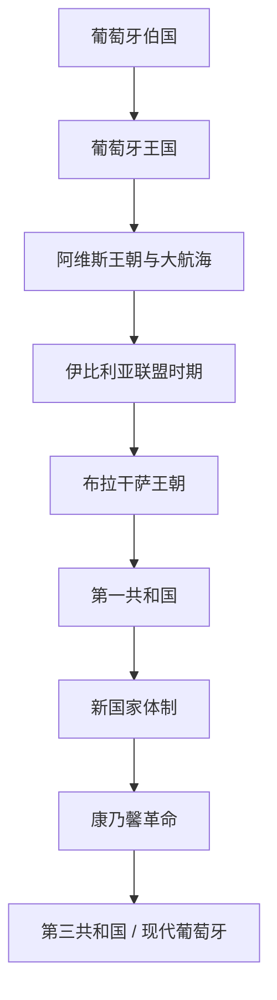

# 葡萄牙

## 历史主线

葡萄牙历史从莱昂王国边境伯国发展为独立王国，并较早形成稳定边界。15世纪以后，葡萄牙以海上探索和贸易据点构成全球帝国；近现代则经历布拉干萨复国、立宪君主制、第一共和国、新国家体制和康乃馨革命后的民主共和国。

## 演变图

## 按时间排序的时期导航

| 顺序 | 阶段 | 时间 | 入口 | 简要概括 |
|---:|---|---|---|---|
| 1 | 葡萄牙伯国 | 868年-1139年 | [葡萄牙伯国](/%E4%BA%BA%E6%96%87%E7%A7%91%E5%AD%A6/%E5%8E%86%E5%8F%B2-%E5%A4%96%E5%9B%BD/%E6%AC%A7%E6%B4%B2/%E4%BC%8A%E6%AF%94%E5%88%A9%E4%BA%9A%E5%8D%8A%E5%B2%9B/%E8%91%A1%E8%90%84%E7%89%99/%E8%91%A1%E8%90%84%E7%89%99%E4%BC%AF%E5%9B%BD.md) | 葡萄牙伯国最初是莱昂王国边境伯国，位于杜罗河与米尼奥河一带。地方贵族在收复失地运动中扩大自 |
| 2 | 葡萄牙王国 | 1139年-1910年 | [葡萄牙王国](/%E4%BA%BA%E6%96%87%E7%A7%91%E5%AD%A6/%E5%8E%86%E5%8F%B2-%E5%A4%96%E5%9B%BD/%E6%AC%A7%E6%B4%B2/%E4%BC%8A%E6%AF%94%E5%88%A9%E4%BA%9A%E5%8D%8A%E5%B2%9B/%E8%91%A1%E8%90%84%E7%89%99/%E8%91%A1%E8%90%84%E7%89%99%E7%8E%8B%E5%9B%BD.md) | 阿方索一世称王后，葡萄牙逐步取得国际承认，并在13世纪完成阿尔加维征服，形成大体稳定的西部 |
| 3 | 阿维斯王朝与大航海 | 1385年-1580年 | [阿维斯王朝与大航海](/%E4%BA%BA%E6%96%87%E7%A7%91%E5%AD%A6/%E5%8E%86%E5%8F%B2-%E5%A4%96%E5%9B%BD/%E6%AC%A7%E6%B4%B2/%E4%BC%8A%E6%AF%94%E5%88%A9%E4%BA%9A%E5%8D%8A%E5%B2%9B/%E8%91%A1%E8%90%84%E7%89%99/%E9%98%BF%E7%BB%B4%E6%96%AF%E7%8E%8B%E6%9C%9D%E4%B8%8E%E5%A4%A7%E8%88%AA%E6%B5%B7.md) | 阿维斯王朝在1383-1385年危机后建立，随后支持沿非洲海岸和印度洋的航海扩张，是葡萄牙 |
| 4 | 伊比利亚联盟时期的葡萄牙 | 1580年-1640年 | [伊比利亚联盟时期的葡萄牙](/%E4%BA%BA%E6%96%87%E7%A7%91%E5%AD%A6/%E5%8E%86%E5%8F%B2-%E5%A4%96%E5%9B%BD/%E6%AC%A7%E6%B4%B2/%E4%BC%8A%E6%AF%94%E5%88%A9%E4%BA%9A%E5%8D%8A%E5%B2%9B/%E8%91%A1%E8%90%84%E7%89%99/%E4%BC%8A%E6%AF%94%E5%88%A9%E4%BA%9A%E8%81%94%E7%9B%9F%E6%97%B6%E6%9C%9F%E7%9A%84%E8%91%A1%E8%90%84%E7%89%99.md) | 葡萄牙在王位继承危机后由西班牙哈布斯堡君主兼领，保留自身制度和殖民体系，但海外利益受到荷兰 |
| 5 | 布拉干萨王朝 | 1640年-1910年 | [布拉干萨王朝](/%E4%BA%BA%E6%96%87%E7%A7%91%E5%AD%A6/%E5%8E%86%E5%8F%B2-%E5%A4%96%E5%9B%BD/%E6%AC%A7%E6%B4%B2/%E4%BC%8A%E6%AF%94%E5%88%A9%E4%BA%9A%E5%8D%8A%E5%B2%9B/%E8%91%A1%E8%90%84%E7%89%99/%E5%B8%83%E6%8B%89%E5%B9%B2%E8%90%A8%E7%8E%8B%E6%9C%9D.md) | 1640年葡萄牙复国后，布拉干萨王朝统治葡萄牙及其海外帝国。巴西独立、自由主义内战和立宪政 |
| 6 | 葡萄牙第一共和国 | 1910年-1926年 | [葡萄牙第一共和国](/%E4%BA%BA%E6%96%87%E7%A7%91%E5%AD%A6/%E5%8E%86%E5%8F%B2-%E5%A4%96%E5%9B%BD/%E6%AC%A7%E6%B4%B2/%E4%BC%8A%E6%AF%94%E5%88%A9%E4%BA%9A%E5%8D%8A%E5%B2%9B/%E8%91%A1%E8%90%84%E7%89%99/%E8%91%A1%E8%90%84%E7%89%99%E7%AC%AC%E4%B8%80%E5%85%B1%E5%92%8C%E5%9B%BD.md) | 1910年革命推翻君主制，建立共和国，但政党分裂、财政危机和军事干预使政局长期不稳。 |
| 7 | 新国家体制 | 1933年-1974年 | [新国家体制](/%E4%BA%BA%E6%96%87%E7%A7%91%E5%AD%A6/%E5%8E%86%E5%8F%B2-%E5%A4%96%E5%9B%BD/%E6%AC%A7%E6%B4%B2/%E4%BC%8A%E6%AF%94%E5%88%A9%E4%BA%9A%E5%8D%8A%E5%B2%9B/%E8%91%A1%E8%90%84%E7%89%99/%E6%96%B0%E5%9B%BD%E5%AE%B6%E4%BD%93%E5%88%B6.md) | 萨拉查建立威权保守的新国家体制，强调社团主义、天主教传统和殖民帝国，直到殖民战争和军队不满 |
| 8 | 康乃馨革命与第三共和国 | 1974年至今 | [康乃馨革命与第三共和国](/%E4%BA%BA%E6%96%87%E7%A7%91%E5%AD%A6/%E5%8E%86%E5%8F%B2-%E5%A4%96%E5%9B%BD/%E6%AC%A7%E6%B4%B2/%E4%BC%8A%E6%AF%94%E5%88%A9%E4%BA%9A%E5%8D%8A%E5%B2%9B/%E8%91%A1%E8%90%84%E7%89%99/%E5%BA%B7%E4%B9%83%E9%A6%A8%E9%9D%A9%E5%91%BD%E4%B8%8E%E7%AC%AC%E4%B8%89%E5%85%B1%E5%92%8C%E5%9B%BD.md) | 1974年康乃馨革命推翻威权体制，葡萄牙完成民主化、非殖民化，并在1986年加入欧洲共同体 |

## 与伊比利亚共同史的关系

- 共同背景见[伊比利亚半岛](/%E4%BA%BA%E6%96%87%E7%A7%91%E5%AD%A6/%E5%8E%86%E5%8F%B2-%E5%A4%96%E5%9B%BD/%E6%AC%A7%E6%B4%B2/%E4%BC%8A%E6%AF%94%E5%88%A9%E4%BA%9A%E5%8D%8A%E5%B2%9B/README.md)。
- 葡萄牙与西班牙共享罗马、西哥特、安达卢斯和收复失地运动背景，但从12世纪起形成独立国家路径。
