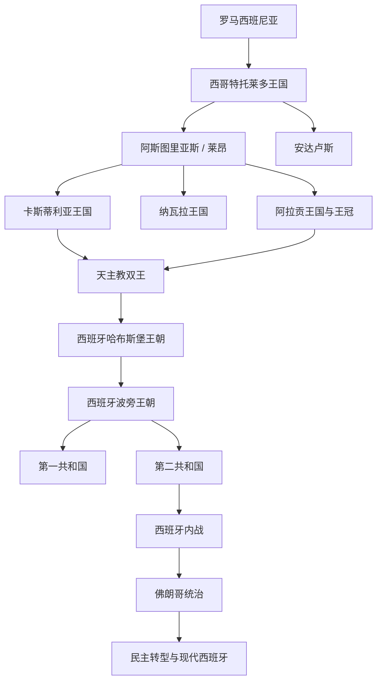

# 西班牙

## 历史主线

西班牙历史可从罗马西班尼亚、西哥特托莱多王国、穆斯林安达卢斯和北部基督教诸国的互动中理解。近代西班牙不是单纯由一个古代国家延续而来，而是在卡斯蒂利亚与阿拉贡王冠联合、格拉纳达陷落、海外扩张和哈布斯堡王朝统治中逐步形成。

## 演变图

## 按时间排序的时期导航

| 顺序 | 阶段 | 时间 | 入口 | 简要概括 |
|---:|---|---|---|---|
| 1 | 罗马西班尼亚与西哥特传统 | 前218年-711年 | [罗马西班尼亚与西哥特传统](/%E4%BA%BA%E6%96%87%E7%A7%91%E5%AD%A6/%E5%8E%86%E5%8F%B2-%E5%A4%96%E5%9B%BD/%E6%AC%A7%E6%B4%B2/%E4%BC%8A%E6%AF%94%E5%88%A9%E4%BA%9A%E5%8D%8A%E5%B2%9B/%E8%A5%BF%E7%8F%AD%E7%89%99/%E7%BD%97%E9%A9%AC%E8%A5%BF%E7%8F%AD%E5%B0%BC%E4%BA%9A%E4%B8%8E%E8%A5%BF%E5%93%A5%E7%89%B9%E4%BC%A0%E7%BB%9F.md) | 西班牙早期历史继承罗马西班尼亚、西哥特托莱多王国和基督教北部抵抗传统。现代西班牙不是这些政 |
| 2 | 阿斯图里亚斯、莱昂与早期基督教王国 | 718年-1230年 | [阿斯图里亚斯、莱昂与早期基督教王国](/%E4%BA%BA%E6%96%87%E7%A7%91%E5%AD%A6/%E5%8E%86%E5%8F%B2-%E5%A4%96%E5%9B%BD/%E6%AC%A7%E6%B4%B2/%E4%BC%8A%E6%AF%94%E5%88%A9%E4%BA%9A%E5%8D%8A%E5%B2%9B/%E8%A5%BF%E7%8F%AD%E7%89%99/%E9%98%BF%E6%96%AF%E5%9B%BE%E9%87%8C%E4%BA%9A%E6%96%AF%E3%80%81%E8%8E%B1%E6%98%82%E4%B8%8E%E6%97%A9%E6%9C%9F%E5%9F%BA%E7%9D%A3%E6%95%99%E7%8E%8B%E5%9B%BD.md) | 阿斯图里亚斯王国在半岛北部形成基督教抵抗核心，后发展出莱昂王国，并与卡斯蒂利亚、加利西亚等 |
| 3 | 卡斯蒂利亚王国 | 1035年-1715年 | [卡斯蒂利亚王国](/%E4%BA%BA%E6%96%87%E7%A7%91%E5%AD%A6/%E5%8E%86%E5%8F%B2-%E5%A4%96%E5%9B%BD/%E6%AC%A7%E6%B4%B2/%E4%BC%8A%E6%AF%94%E5%88%A9%E4%BA%9A%E5%8D%8A%E5%B2%9B/%E8%A5%BF%E7%8F%AD%E7%89%99/%E5%8D%A1%E6%96%AF%E8%92%82%E5%88%A9%E4%BA%9A%E7%8E%8B%E5%9B%BD.md) | 卡斯蒂利亚从伯国发展为半岛中部和南部扩张的核心王国，最终与阿拉贡王冠联合，成为西班牙王权和 |
| 4 | 阿拉贡王国与阿拉贡王冠 | 1035年-1715年 | [阿拉贡王国与阿拉贡王冠](/%E4%BA%BA%E6%96%87%E7%A7%91%E5%AD%A6/%E5%8E%86%E5%8F%B2-%E5%A4%96%E5%9B%BD/%E6%AC%A7%E6%B4%B2/%E4%BC%8A%E6%AF%94%E5%88%A9%E4%BA%9A%E5%8D%8A%E5%B2%9B/%E8%A5%BF%E7%8F%AD%E7%89%99/%E9%98%BF%E6%8B%89%E8%B4%A1%E7%8E%8B%E5%9B%BD%E4%B8%8E%E9%98%BF%E6%8B%89%E8%B4%A1%E7%8E%8B%E5%86%A0.md) | 阿拉贡王国与加泰罗尼亚诸伯国结合，形成面向地中海的阿拉贡王冠，统治巴伦西亚、马略卡、西西里 |
| 5 | 纳瓦拉王国 | 824年-1620年 | [纳瓦拉王国](/%E4%BA%BA%E6%96%87%E7%A7%91%E5%AD%A6/%E5%8E%86%E5%8F%B2-%E5%A4%96%E5%9B%BD/%E6%AC%A7%E6%B4%B2/%E4%BC%8A%E6%AF%94%E5%88%A9%E4%BA%9A%E5%8D%8A%E5%B2%9B/%E8%A5%BF%E7%8F%AD%E7%89%99/%E7%BA%B3%E7%93%A6%E6%8B%89%E7%8E%8B%E5%9B%BD.md) | 纳瓦拉位于比利牛斯西部，是法兰克、伊比利亚和巴斯克世界之间的边缘王国。其南部被西班牙兼并， |
| 6 | 西班牙哈布斯堡王朝 | 1516年-1700年 | [西班牙哈布斯堡王朝](/%E4%BA%BA%E6%96%87%E7%A7%91%E5%AD%A6/%E5%8E%86%E5%8F%B2-%E5%A4%96%E5%9B%BD/%E6%AC%A7%E6%B4%B2/%E4%BC%8A%E6%AF%94%E5%88%A9%E4%BA%9A%E5%8D%8A%E5%B2%9B/%E8%A5%BF%E7%8F%AD%E7%89%99/%E8%A5%BF%E7%8F%AD%E7%89%99%E5%93%88%E5%B8%83%E6%96%AF%E5%A0%A1%E7%8E%8B%E6%9C%9D.md) | 哈布斯堡西班牙在查理一世和腓力二世时代成为欧洲和全球强权，拥有美洲帝国、尼德兰、意大利领地 |
| 7 | 西班牙波旁王朝 | 1700年至今（中有中断） | [西班牙波旁王朝](/%E4%BA%BA%E6%96%87%E7%A7%91%E5%AD%A6/%E5%8E%86%E5%8F%B2-%E5%A4%96%E5%9B%BD/%E6%AC%A7%E6%B4%B2/%E4%BC%8A%E6%AF%94%E5%88%A9%E4%BA%9A%E5%8D%8A%E5%B2%9B/%E8%A5%BF%E7%8F%AD%E7%89%99/%E8%A5%BF%E7%8F%AD%E7%89%99%E6%B3%A2%E6%97%81%E7%8E%8B%E6%9C%9D.md) | 西班牙王位继承战争后波旁王朝入主西班牙，推行中央集权改革。王朝经历拿破仑入侵、立宪冲突、共 |
| 8 | 西班牙第一共和国 | 1873年-1874年 | [西班牙第一共和国](/%E4%BA%BA%E6%96%87%E7%A7%91%E5%AD%A6/%E5%8E%86%E5%8F%B2-%E5%A4%96%E5%9B%BD/%E6%AC%A7%E6%B4%B2/%E4%BC%8A%E6%AF%94%E5%88%A9%E4%BA%9A%E5%8D%8A%E5%B2%9B/%E8%A5%BF%E7%8F%AD%E7%89%99/%E8%A5%BF%E7%8F%AD%E7%89%99%E7%AC%AC%E4%B8%80%E5%85%B1%E5%92%8C%E5%9B%BD.md) | 第一共和国建立于王政危机和自由派分裂背景下，时间短暂，面临卡洛斯战争、地方主义和军政不稳。 |
| 9 | 西班牙第二共和国 | 1931年-1939年 | [西班牙第二共和国](/%E4%BA%BA%E6%96%87%E7%A7%91%E5%AD%A6/%E5%8E%86%E5%8F%B2-%E5%A4%96%E5%9B%BD/%E6%AC%A7%E6%B4%B2/%E4%BC%8A%E6%AF%94%E5%88%A9%E4%BA%9A%E5%8D%8A%E5%B2%9B/%E8%A5%BF%E7%8F%AD%E7%89%99/%E8%A5%BF%E7%8F%AD%E7%89%99%E7%AC%AC%E4%BA%8C%E5%85%B1%E5%92%8C%E5%9B%BD.md) | 第二共和国试图推进世俗化、土地、军队和地区自治改革，但社会撕裂加剧，最终引发西班牙内战。 |
| 10 | 西班牙内战 | 1936年-1939年 | [西班牙内战](/%E4%BA%BA%E6%96%87%E7%A7%91%E5%AD%A6/%E5%8E%86%E5%8F%B2-%E5%A4%96%E5%9B%BD/%E6%AC%A7%E6%B4%B2/%E4%BC%8A%E6%AF%94%E5%88%A9%E4%BA%9A%E5%8D%8A%E5%B2%9B/%E8%A5%BF%E7%8F%AD%E7%89%99/%E8%A5%BF%E7%8F%AD%E7%89%99%E5%86%85%E6%88%98.md) | 西班牙内战是共和国阵营与民族派之间的战争，也成为欧洲法西斯、反法西斯和冷战前意识形态冲突的 |
| 11 | 佛朗哥统治 | 1939年-1975年 | [佛朗哥统治](/%E4%BA%BA%E6%96%87%E7%A7%91%E5%AD%A6/%E5%8E%86%E5%8F%B2-%E5%A4%96%E5%9B%BD/%E6%AC%A7%E6%B4%B2/%E4%BC%8A%E6%AF%94%E5%88%A9%E4%BA%9A%E5%8D%8A%E5%B2%9B/%E8%A5%BF%E7%8F%AD%E7%89%99/%E4%BD%9B%E6%9C%97%E5%93%A5%E7%BB%9F%E6%B2%BB.md) | 佛朗哥在内战后建立威权体制，早期带有法西斯和民族天主教色彩，后期通过经济开放维持政权，19 |
| 12 | 西班牙民主转型与现代西班牙 | 1975年至今 | [西班牙民主转型与现代西班牙](/%E4%BA%BA%E6%96%87%E7%A7%91%E5%AD%A6/%E5%8E%86%E5%8F%B2-%E5%A4%96%E5%9B%BD/%E6%AC%A7%E6%B4%B2/%E4%BC%8A%E6%AF%94%E5%88%A9%E4%BA%9A%E5%8D%8A%E5%B2%9B/%E8%A5%BF%E7%8F%AD%E7%89%99/%E8%A5%BF%E7%8F%AD%E7%89%99%E6%B0%91%E4%B8%BB%E8%BD%AC%E5%9E%8B%E4%B8%8E%E7%8E%B0%E4%BB%A3%E8%A5%BF%E7%8F%AD%E7%89%99.md) | 胡安·卡洛斯一世和改革派推动从威权体制向议会君主制转型，1978年宪法确立自治共同体和民主 |

## 与伊比利亚共同史的关系

- 共同背景见[伊比利亚半岛](/%E4%BA%BA%E6%96%87%E7%A7%91%E5%AD%A6/%E5%8E%86%E5%8F%B2-%E5%A4%96%E5%9B%BD/%E6%AC%A7%E6%B4%B2/%E4%BC%8A%E6%AF%94%E5%88%A9%E4%BA%9A%E5%8D%8A%E5%B2%9B/README.md)。
- 穆斯林统治和收复失地运动不是西班牙单独历史，也影响葡萄牙方向。
- 卡斯蒂利亚和阿拉贡联合后，才更适合进入“西班牙”国家主线。
