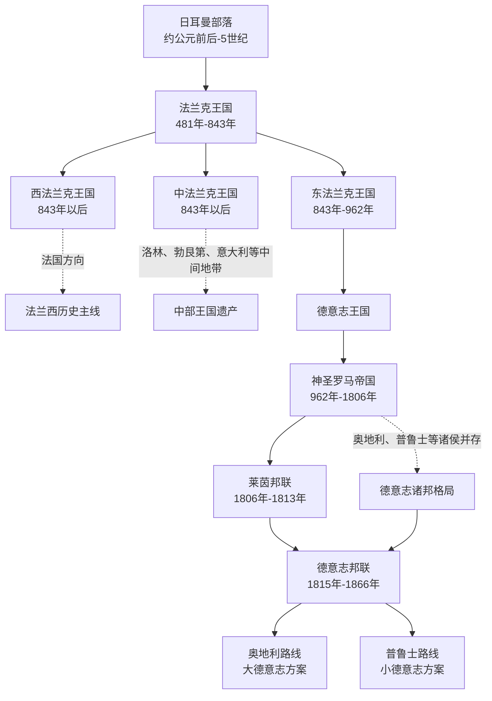

# 德意志共同历史

这里放置德国与奥地利在分流前共享的德意志世界历史背景，包括日耳曼部落、法兰克王国、东法兰克王国、神圣罗马帝国，以及近代德意志诸邦在正式分流前的共同政治框架。

| 顺序 | 阶段 | 时间 | 简要概括 |
| --- | --- | --- | --- |
| 1 | [日耳曼部落](/%E4%BA%BA%E6%96%87%E7%A7%91%E5%AD%A6/%E5%8E%86%E5%8F%B2-%E5%A4%96%E5%9B%BD/%E6%AC%A7%E6%B4%B2/%E5%BE%B7%E6%84%8F%E5%BF%97/%E5%85%B1%E5%90%8C%E5%8E%86%E5%8F%B2/%E6%97%A5%E8%80%B3%E6%9B%BC%E9%83%A8%E8%90%BD.md) | 约公元前后-5世纪 | 德意志历史的族群和地域源头之一。 |
| 2 | [法兰克王国](/%E4%BA%BA%E6%96%87%E7%A7%91%E5%AD%A6/%E5%8E%86%E5%8F%B2-%E5%A4%96%E5%9B%BD/%E6%AC%A7%E6%B4%B2/%E5%BE%B7%E6%84%8F%E5%BF%97/%E5%85%B1%E5%90%8C%E5%8E%86%E5%8F%B2/%E6%B3%95%E5%85%B0%E5%85%8B%E7%8E%8B%E5%9B%BD.md) | 481年-843年 | 法兰克人建立的西欧强权，后来分裂出东西两条历史路径。 |
| 3 | [东法兰克王国](/%E4%BA%BA%E6%96%87%E7%A7%91%E5%AD%A6/%E5%8E%86%E5%8F%B2-%E5%A4%96%E5%9B%BD/%E6%AC%A7%E6%B4%B2/%E5%BE%B7%E6%84%8F%E5%BF%97/%E5%85%B1%E5%90%8C%E5%8E%86%E5%8F%B2/%E4%B8%9C%E6%B3%95%E5%85%B0%E5%85%8B%E7%8E%8B%E5%9B%BD.md) | 843年-962年 | 德意志王国和神圣罗马帝国形成前的关键阶段。 |
| 4 | [神圣罗马帝国](/%E4%BA%BA%E6%96%87%E7%A7%91%E5%AD%A6/%E5%8E%86%E5%8F%B2-%E5%A4%96%E5%9B%BD/%E6%AC%A7%E6%B4%B2/%E5%BE%B7%E6%84%8F%E5%BF%97/%E5%85%B1%E5%90%8C%E5%8E%86%E5%8F%B2/%E7%A5%9E%E5%9C%A3%E7%BD%97%E9%A9%AC%E5%B8%9D%E5%9B%BD/README.md) | 962年-1806年 | 以德意志地区为核心的中欧帝国结构，长期维持松散的封建和诸侯体系。 |
| 5 | [莱茵邦联](/%E4%BA%BA%E6%96%87%E7%A7%91%E5%AD%A6/%E5%8E%86%E5%8F%B2-%E5%A4%96%E5%9B%BD/%E6%AC%A7%E6%B4%B2/%E5%BE%B7%E6%84%8F%E5%BF%97/%E5%85%B1%E5%90%8C%E5%8E%86%E5%8F%B2/%E8%8E%B1%E8%8C%B5%E9%82%A6%E8%81%94.md) | 1806年-1813年 | 拿破仑主导下的德意志诸邦重组。 |
| 6 | [德意志邦联](/%E4%BA%BA%E6%96%87%E7%A7%91%E5%AD%A6/%E5%8E%86%E5%8F%B2-%E5%A4%96%E5%9B%BD/%E6%AC%A7%E6%B4%B2/%E5%BE%B7%E6%84%8F%E5%BF%97/%E5%85%B1%E5%90%8C%E5%8E%86%E5%8F%B2/%E5%BE%B7%E6%84%8F%E5%BF%97%E9%82%A6%E8%81%94.md) | 1815年-1866年 | 德意志诸邦联盟，奥地利和普鲁士竞争主导权。 |
